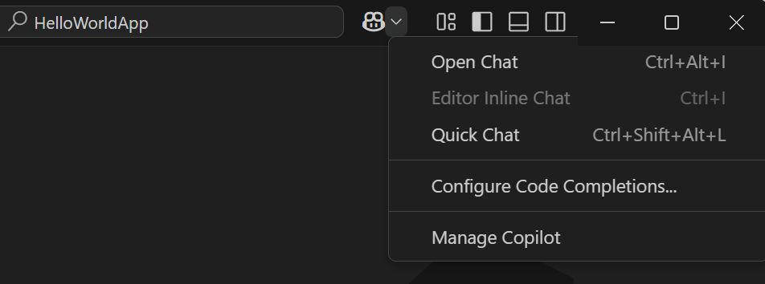
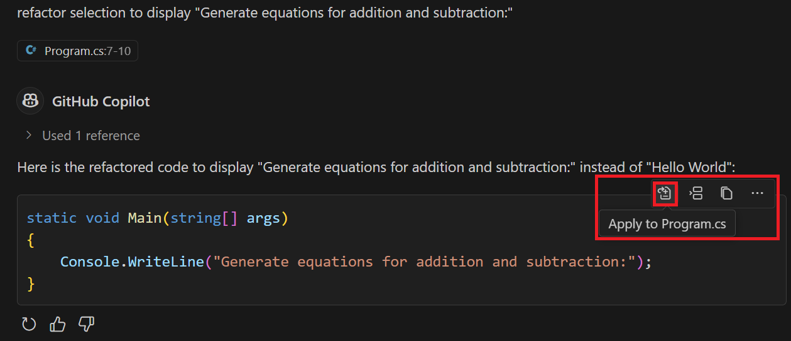

---
lab:
  title: 'Übung: Untersuchen von GitHub Copilot-Einstellungen und Benutzeroberflächenfeatures'
  description: 'Erfahren Sie, wie Sie GitHub Copilot-Einstellungen konfigurieren und auf GitHub Copilot-Features in Visual Studio Code zugreifen.'
---

# Untersuchen von GitHub Copilot-Einstellungen und Benutzeroberflächenfeatures

Visual Studio Code bietet Entwicklern eine nahtlose und anpassbare GitHub Copilot-Oberfläche. In dieser Übung untersuchen Sie GitHub Copilot-Einstellungen und erkunden die GitHub Copilot-Benutzeroberfläche in Visual Studio Code.

Diese Übung dauert ca. **25** Minuten.

> **WICHTIG:** Um diese Übung abzuschließen, benötigen Sie ein eigenes GitHub-Konto und ein GitHub Copilot-Abonnement. Falls Sie kein GitHub-Konto haben, können Sie sich für ein kostenloses Einzelkonto <a href="https://github.com/" target="_blank">registrieren</a> und den GitHub Copilot Free-Plan verwenden, um die Übung abzuschließen. Wenn Sie Zugriff auf ein GitHub Copilot Pro-, GitHub Copilot Pro+-, GitHub Copilot Business- oder GitHub Copilot Enterprise-Abonnement in Ihrer Labumgebung haben, können Sie Ihr vorhandenes GitHub Copilot-Abonnement für diese Übung verwenden.

## Vor der Installation

Ihre Labumgebung muss Folgendes enthalten:

- Git 2.48 oder höher
- .NET oder Python:

    - **.NET SDK 9.0** oder höher mit Visual Studio Code mit der Erweiterung **C# Dev Kit**
    - **Python 3.10** oder höher mit Visual Studio Code mit der Erweiterung **Python**

- Zugriff auf ein GitHub-Konto mit aktiviertem GitHub Copilot

Wenn Sie einen lokalen PC als Labumgebung für diese Übung verwenden, gilt Folgendes:

- Wenn Sie Hilfe beim Konfigurieren Ihres lokalen PCs als Labumgebung benötigen, öffnen Sie den folgenden Link in einem Browser: <a href="https://go.microsoft.com/fwlink/?linkid=2320147" target="_blank">Konfigurieren der Ressourcen für Ihre Labumgebung</a>.

- Wenn Sie Hilfe beim Aktivieren Ihres GitHub Copilot-Abonnements in Visual Studio Code benötigen, öffnen Sie den folgenden Link in einem Browser: <a href="https://go.microsoft.com/fwlink/?linkid=2320158" target="_blank">Aktivieren von GitHub Copilot in Visual Studio Code</a>.

Wenn Sie eine gehostete Labumgebung für diese Übung verwenden, gilt Folgendes:

- Wenn Sie Hilfe beim Aktivieren Ihres GitHub Copilot-Abonnements in Visual Studio Code benötigen, fügen Sie den folgenden Link in die Navigationsleiste eines Browsers ein: <a href="https://go.microsoft.com/fwlink/?linkid=2320158" target="_blank">Aktivieren von GitHub Copilot in Visual Studio Code</a>.

- So stellen Sie sicher, dass das .NET SDK für die Verwendung des offiziellen NuGet.org-Repositorys als Quelle zum Herunterladen und Wiederherstellen von Paketen konfiguriert ist:

    Öffnen Sie ein Befehlsterminal, und führen Sie den folgenden Befehl aus:

    ```bash

    dotnet nuget add source https://api.nuget.org/v3/index.json -n nuget.org

    ```

- Führen Sie die folgenden Schritte aus, um die gehostete Labumgebung für Python zu konfigurieren:

    1. Führen Sie den folgenden Befehl aus, um die Version von Python zu ermitteln, die in der gehosteten Umgebung installiert ist:

        ```bash
        python --version
        ```

        Führen Sie bei Bedarf die Schritte unter der folgenden URL aus, um Python in Visual Studio Code zu konfigurieren: <a href="https://code.visualstudio.com/docs/python/python-tutorial" target="_blank">Erste Schritte mit Python in VS Code</a>

    1. Installieren Sie die Python-Erweiterung über die Ansicht „Erweiterungen“ in Visual Studio Code.

## Übungsszenario

Sie arbeiten in der Programmierung, und zwar bei der IT-Abteilung Ihrer Gemeinde. Die Back-End-Systeme, die die öffentliche Bibliothek unterstützen, wurden bei einem Brand zerstört. Ihr Team muss eine temporäre Lösung entwickeln, damit die Mitarbeitenden der Bibliothek ihre Vorgänge verwalten können, bis das System ersetzt werden kann. Ihr Team hat GitHub Copilot ausgewählt, um den Entwicklungsprozess zu beschleunigen.

Diese Übung umfasst die folgenden Aufgaben:

1. Untersuchen Sie die GitHub Copilot-Einstellungen in Visual Studio Code.
1. Erkunden Sie die Benutzeroberfläche von GitHub Copilot in Visual Studio Code.

## Untersuchen der GitHub Copilot-Einstellungen in Visual Studio Code

GitHub Copilot-Einstellungen werden zwischen Ihrem GitHub-Konto und der Visual Studio Code-Umgebung aufgeteilt. In Visual Studio Code können Sie mit den Einstellungen das Verhalten von GitHub Copilot und GitHub Copilot Chat konfigurieren. Die Einstellungen in Ihrem GitHub-Konto dienen dazu, Ihr GitHub Copilot-Abonnement zu verwalten, die Aufbewahrung von Prompts und Vorschlägen zu konfigurieren und Vorschläge zuzulassen oder zu blockieren, die mit öffentlichem Code übereinstimmen.

### Aktivieren oder Deaktivieren von GitHub Copilot in Visual Studio Code

Die GitHub Copilot-Erweiterungen in Visual Studio Code sind standardmäßig aktiviert, wenn Sie einen Plan aktivieren. Sie können GitHub Copilot in Visual Studio Code jedoch für einen bestimmten Zeitraum deaktivieren, falls erforderlich.

Führen Sie die folgenden Schritte aus, um diesen Abschnitt der Übung zu absolvieren:

1. Öffnen Sie eine neue Instanz von Visual Studio Code.

1. Öffnen Sie in Visual Studio Code die Ansicht **Erweiterungen**.

1. Scrollen Sie in der Liste der installierten Erweiterungen nach unten zu **GitHub Copilot**.

1. Wenn Sie ein Dropdownmenü für die GitHub Copilot-Erweiterung anzeigen möchten, das auch die Optionen „Aktivieren“ und „Deaktivieren“ enthält, wählen Sie das Zahnradsymbol für die GitHub Copilot-Erweiterung aus.

    

Wenn Sie die Optionen zum Aktivieren und Deaktivieren testen möchten, können Sie die Option „Deaktivieren“ auswählen. Achten Sie jedoch darauf, GitHub Copilot erneut zu aktivieren, bevor Sie mit dieser Übung fortfahren.

### Untersuchen der Einstellungen für die GitHub Copilot-Erweiterungen

Standardeinstellungen werden für Sie konfiguriert, wenn Sie GitHub Copilot in Visual Studio Code aktivieren. Die Einstellungen sind unter der Bezeichnung „Erweiterungen“ angeordnet, die Einstellungen für GitHub Copilot und GitHub Copilot Chat enthält. Sie können Einstellungen für die GitHub Copilot-Erweiterungen mithilfe der Registerkarte „Einstellungen“ von Visual Studio Code anpassen.

> **TIPP**: Sie können das Copilot Chat-Menü verwenden, um die Registerkarte „Einstellungen“ zu öffnen, die nach GitHub Copilot gefiltert ist.

Führen Sie die folgenden Schritte aus, um diesen Abschnitt der Übung zu absolvieren:

1. Öffnen Sie auf der oberen Menüleiste von Visual Studio Code das Copilot Chat-Menü.

    Das Copilot Chat-Menü enthält die Option **Codevervollständigungen konfigurieren**, die Zugriff auf eine gefilterte Liste der GitHub Copilot-Einstellungen bietet.

    

1. Wählen Sie im Copilot Chat-Menü **Codevervollständigungen konfigurieren** aus, und wählen Sie dann **Einstellungen bearbeiten** aus.

1. Nehmen Sie sich einen Moment Zeit, um sich anzusehen, wie die GitHub Copilot-Einstellungen angeordnet sind.

    

    Beachten Sie, dass die Einstellungen für *GitHub Copilot* und *GitHub Copilot Chat-* getrennt sind. Beachten Sie auch die Kategorien *Preview* und *Experimental*.

1. Wählen Sie unter der Bezeichnung „Erweiterungen“ **GitHub Copilot** aus.
  
    

    Beachten Sie, dass die Einstellungsliste jetzt ausschließlich nach GitHub Copilot gefiltert ist.

    Die GitHub Copilot-Erweiterung verfügt über die folgenden Einstellungsoptionen:

    - **GitHub.Copilot.Advanced**: Konfigurieren Sie erweiterte Einstellungen für GitHub Copilot in „settings.json“.

        Wenn Sie **In settings.json bearbeiten** auswählen, wird die „settings.json“-Datei geöffnet, bei der es sich um eine JSON-Datei handelt, die die Einstellungen für GitHub Copilot enthält. Die Einstellungen sind in Abschnitte unterteilt, und jeder Abschnitt enthält eine Liste der Einstellungen.

        

    - **GitHub.Copilot.Enable**: Aktivieren oder deaktivieren Sie Copilot-Vervollständigungen für angegebene Sprachen.

        Der Begriff *Sprachen* bezieht sich auf Programmiersprachen, berücksichtigt aber auch andere Dateiformate. Die Sprachen werden mithilfe einer Liste von Sprachen und einem Wert von **true** oder **false** angegeben, um GitHub Copilot für jede Sprache zu aktivieren oder zu deaktivieren. Standardmäßig ist GitHub Copilot für alle Sprachen aktiviert. Diese Einstellung wird mit dem Platzhalterzeichen **\*** in der ersten Zeile und dem Wert **true** angegeben. Die nachfolgenden Zeilen geben Sprachen an, für die GitHub Copilot aktiviert oder deaktiviert ist. Im Beispiel ist GitHub Copilot für **C#**, **JavaScript** und **Python** aktiviert und für **Klartext** und **Markdown** deaktiviert.

        

    - **GitHub.Copilot.SelectedCompletionModel**: Wählen Sie das Modell aus, das für Copilot-Vervollständigungen verwendet werden soll.

        Um ein Vervollständigungsmodell auszuwählen, öffnen Sie das Menü „Copilot-Vervollständigungen konfigurieren“, und wählen Sie dann die Menüoption **Vervollständigungsmodell ändern** aus.

        

        Die Liste der Modelle kann durch Ihr GitHub Copilot-Abonnement, die in Ihrer Region verfügbaren Modelle und die für Ihre Organisation verfügbaren Modelle eingeschränkt sein.

        

1. Wählen Sie unter **Copilot-Vervollständigung für angegebene Sprachen aktivieren oder deaktivieren** die Option **Markdown** aus.

    Der Standardwert für Markdown ist auf **false** festgelegt. Das bedeutet, dass GitHub Copilot-Vervollständigungen für Markdown-Dateien deaktiviert ist.

1. Um Copilot für Markdown-Dateien zu aktivieren, wählen Sie **Element bearbeiten** (Stiftsymbol) und anschließend **false** aus, ändern Sie den Wert in **true**, und wählen Sie dann **OK** aus.

    Sie können jetzt GitHub Copilot verwenden, um Sie beim Erstellen oder Aktualisieren von Markdown-Dateien zu unterstützen. Beispielsweise kann GitHub Copilot Codevervollständigungsvorschläge generieren, wenn Sie an der Projektdokumentation arbeiten.

1. Wählen Sie unter der Bezeichnung „Erweiterungen“ die Option „GitHub Copilot Chat“ aus.

    

    Die GitHub Copilot Chat-Erweiterung enthält zahlreiche Einstellungen und wird regelmäßig aktualisiert. Die GitHub Copilot Chat-Erweiterung enthält auch Vorschau- und experimentelle Einstellungen, an denen Änderungen vorbehalten sind und die eingestellt werden könnten. Die Vorschau- und experimentellen Einstellungen sind am Ende der Liste enthalten und werden entweder als **Preview** oder **Experimental** ausgewiesen.

    

1. Nehmen Sie sich ein paar Minuten Zeit, um sich die Einstellungen für GitHub Copilot Chat anzusehen.

    Es empfiehlt sich, während dieser Schulung die Standardeinstellungen beizubehalten. Dadurch können Sie dafür sorgen, dass Sie beim Arbeiten durch die Übungen die erwartete Erfahrung haben. Nach Abschluss der Schulung können Sie mit diesen Einstellungen experimentieren, um Ihre Erfahrung mit GitHub Copilot und Copilot Chat anzupassen.

1. Schließen Sie die Registerkarte „Einstellungen“.

## Erkunden der Benutzeroberfläche von GitHub Copilot in Visual Studio Code

Visual Studio Code integriert die KI-Features von GitHub Copilot nahtlos in Ihre Entwicklungsumgebung.

GitHub Copilot-Features richten sich an die folgenden Kategorien aus:

- Chat in natürlicher Sprache: GitHub Copilot bietet drei unterschiedliche Chatoberflächen: Chatansicht, Schnellchat und Inlinechat.

- Codevervollständigungen: GitHub Copilot ist in den Code-Editor integriert, um kontextbezogene Codevervollständigungsvorschläge während der Eingabe zu generieren.

- Intelligente Aktionen: GitHub Copilot automatisiert gängige Aufgaben mit intelligenten Aktionen, um das wiederholte Schreiben von Prompts zu vermeiden.

Die Produktivitätsfeatures von GitHub Copilot sind leicht zugänglich und können nahtlos in Ihren Workflow integriert werden, ohne beim Programmieren zu stören.

### Erkunden der Chatansichtsfeatures

Führen Sie die folgenden Schritte aus, um diesen Abschnitt der Übung zu absolvieren:

1. Um die Chatansicht zu öffnen, wählen Sie die Schaltfläche **Chat umschalten** aus.

    Die Schaltfläche „Chat umschalten“ befindet sich oben im Visual Studio Code-Fenster, direkt rechts neben dem Suchtextfeld.

    

    Die GitHub Copilot Chat-Ansicht wird in einem Seitenleistenfenster auf der rechten Seite des Visual Studio Code-Fensters geöffnet.

1. Nehmen Sie sich ein paar Minuten Zeit, um sich die Oberfläche der Chatansicht anzusehen.

    

    Beginnend von oben und nach unten enthält die Chatansicht die folgenden Elemente:

    - Chatansichtssymbolleiste: Die Chatansichtssymbolleiste befindet sich in der oberen rechten Ecke der Chatansicht. Sie können die Symbolleiste verwenden, um den Chatverlauf zu verwalten, einen neuen Chat zu starten, die Chatansicht an einem anderen Ort zu öffnen oder die Chatansicht auszublenden. Zeigen Sie mit dem Mauszeiger auf die Symbole der Symbolleistenschaltfläche, um eine Beschreibung anzuzeigen.

    - Chatantwortbereich: Der Chatantwortbereich ist der Bereich unterhalb der Chatansichtssymbolleiste, in der GitHub Copilot Antworten anzeigt. Zu den Antworten gehören Codevorschläge, Erklärungen, interaktive Elemente und andere Informationen im Zusammenhang mit Ihrem Prompt.

    - Schaltfläche „Kontext hinzufügen“: Die Schaltfläche „Kontext hinzufügen“ befindet sich im unteren Abschnitt der Chatansicht. Sie können diese Schaltfläche nach Ressourcen suchen, die Kontext zu Chatsitzungen hinzufügen. Die Ressourcen können alles Mögliche von internen Projektdateien bis hin zu öffentlichen Repositorys auf GitHub, die sich außerhalb Ihrer Organisation befinden, sein.

    - Copilot fragen: Im Textfeld „Copilot fragen“ geben Sie Ihre Prompts ein. Sie können das Textfeld „Copilot fragen“ verwenden, um GitHub Copilot Fragen zu Ihrer Codebasis zu stellen, um Codevorschläge zu bitten oder Hilfe bei bestimmten Aufgaben zu erhalten.

    - Schaltfläche „Chat mit Erweiterung“: Die Schaltfläche „Chat mit Erweiterung“ befindet sich unterhalb des Textfelds „Copilot fragen“. GitHub Copilot-Erweiterungen sind eine Art von GitHub-App, die die Features externer Tools in GitHub Copilot Chat integrieren. Sie können diese Schaltfläche verwenden, um aus einer Liste der Copilot-Erweiterungen auszuwählen. Die Standarderweiterungen bieten eine Kombination aus Chatteilnehmern und Schrägstrichbefehlen, die Kontext für Ihre Eingabeaufforderungen bereitstellen.

        > **HINWEIS:** Jeder mit einem Copilot Pro-, Copilot Pro+- oder Copilot Free-Plan kann Copilot-Erweiterungen verwenden. Für Organisationen oder Unternehmen mit einem Copilot Business- oder Copilot Enterprise-Plan können Organisationsbesitzer und Unternehmensadministratoren den Zugriff auf Copilot-Erweiterungen gewähren. Copilot-Erweiterungen sind für GitHub Enterprise Server nicht verfügbar.

    - Schaltfläche „Sprach-Chat starten“: Die Schaltfläche „Sprach-Chat starten“ befindet sich unterhalb des Textfelds „Copilot fragen“. Mit dieser Schaltfläche können Sie Sprachinteraktionen mit GitHub Copilot aktivieren oder deaktivieren. Wenn Sprachinteraktionen aktiviert sind, können Sie GitHub Copilot bei Spracheingabe Fragen stellen oder um Codevorschläge bitten.

    - Menü „Chatmodus“: Das Dropdownmenü „Chatmodus“ befindet sich rechts neben der Schaltfläche „Sprach-Chat starten“. Je nach Anforderungen können Sie zwischen verschiedenen Chatmodi wählen:

        - **Fragen**: Verwenden Sie diesen Modus, um GitHub Copilot Fragen zu Ihrer Codebasis zu stellen. Sie können GitHub Copilot auffordern, Code zu erklären, Änderungen vorzuschlagen oder Informationen zur Codebasis bereitzustellen.
        - **Bearbeiten**: Verwenden Sie diesen Modus, um Code in Ihrem Arbeitsbereich zu bearbeiten. Sie können GitHub Copilot verwenden, um Code umzugestalten, Kommentare hinzuzufügen oder andere Änderungen an Ihrem Code vorzunehmen.
        - **Agent**: Verwenden Sie diesen Modus, um GitHub Copilot als Agent auszuführen. Sie können GitHub Copilot verwenden, um Befehle auszuführen, Code auszuführen oder andere Aufgaben in Ihrem Arbeitsbereich auszuführen.

    - Menü „Modell auswählen“: Das Menü „Modell auswählen“ befindet sich rechts neben dem Menü „Chatmodus“. Mit dieser Schaltfläche können Sie das Modell auswählen, das GitHub Copilot zum Generieren von Codevorschlägen verwendet. Das Standardmodell ist GPT-4o. Die Modellauswahl kann je nach GitHub Copilot-Abonnement, GitHub Copilot-Einstellungen und den in Ihrer Region verfügbaren Modellen eingeschränkt sein.

    - Menü „Senden und dispatchen“: Das Menü „Senden und dispatchen“ befindet sich rechts neben dem Menü „Modell auswählen“. Sie können diese Schaltfläche verwenden, um Ihren Prompt an GitHub Copilot zu übermitteln und eine Antwort zu erhalten. Das Menü enthält mehrere Optionen für die Übermittlung Ihrer Anfrage.

1. Verwenden Sie das Textfeld „Copilot fragen“, um den folgenden Prompt einzugeben, und übermitteln Sie dann den Prompt:

    **Für C#:**

    ```text
    Create a C# console app that prints Hello World to the console.
    ```

    **Alternativ für Python:**

    ```text
    Create a Python console app that prints Hello World to the console.
    ```

1. Beachten Sie, dass die Antwort von GitHub Copilot eine interaktive Liste von Dateien und eine Schaltfläche **Arbeitsbereich erstellen** enthält.

1. Um GitHub Copilot das Codeprojekt erstellen zu lassen, wählen Sie **Arbeitsbereich erstellen** aus.

    GitHub Copilot fordert Sie vor dem Erstellen Ihres Arbeitsbereichs zur Eingabe eines übergeordneten Ordners auf.

1. Wählen Sie im Dialogfeld „Datei“ den Ordner **Desktop** und dann **Als übergeordneten Ordner auswählen** aus.

1. Wenn Sie aufgefordert werden, den erstellten Arbeitsbereich zu öffnen, wählen Sie **Öffnen** aus.

    Komplexere Prompts können verwendet werden, um einen Arbeitsbereich mit mehreren Dateien zu erstellen oder verschiedene Projekttypen zu erstellen. Sie können beispielsweise den folgenden Prompt verwenden, um zusätzliche Bedingungen für das Konsolen-App-Projekt anzugeben:

    **Für C#:**

    ```text
    Create a C# console app that prints Hello World to the console. Include a .gitignore file.
    ```

    **Alternativ für Python:**

    ```text
    Create a Python console app that prints Hello World to the console. Include a .gitignore file.
    ```

### Erkunden der Schnellchatfeatures

Das Fenster „Schnellchat“ ist eine vereinfachte Oberfläche für die Interaktion mit GitHub Copilot. Dort können Sie schnell Fragen stellen, um Codevorschläge bitten oder Hilfe zu bestimmten Aufgaben erhalten, ohne den Code-Editor verlassen zu müssen.

1. Öffnen Sie das Copilot Chat-Menü. Sie sehen, dass drei Chatoptionen aufgelistet sind.

    

    Die drei Chatoptionen sind:

    - Chat öffnen: Diese Option wird verwendet, um die Chatansicht zu öffnen.

    - Editor-Inlinechat: Diese Option wird verwendet, um direkt im Code-Editor mit GitHub Copilot zu interagieren. Die Option „Inlinechat“ ist nur aktiviert, wenn eine Datei im Editor geöffnet ist.

    - Schnellchat: Diese Option wird verwendet, um mit GitHub Copilot mit einer vereinfachten Oberfläche zu interagieren. Sie können den Schnellchat verwenden, um Fragen zu stellen, um Codevorschläge zu bitten oder Hilfe zu bestimmten Aufgaben zu erhalten, ohne den Code-Editor verlassen zu müssen.

1. Wählen Sie im Copilot Chat-Menü **Schnellchat** aus.

    Standardmäßig wird das Schnellchatfenster oben im Visual Studio Code-Fenster geöffnet.

1. Beachten Sie, dass das Schnellchatfenster viele der Optionen bietet, die es auch in der Chatansicht gibt.

1. Verwenden Sie das Schnellchatfenster, um den folgenden Prompt zu übermitteln:

    ```text
    Tell me about the Program.cs file
    ```

    Ohne zusätzlichen Kontext ist die Antwort wahrscheinlich eine Beschreibung, wie „Program.cs“-Dateien in verschiedenen Projekttypen verwendet werden.

1. Wenn Sie Ihre „Program.cs“-Datei zum Schnellchatkontext hinzufügen möchten, ziehen Sie sie aus der Explorer-Ansicht oben ins Schnellchatfenster.

1. Beachten Sie, dass das Schnellchatfenster jetzt rechts neben der Schaltfläche **Kontext hinzufügen** **Program.cs** enthält.

    > **TIPP**: Das Hinzufügen von Projektdateien zum Chatkontext (Chatansicht, Schnellchat oder Inlinechat) hilft GitHub Copilot dabei, relevantere Vorschläge zu machen. Beim Hinzufügen von Projektdateien zum Chatkontext ist es häufig einfacher, einen Drag-and-Drop-Vorgang anstelle der Schaltfläche „Kontext hinzufügen“ zu verwenden.

1. Scrollen Sie zum oberen Rand des Schnellchatfensters, und übermitteln Sie den gleichen Prompt erneut:

    ```text
    Tell me about the Program.cs file
    ```

1. Beachten Sie, dass die neue Antwort eine Beschreibung des Inhalts Ihrer „Program.cs“-Datei anstelle einer allgemeinen Beschreibung zur Verwendung von „Program.cs“-Dateien enthält.

1. Wählen Sie in der oberen rechten Ecke des Schnellchatfensters **In der Chatansicht öffnen** aus.

    Beachten Sie, dass das Fenster „Schnellchat“ geschlossen wird und die Chatansicht mit Antworten geöffnet wird, die im Fenster „Schnellchat“ vorhanden waren. Wenn in der Chatansicht die Chatsitzung nicht angezeigt wird, öffnen Sie das Schnellchatfenster über das Copilot Chat-Menü, und wählen Sie dann **In der Chatansicht öffnen** aus.

    Das Wechseln zur Chatansicht ist nützlich, wenn Sie eine Chatsitzung erweitern und verwalten müssen, die im Schnellchatfenster gestartet wurde.

    > **TIPP**: Das Schnellchatfenster eignet sich hervorragend für schnelle Fragen und einfache Aufgaben. Wenn Sie jedoch eine dediziertere Chatumgebung wünschen, sollten Sie die Chatansicht verwenden. Die Chatansicht ist eine umfangreichere Oberfläche für die Interaktion mit GitHub Copilot und beinhaltet Features wie Chatverlauf, Dateiverwaltung und erweiterte Optionen zum Verwalten Ihrer Chatsitzungen.

### Erkunden der Inlinechatfeatures

Die Inlinechatoberfläche wurde für Codeinteraktionen direkt im Editor entwickelt. Sie bietet eine fokussiertere und optimierte Oberfläche für die Arbeit mit Code, sodass Sie Fragen stellen, um Codevorschläge bitten und Änderungen vornehmen können, ohne den Code-Editor verlassen zu müssen.

1. Öffnen Sie die Datei „Program.cs“ im Editor.

1. Öffnen Sie das Copilot Chat-Menü, und beachten Sie Folgendes:

    - Die Menüoption „Editor-Inlinechat“ ist jetzt aktiviert.
    - Die Tastenkombination **STRG+I** kann zum Öffnen einer Inlinechatsitzung verwendet werden.

1. Wählen Sie im Code-Editor den folgenden Code aus:

    ```csharp

    namespace HelloWorldApp
    {
        class Program
        {
            static void Main(string[] args)
            {
                Console.WriteLine("Hello World");
            }
        }
    }

    ```

1. Zum Öffnen einer Inlinechatsitzung verwenden Sie die Tastenkombination **STRG+I**.

1. Nehmen Sie sich kurz Zeit, um sich die Inlinechatoberfläche anzusehen.

    Die Inlinechatoberfläche enthält einige der Features, die auch in der Chatansicht und im Schnellchat vorhanden sind, doch sie wurde für Codeinteraktionen direkt im Editor entwickelt.

1. Geben Sie den folgenden Prompt in das Textfeld „Copilot fragen“ ein, und übermitteln Sie dann den Prompt:

    ```text

    refactor using `namespace HelloWorldApp;`

    ```

1. Nehmen Sie sich kurz Zeit, um sich die vom Inlinechat generierte Antwort anzusehen.

    

    Beachten Sie Folgendes:

    - Der Inlinechat generiert einen Vorschlag, indem der Code direkt aktualisiert wird.
    - Sie können **Annehmen** auswählen, um die vorgeschlagene Änderung anzuwenden, **Schließen**, um die ausgewählte Änderung abzulehnen, oder **Erneut ausführen**, um einen neuen Vorschlag zu generieren.
    - Es gibt auch das Menü **Weitere Aktionen**, das zusätzliche Optionen zum Verwalten der Inlinechatsitzung enthält, und Sie können den Vorschlag als „Hilfreich“ oder „Nicht hilfreich“ bewerten.

1. Um die vorgeschlagene Codeänderung zu akzeptieren, wählen Sie **Annehmen** aus.

    Der Code wird aktualisiert, um die Syntax des dateibezogenen Namespaces zu verwenden.

### Vergleich der Modi „Fragen“ und „Bearbeiten“ der Chatansicht

Die Chatansicht verfügt über drei Modi: **Fragen**, **Bearbeiten** und **Agent**. Der Modus „Fragen“ wurde für das Stellen von Fragen und Generieren von Codevorschlägen entwickelt, während der Modus „Bearbeiten“ für das Coderefactoring und die Bearbeitung von Aufgaben entwickelt wurde. Der Modus „Agent“ ist für das Ausführen von Befehlen und Code konzipiert.

1. Stellen Sie sicher, dass die Chatansicht im Modus **Fragen** geöffnet ist.

1. Wählen Sie den folgenden Code aus:

    ```csharp

    static void Main(string[] args)
    {
        Console.WriteLine("Hello World");
    }

    ```

    Beachten Sie, dass der Kontext der Chatansicht aktualisiert wird, um die ausgewählten Codezeilen in der „Program.cs“-Datei anzugeben.

1. Geben Sie in der Chatansicht die folgende Eingabeaufforderung ein:

    ```text

    refactor selection to display "Generate equations for addition and subtraction:"

    ```

1. Nehmen Sie sich kurz Zeit, um sich die Antwort anzusehen, die in der Chatansicht angezeigt wird.

    

    Beachten Sie, dass beim Bewegen des Mauszeigers über den Code die Chatansicht die folgenden Optionen anzeigt:

    - **Auf Program.cs anwenden**: Verwenden Sie die Option „Auf Program.cs anwenden“, um die vorgeschlagene Codeänderung auf die Datei „Program.cs“ anzuwenden.
    - **Beim Cursor einfügen**: Verwenden Sie die Option „Beim Cursor einfügen“, um die vorgeschlagene Codeänderung an der aktuellen Cursorposition im Editor einzufügen.
    - **Kopieren**: Verwenden Sie die Option „Kopieren“, um die vorgeschlagene Codeänderung in die Zwischenablage zu kopieren.

1. Wählen Sie in der Chatansicht **Modus festlegen** und dann **Bearbeiten** aus.

1. Wenn eine Meldung angezeigt wird, die besagt, dass das Ändern des Chatmodus die aktuelle Chatsitzung beendet, wählen Sie **Ja** aus, um eine neue Chatsitzung zu starten, und übermitteln Sie dann den folgenden Prompt erneut:

    ```text

    refactor selection to display "Generate equations for addition and subtraction:"

    ```

1. Nehmen Sie sich kurz Zeit, um sich die im Code-Editor vorgeschlagenen Änderungen anzusehen.

    

    Beachten Sie Folgendes:

    - Der Code-Editor zeigt die Ansicht *Diff-Stil* an, die die am Code vorgenommenen Änderungen anzeigt, ähnlich wie die Diff-Ansicht, die in Pull Requests auf GitHub verwendet wird.
    - Der Code-Editor zeigt Schaltflächen **Übernehmen** und **Rückgängig** an, mit denen Sie die am Code vorgenommenen Änderungen anwenden oder ablehnen können.
    - Der Code-Editor zeigt zusätzliche Schaltflächen an, mit denen die vorgeschlagenen Bearbeitungen verwaltet werden können.

    Zusätzlich zu den Bearbeitungssteuerelementen, die auf der Registerkarte „Editor“ angezeigt werden, zeigt die Chatansicht die Schaltfläche **Übernehmen** an, mit der Sie alle Bearbeitungen anwenden können, und die Schaltfläche **Rückgängig**, um die Bearbeitungen abzubrechen, und eine gekürzte Beschreibung der vorgeschlagenen Änderung.

1. Wählen Sie in der Chatansicht **Übernehmen** aus, um die vorgeschlagenen Codeänderungen anzuwenden.

> **HINWEIS:** Der Agent-Modus der Chatansicht wurde für die Ausführung von Aufgaben mit einem autonomen Agent entwickelt. Um GitHub Copilot-Ressourcen zu sparen, wird der Agent-Modus in dieser Übung nicht verwendet.

### Erkunden von Codevervollständigungsvorschlägen

GitHub Copilot macht Vorschläge für die Codevervollständigung basierend auf dem Kontext des Codes im Editor. Sie können Codevervollständigungsvorschläge verwenden, um Codeausschnitte schnell zu generieren, vorhandenen Code umzugestalten oder neue Features zu implementieren.

1. Positionieren Sie bei geöffneter „Program.cs“-Datei im Code-Editor den Cursor am Ende der „Console.WriteLine“-Anweisung.

1. Um einen Codevervollständigungsvorschlag zu generieren, drücken Sie die **EINGABETASTE**.

    GitHub Copilot generiert einen Vorschlag für die Codevervollständigung basierend auf dem Kontext des Codes im Editor. In diesem Fall schlägt GitHub Copilot eine neue „Console.WriteLine“-Anweisung für das Generieren von Gleichungen vor.

    

1. Um den Codevervollständigungsvorschläge zu akzeptieren, drücken Sie die **TAB-TASTE**.

    Der Code im Editor wird aktualisiert, um die neue „Console.WriteLine“-Anweisung einzuschließen.

    Wenn Sie einen Codevervollständigungsvorschlag akzeptieren, schlägt GitHub Copilot möglicherweise zusätzliche Codezeilen vor. In diesem Fall können Sie die **TAB-TASTE** drücken, um den Vorschlag anzunehmen, die **ESC-TASTE** drücken, um den Vorschlag abzulehnen, oder Ihren eigenen Code eingeben, um den Vorschlag zu überschreiben.

### Zugriff auf intelligente Aktionen

Intelligente Aktionen sind eine Reihe vordefinierter Aktionen, die über das Copilot-Kontextmenü verfügbar sind. Sie können intelligente Aktionen verwenden, um allgemeine Aufgaben in Visual Studio Code schnell auszuführen, ohne Prompts schreiben zu müssen.

1. Wählen Sie im Code-Editor die Main-Methode aus, klicken Sie mit der rechten Maustaste auf den ausgewählten Code, und wählen Sie dann **Copilot** aus.

    Es sollte ein GitHub Copilot-Kontextmenü mit drei Abschnitten angezeigt werden.

    

    - Der erste Abschnitt enthält die Option zum Öffnen einer Inlinechatsitzung.
    - Der zweite Abschnitt enthält eine Liste der intelligenten Aktionen.
    - Der dritte Abschnitt enthält Optionen zum Hinzufügen von Kontext zu einer Chatsitzung.

1. Wählen Sie im Kontextmenü von GitHub Copilot **Erklären** aus.

1. Nehmen Sie sich kurz Zeit, um sich die Ergebnisse der intelligenten Aktion anzusehen.

    Beachten Sie, dass die intelligente Aktion „Erklären“ einen Prompt erstellt, der auf der Codeauswahl basiert, und diesen in der Chatansicht übermittelt.

    

    Die Erläuterung enthält eine detaillierte Beschreibung des ausgewählten Codes und kann vorgeschlagene Änderungen enthalten.

1. Öffnen Sie das Kontextmenü von GitHub Copilot erneut, und wählen Sie dann **Dokumentation generieren** aus.

1. Nehmen Sie sich kurz Zeit, um sich die Ergebnisse der intelligenten Aktion anzusehen.

    Beachten Sie, dass die intelligente Aktion „Dokumentation generieren“ eine Inlinechatsitzung öffnet und einen Prompt sendet, der GitHub Copilot bittet, Dokumentationen für den ausgewählten Code vorzuschlagen.

    

1. Wählen Sie im Inlinechatfenster **Akzeptieren** aus, um die vorgeschlagene Dokumentation anzuwenden.

## Zusammenfassung

In dieser Übung haben Sie GitHub Copilot-Einstellungen untersucht und die GitHub Copilot-Benutzeroberfläche in Visual Studio Code erkundet. Sie haben gelernt, wie Sie GitHub Copilot-Einstellungen konfigurieren und die Features „Chatansicht“, „Schnellchat“ und „Inlinechat“ kennengelernt. Sie haben auch GitHub Copilot verwendet, um Codevervollständigungen zu generieren und intelligente Aktionen zum Ausführen gängiger Aufgaben zu verwenden.

## Bereinigen

Nachdem Sie die Übung abgeschlossen haben, nehmen Sie sich kurz Zeit, um sicherzustellen, dass Sie keine Änderungen an Ihrem GitHub-Konto oder GitHub Copilot-Abonnement vorgenommen haben, die Sie nicht beibehalten möchten. Falls Sie Änderungen vorgenommen haben, machen Sie diese jetzt wieder rückgängig.
