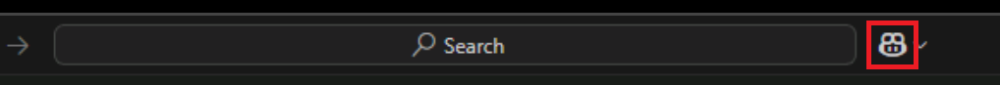

---
lab:
  title: 'Übung: Analysieren und Dokumentieren von Code mithilfe von GitHub Copilot'
  description: 'Erfahren Sie, wie Sie neuen oder unbekannten Code analysieren und Dokumentationen mit GitHub Copilot in Visual Studio Code generieren.'
---

# Analysieren und Dokumentieren von Code mithilfe von GitHub Copilot

GitHub Copilot kann Ihnen dabei helfen, eine Codebasis zu verstehen und zu dokumentieren, indem Erklärungen und Dokumentation generiert werden. In dieser Übung verwenden Sie GitHub Copilot, um eine Codebasis zu analysieren und Dokumentationen für das Projekt zu generieren.

Diese Übung dauert ca. **20** Minuten.

> **WICHTIG:** Um diese Übung abzuschließen, müssen Sie ein eigenes GitHub-Konto und ein eigenes GitHub Copilot-Abonnement bereitstellen. Wenn Sie kein GitHub-Konto haben, können Sie sich für ein kostenloses eigenes Konto <a href="https://github.com/" target="_blank">registrieren</a> und einen GitHub Copilot Free-Plan verwenden, um die Übung abzuschließen. Wenn Sie Zugriff auf ein GitHub Copilot Pro-, GitHub Copilot Pro+-, GitHub Copilot Business- oder GitHub Copilot Enterprise-Abonnement in Ihrer Übungsumgebung haben, können Sie Ihr vorhandenes GitHub Copilot-Abonnement verwenden, um diese Übung abzuschließen.

## Vor der Installation

Ihre Übungsumgebung muss Folgendes enthalten: Git 2.48 oder höher, .NET SDK 9.0 oder höher, Visual Studio Code mit der C#Dev Kit-Erweiterung und Zugriff auf ein GitHub-Konto mit aktiviertem GitHub Copilot.

Wenn Sie einen lokalen PC als Übungsumgebung für diese Übung verwenden, gilt Folgendes:

- Um Hilfe beim Konfigurieren Ihres lokalen PCs als Übungsumgebung zu erhalten, öffnen Sie den folgenden Link in einem Browser: <a href="https://go.microsoft.com/fwlink/?linkid=2320147" target="_blank">Konfigurieren Sie die Ressourcen Ihrer Übungsumgebung</a>.

- Um Hilfe beim Aktivieren Ihres GitHub Copilot-Abonnements in Visual Studio Code zu erhalten, öffnen Sie den folgenden Link in einem Browser: <a href="https://go.microsoft.com/fwlink/?linkid=2320158" target="_blank">Aktivieren Sie GitHub Copilot in Visual Studio Code</a>.

Wenn Sie eine gehostete Übungsumgebung für diese Übung verwenden, gilt Folgendes:

- Um Hilfe beim Aktivieren Ihres GitHub Copilot-Abonnements in Visual Studio Code zu erhalten, fügen Sie die folgende URL in die Seitennavigationsleiste eines Browsers ein: <a href="https://go.microsoft.com/fwlink/?linkid=2320158" target="_blank">Aktivieren Sie GitHub Copilot in Visual Studio Code</a>.

- Öffnen Sie eine Eingabeaufforderung, und führen Sie die folgenden Befehle aus:

    Um sicherzustellen, dass Visual Studio Code für die Verwendung der richtigen Version von .NET konfiguriert ist, führen Sie den folgenden Befehl aus:

    ```bash

    dotnet nuget add source https://api.nuget.org/v3/index.json -n nuget.org

    ```

## Übungsszenario

Sie sind Entwicklerin bzw. Entwickler und arbeiten in der IT-Abteilung Ihrer lokalen Community. Die Back-End-Systeme, die die öffentliche Bibliothek unterstützen, wurden in einem Brand zerstört. Ihr Team muss eine temporäre Lösung entwickeln, damit die Mitarbeitenden der Bibliothek ihre Vorgänge verwalten können, bis das System ersetzt werden kann. Ihr Team hat GitHub Copilot ausgewählt, um den Entwicklungsprozess zu beschleunigen.

Ein Teammitglied hat eine erste Version der Bibliotheksanwendung entwickelt, aber aufgrund von Zeiteinschränkungen hatte es keine Chance, den Code zu dokumentieren. Sie müssen die Codebasis analysieren und Dokumentation für das Projekt erstellen.

Diese Übung umfasst die folgenden Aufgaben:

- Richten Sie die Bibliotheksanwendung in Visual Studio Code ein.
- Verwenden von GitHub Copilot zum Erklären der Codebasis der Bibliotheksanwendung
- Verwenden Sie GitHub Copilot, um eine README.md-Datei für die Bibliotheksanwendung zu erstellen.

## Einrichten der Bibliotheksanwendung in Visual Studio Code

Ihr Kollege hat eine erste Version der Bibliotheksanwendung entwickelt und als ZIP-Datei zur Verfügung gestellt. Sie müssen die ZIP-Datei herunterladen, die Codedateien extrahieren und dann die Lösung in Visual Studio Code öffnen.

Gehen Sie folgendermaßen vor, um die Bibliotheksanwendung einzurichten:

1. Öffnen Sie ein Browserfenster in Ihrer Übungsumgebung.

1. Um eine ZIP-Datei mit der Bibliotheksanwendung herunterzuladen, fügen Sie die folgende URL in die Adressleiste Ihres Browsers ein: [GitHub Copilot-Übung – Analysieren und Dokumentieren von Code](https://github.com/MicrosoftLearning/mslearn-github-copilot-dev/raw/refs/heads/main/DownloadableCodeProjects/Downloads/AZ2007LabAppM2.zip)

    Die ZIP-Datei mit dem Namen „AZ2007LabAppM2.zip“ wird in Ihre Übungsumgebung heruntergeladen.

1. Extrahieren Sie die Dateien aus der Datei **AZ2007LabAppM2.zip**.

    Zum Beispiel:

    1. Navigieren Sie zu dem Ordner mit Downloads in Ihrer Übungsumgebung.

    1. Klicken Sie mit der rechten Maustaste auf **AZ2007LabAppM2.zip** und wählen Sie dann **Alle extrahieren** aus.

    1. Wählen Sie **Dateien nach Extrahierung anzeigen** und dann **Extrahieren** aus.

1. Öffnen Sie den Ordner mit den extrahierten Dateien und kopieren Sie dann den Ordner **AccelerateDevGHCopilot** an einen Speicherort, auf den Sie einfach zugreifen können, z. B. Ihren Windows-Ordner „Desktop“.

1. Öffnen Sie den Ordner **AccelerateDevGHCopilot** in Visual Studio Code.

    Zum Beispiel:

    1. Öffnen Sie Visual Studio Code in Ihrer Übungsumgebung.

    1. Wählen Sie in Visual Studio Code im Menü **Datei** die Option **Ordner öffnen** aus.

    1. Navigieren Sie zum Windows-Ordner „Desktop“ und wählen Sie **AccelerateDevGHCopilot** und dann **Ordner auswählen** aus.

1. Erweitern Sie in der PROJEKTMAPPEN-EXPLORER-Ansicht in Visual Studio Code die Lösung, um die folgende Lösungstruktur anzuzeigen:

    - AccelerateDevGHCopilot\
        - src\
            - Library.ApplicationCore\
            - Library.Console\
            - Library.Infrastructure\
        - tests\
            - UnitTests\

1. Stellen Sie sicher, dass die Lösung erfolgreich erstellt wird.

    Um beispielsweise die Lösung in der PROJEKTMAPPEN-EXPLORER-Ansicht zu erstellen, klicken Sie mit der rechten Maustaste auf **AccelerateDevGHCopilot** und wählen Sie anschließend **Erstellen** aus.

    Es werden einige Warnungen angezeigt, es sollten aber keine Fehler auftreten.

## Verwenden von GitHub Copilot zum Erklären der Codebasis der Bibliotheksanwendung

GitHub Copilot kann Ihnen helfen, eine unbekannte Codebasis zu verstehen, indem Erklärungen auf Lösungs-, Datei- und Codeebene generiert werden.

### Analysieren von Code mithilfe von Prompts in der Chat-Ansicht

Die Chat-Ansicht von GitHub Copilot enthält eine chatbasierte Schnittstelle, über die Sie mit GitHub Copilot mithilfe von Prompts in natürlicher Sprache interagieren können. Beim erstmaligen Testen einer vorhandenen Codebasis können Sie Prompts erstellen, die eine Erklärung auf Arbeitsbereich- oder Projektebene oder auf Codeblock- oder Codezeilenebene generieren. Um Ihnen bei der Angabe des Kontexts Ihres Prompts zu helfen, stellt GitHub Copilot Chat-Teilnehmende, Chat-Variablen und Slash-Befehle bereit.

- Chat-Teilnehmende werden verwendet, um Ihren Prompt auf eine bestimmte Domäne festzulegen.
- Chat-Variablen werden verwendet, um bestimmten Kontext in Ihren Prompt einzuschließen.
- Slash-Befehle werden verwendet, um komplexe Prompts für häufige Szenarien zu vermeiden.

Führen Sie die folgenden Schritte aus, um diesen Abschnitt der Übung zu absolvieren:

1. Stellen Sie sicher, dass die AccelerateDevGHCopilot-Lösung in Visual Studio Code geöffnet ist.

1. Öffnen Sie die Chat-Ansicht von GitHub Copilot.

    Um die Chat-Ansicht zu öffnen, wählen Sie oben im Fenster von Visual Studio Code die Schaltfläche **Chat umschalten** aus.

    

    Sie können die Chat-Ansicht auch mit der Tastenkombination **STRG+ALT+I** öffnen.

1. Öffnen Sie die Chat-Ansicht, und geben Sie dann einen Prompt ein, der den Chat-Teilnehmer **@workspace** von GitHub Copilot verwendet, um eine Beschreibung des Projekts zu generieren.

    Geben Sie in der Chat-Ansicht beispielsweise den folgenden Prompt ein:

    ```plaintext
    @workspace describe this project
    ```

    Verwenden Sie Chat-Teilnehmende, z. B. **@workspace**, um die von GitHub Copilot generierten Antworten zu verbessern. Chat-Teilnehmende funktionieren wie Domänen-Fachleute, die Ihnen in ihren speziellen Bereichen helfen können. Verwenden Sie **@workspace**, wenn GitHub Copilot die Struktur Ihres Projekts berücksichtigen soll, wie verschiedene Teile Ihres Codes interagieren oder Entwurfsmuster in Ihrem Projekt entwerfen soll.

    Wenn Sie eine Liste aller verfügbaren Chat-Teilnehmenden anzeigen möchten, geben Sie **@** in das Feld für Chat-Prompts ein.

1. Nehmen Sie sich eine Minute Zeit, um die Antwort von GitHub Copilot mit den tatsächlichen Projektdateien zu vergleichen.

    Es sollte eine Antwort angezeigt werden, die die einzelnen Projekte in der Lösung beschreibt:

    - **Library.ApplicationCore**
    - **Library.Console**
    - **Library.Infrastructure**
    - **UnitTests**

1. Verwenden Sie die PROJEKTMAPPEN-EXPLORER-Ansicht, um die Projektordner zu erweitern.

1. Suchen und öffnen Sie die Datei **ConsoleApp.cs**.

    Die Datei „ConsoleApp.cs“ befindet sich im Ordner **src/Library.Console**.

1. Nehmen Sie sich einen Moment Zeit, um die Codedatei zu überprüfen.

1. Geben Sie in der Chat-Ansicht einen Prompt ein, der eine Beschreibung der Klasse **ConsoleApp** generiert.

    Geben Sie in der Chat-Ansicht beispielsweise den folgenden Prompt ein:

    ```plaintext
    @workspace #usages How is the ConsoleApp class used?
    ```

    Verwenden Sie Chat-Variablen, z. B. **#usages**, um bestimmten Kontext in Ihren Prompt einzuschließen. Wenn Sie eine Liste der Chat-Variablen anzeigen möchten, geben Sie **#** in das Feld für Chat-Prompts ein.

    > **HINWEIS:** GitHub Copilot berücksichtigt Ihren Chatverlauf und die Codedateien, die Sie in Visual Studio Code geöffnet haben, wenn Sie einen Kontext für Ihren Prompt erstellen und eine Antwort generieren.

1. Nehmen Sie sich eine Minute Zeit, um die Korrektheit der Antwort von GitHub Copilot zu überprüfen.

    Es sollte eine Antwort angezeigt werden, die beschreibt, wo die Klasse **ConsoleApp** definiert ist und wie sie in der Codebasis verwendet wird. Es wird auf die Dateien „ConsoleApp.cs“ und „Program.cs“ sowie auf Zeilennummern in der Antwort verwiesen

1. Öffnen Sie die Datei **Program.cs** und überprüfen Sie den Code.

1. Geben Sie in der Chat-Ansicht einen Prompt ein, der eine Erklärung der Datei „Program.cs“ generiert.

    Geben Sie in der Chat-Ansicht beispielsweise den folgenden Prompt ein:

    ```plaintext
    @workspace /explain Explain the Program.cs file
    ```

    Verwenden Sie Slash-Befehle, z. B. **/explain**, um komplexe Prompts für häufige Szenarien zu vermeiden. Um eine Liste aller verfügbaren Slash-Befehle anzuzeigen, geben Sie **/** in das Feld für Chat-Prompts ein. Die verfügbaren Schrägstrichbefehle können je nach Chatumgebung und -kontext variieren.

1. Nehmen Sie sich eine Minute Zeit, um die von GitHub Copilot generierte Detailantwort zu überprüfen.

    Es sollte eine Antwort angezeigt werden, die eine Übersicht und eine Aufschlüsselung enthält, in denen erläutert wird, wie die Datei in der Anwendung verwendet wird.

1. Schließen Sie die Datei „Program.cs“.

### Verbessern von Chat-Antworten durch Hinzufügen von Kontext

GitHub Copilot verwendet Kontext, um relevantere Antworten zu generieren.

Das Öffnen von Dateien im Code-Editor ist eine Möglichkeit zum Einrichten des Kontexts. Sie können dem Chat-Kontext jedoch auch Dateien per Drag-and-Drop oder über die Schaltfläche **Kontext anfügen** in der Chat-Ansicht hinzufügen.

Führen Sie die folgenden Schritte aus, um diesen Abschnitt der Übung zu absolvieren:

1. Erweitern Sie das Projekt **Library.Infrastructure**, und erweitern Sie dann den Ordner **Data**.

1. Fügen Sie die folgenden Dateien aus der PROJEKTMAPPEN-EXPLORER-Ansicht per Drag-and-Drop zum Chat-Kontext hinzu: **JsonData.cs**, **JsonLoanRepository.cs** und **JsonPatronRepository.cs**.

    GitHub Copilot verwendet den Chat-Kontext, um die Codedateien zu verstehen, die für Ihren Prompt relevant sind. Sie können dem Chat-Kontext Dateien per Drag-and-Drop hinzufügen oder die Schaltfläche **Kontext anfügen** in der Chat-Ansicht verwenden.

    Anstatt einzelne Dateien manuell hinzuzufügen, können Sie Copilot die richtigen Dateien automatisch in Ihrer Codebasis suchen lassen. Dies kann hilfreich sein, wenn Sie nicht wissen, welche Dateien für Ihre Frage relevant sind.

    Damit Copilot die richtigen Dateien automatisch findet, fügen Sie ihrem Promp „#codebase“ hinzu, oder wählen Sie „Codebasis“ aus der Liste der Kontexttypen aus.

1. Geben Sie einen Prompt in der Chat-Ansicht ein, der eine Erklärung der Datenzugriffsklassen generiert.

    Geben Sie in der Chat-Ansicht beispielsweise den folgenden Prompt ein:

    ```plaintext
    @workspace /explain Explain how the data access classes work
    ```

1. Nehmen Sie sich ein paar Minuten Zeit, um die Antwort durchzulesen.

    Es sollte eine Antwort angezeigt werden, die jede der Datenzugriffsklassen (**JsonData**, **JsonLoanRepository** und **JsonPatronRepository**) beschreibt und wie sie zusammenarbeiten, um den Datenzugriff in der Anwendung zu verwalten. Wichtige Methoden wie **LoadData**, **SaveLoans** und **SavePatrons** sollten in der Antwort erwähnt werden.

1. Nehmen Sie sich eine Minute Zeit, um die JSON-Datendateien zu untersuchen, die zum Simulieren von Bibliotheksdatensätzen verwendet werden.

    Die JSON-Datendateien befinden sich im Ordner **src/Library.Console/Json**.

    Die Datendateien verwenden ID-Eigenschaften, um Entitäten zu verknüpfen. Ein **Loan**-Objekt hat beispielsweise eine **PatronId**-Eigenschaft, die mit einem **Patron**-Objekt mit derselben ID verknüpft ist. Die JSON-Dateien enthalten Daten für Autoren, Bücher, Buchelemente, Kunden und Ausleihen.

    > **HINWEIS:** Beachten Sie, dass Autorennamen, Buchtitel und Kundennamen für die Zwecke dieser Schulung anonymisiert wurden.

### Erstellen und Ausführen der Anwendung

Das Ausführen der Anwendung hilft Ihnen, die Benutzeroberfläche, die wichtigsten Funktionen der Anwendung und die Interaktion von App-Komponenten zu verstehen.

Führen Sie die folgenden Schritte aus, um diesen Abschnitt der Übung zu absolvieren:

1. Stellen Sie sicher, dass die **Projektmappen-Explorer**-Ansicht geöffnet ist.

    Die Projektmappen-Explorer-Ansicht ist nicht identisch mit der Explorer-Ansicht. In der Solution Explorer-Ansicht werden Projekt- und Lösungsdateien als „Verzeichnis“-Knoten verwendet, um die Struktur der Lösung anzuzeigen.

1. Klicken Sie zum Ausführen der Anwendung mit der rechten Maustaste auf **Library.Console**, wählen Sie **Debuggen** aus, und wählen Sie anschließend **Neue Instanz starten** aus.

    Wenn die Optionen **Debuggen** und **Neue Instanz starten** nicht angezeigt werden, stellen Sie sicher, dass Sie die Projektmappen-Explorer-Ansicht und nicht die Explorer-Ansicht verwenden.

    Die folgenden Schritte führen Sie durch einen einfachen Anwendungsfall.

1. Wenn Sie zur Eingabe eines Kundennamens aufgefordert werden, geben Sie **One** ein, und drücken Sie anschließend die EINGABETASTE.

    Daraufhin sollte eine Liste mit Kunden angezeigt werden, die der Suchabfrage entsprechen.

    > **HINWEIS:** Die Anwendung verwendet einen Suchvorgang, bei dem die Groß-/Kleinschreibung beachtet wird.

1. Geben Sie an der Eingabeaufforderung „Eingabeoptionen“ die Zahl **2** ein, und drücken Sie anschließend die EINGABETASTE.

    Durch Eingeben von **2** wird der zweite Kunde in der Liste ausgewählt.

    Daraufhin sollten der Name und der Mitgliedschaftsstatus des Kunden angezeigt werden, gefolgt von Details zur Buchausleihe.

1. Geben Sie an der Eingabeaufforderung „Eingabeoptionen“ die Zahl **1** ein, und drücken Sie anschließend die EINGABETASTE.

    Wenn Sie **1** eingeben, wird das erste Buch in der Liste ausgewählt.

    Es sollten Buchdetails aufgeführt sein, einschließlich des Rückgabedatums und des -status.

1. Geben Sie an der Eingabeaufforderung „Eingabeoptionen“ die Option **r** ein, und drücken Sie anschließend die EINGABETASTE.

    Die Eingabe **r** gibt das Buch zurück.

1. Überprüfen Sie, ob die Meldung „Buch wurde erfolgreich zurückgegeben“ angezeigt.

    Die Meldung „Buch wurde erfolgreich zurückgegeben" sollten die Buchdetails folgen. Zurückgegebene Bücher werden mit **Zurückgegeben: Wahr** gekennzeichnet.

1. Um eine neue Suche zu beginnen, geben Sie **s** ein, und drücken Sie dann die EINGABETASTE.

1. Wenn Sie zur Eingabe eines Kundennamens aufgefordert werden, geben Sie **One** ein, und drücken Sie anschließend die EINGABETASTE.

1. Geben Sie an der Eingabeaufforderung „Eingabeoptionen“ die Zahl **2** ein, und drücken Sie anschließend die EINGABETASTE.

1. Überprüfen Sie, ob die erste Buchausleihe als **Zurückgegeben: Wahr** markiert ist.

1. Geben Sie an der Eingabeaufforderung „Eingabeoptionen“ die Option **q** ein, und drücken Sie anschließend die EINGABETASTE.

1. Beenden Sie die Debugsitzung.

## Erstellen der Projektdokumentation für die Infodatei

Readme-Dateien bieten Projektmitwirkenden und Projektbeteiligten wichtige Informationen zu einem Code-Repository. Sie helfen Benutzenden, den Zweck des Projekts zu verstehen, wie es verwendet wird und wie sie etwas beitragen können. Eine gut strukturierte README-Datei kann die Benutzerfreundlichkeit und Verwendbarkeit eines Projekts erheblich verbessern.

Sie benötigen eine README-Datei, die die folgenden Abschnitte enthält:

- **Projekttitel:** Ein kurzer, klarer Titel für das Projekt.
- **Beschreibung:** Eine detaillierte Erläuterung, worum es sich bei dem Projekt handelt und wofür es verwendet wird.
- **Projektstruktur**: Eine Aufschlüsselung der Projektstruktur einschließlich der wichtigen Ordner und Dateien
- **Wichtige Klassen und Schnittstellen**: Eine Liste der wichtigsten Klassen und Schnittstellen im Projekt
- **Verwendung:** Anleitung zur Verwendung des Projekts (häufig mit Codebeispielen).
- **Lizenz:** Die Lizenz für das Projekt.

In diesem Übungsabschnitt erstellen Sie mithilfe von GitHub Copilot eine Projektdokumentation und fügen diese Ihrer **README.md**-Datei hinzu.

Führen Sie die folgenden Schritte aus, um diesen Abschnitt der Übung zu absolvieren:

1. Fügen Sie dem Stammordner der **AccelerateDevGHCopilot**-Lösung eine neue Datei namens **README.md** hinzu.

1. Öffnen Sie die Chatansicht.

1. Um die Projektdokumentation für Ihre Infodatei zu generieren, geben Sie den folgenden Prompt ein:

    ```plaintext

    @workspace Generate the contents of a README.md file for a code repository. Use "Library App" as the project title. The README file should include the following sections: Description, Project Structure, Key Classes and Interfaces, Usage, License. Format all sections as raw markdown. Use a bullet list with indents to represent the project structure. Do not include ".gitignore" or the ".github", "bin", and "obj" folders.

    ```

    > **HINWEIS:** Wenn Sie mehrere Eingabeaufforderungen verwenden, würde eine pro Abschnitt der Infodatei detailliertere Ergebnisse liefern. In dieser Übung wird ein einziger Prompt verwendet, um den Prozess zu vereinfachen.

1. Überprüfen Sie die Antwort, um sicherzustellen, dass jeder Abschnitt als Markdown formatiert ist.

    Sie können Abschnitte einzeln aktualisieren, um detailliertere Informationen bereitzustellen oder wenn sie nicht ordnungsgemäß formatiert sind. Sie können auch die Antwort von GitHub Copilot in die Infodatei kopieren und dann direkt in der Markdowndatei Korrekturen vornehmen.

1. Kopieren Sie die vorgeschlagene Dokumentation und fügen Sie sie dann in die README.md-Datei ein.

    Um die gesamte Antwort zu kopieren, scrollen Sie nach unten in der Antwort, klicken Sie mit der rechten Maustaste auf den leeren Bereich rechts neben dem Symbol mit dem Daumen nach oben, und wählen Sie dann **Kopieren** aus.

1. Formatieren Sie die README.md-Datei nach Bedarf.

    Sie können die Einstellungen für GitHub Copilot aktualisieren, um Markdown-Formatierung zu aktivieren, und dann GitHub Copilot verwenden, um Abschnitte der README.md-Datei zu aktualisieren.

    Wenn Sie fertig sind, sollten Sie über eine README.md-Datei verfügen, die jeden der angegebenen Abschnitte mit einer entsprechenden Detailebene enthält.

## Zusammenfassung

In dieser Übung haben Sie gelernt, wie Sie GitHub Copilot zum Analysieren und Dokumentieren einer Codebasis verwenden. Sie haben GitHub Copilot verwendet, um Erklärungen für die Projektstruktur, wichtigen Klassen und Datenzugriffsklassen zu generieren. Sie haben auch GitHub Copilot verwendet, um eine README.md-Datei für das Projekt zu erstellen.

## Bereinigen

Nachdem Sie die Übung abgeschlossen haben, nehmen Sie sich eine Minute Zeit, um sicherzustellen, dass Sie keine Änderungen an Ihrem GitHub-Konto oder GitHub Copilot-Abonnement vorgenommen haben, die Sie nicht beibehalten möchten. Wenn Sie Änderungen vorgenommen haben, können Sie sie jetzt rückgängig machen.
