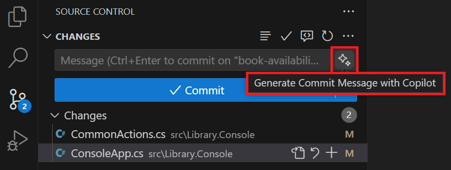
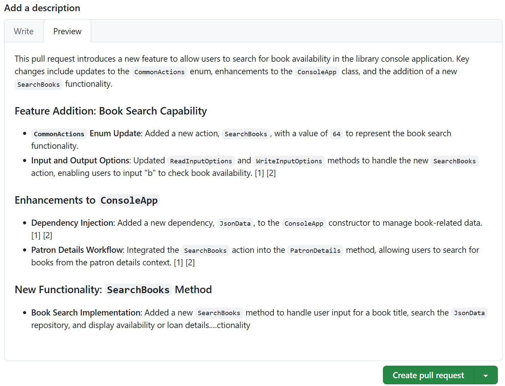

---
lab:
  title: Übung – Entwickeln neuer Codefeatures mit GitHub Copilot
  description: 'Erfahren Sie, wie Sie die Entwicklung neuer Codefeatures mithilfe von GitHub Copilot in Visual Studio Code beschleunigen.'
---

# Entwickeln neuer Codefeatures mithilfe von GitHub Copilot

Die Funktion zur Code-Vervollständigung und zu interaktivem Chat von GitHub Copilot helfen Entwickelnden, Code schneller und mit weniger Fehlern zu schreiben. Sie stellt Vorschläge für Codeausschnitte, Funktionen und sogar ganze Klassen basierend auf dem Kontext des geschriebenen Codes bereit. In dieser Übung verwenden Sie GitHub Copilot, um die Entwicklung neuer Codefunktionen in Visual Studio Code zu beschleunigen.

Diese Übung dauert ca. **30** Minuten.

> **WICHTIG:** Um diese Übung abzuschließen, benötigen Sie ein eigenes GitHub-Konto und ein GitHub Copilot-Abonnement. Falls Sie kein GitHub-Konto haben, können Sie sich für ein kostenloses Einzelkonto <a href="https://github.com/" target="_blank">registrieren</a> und den GitHub Copilot Free-Plan verwenden, um die Übung abzuschließen. Wenn Sie in Ihrer Übungsumgebung Zugriff auf ein GitHub Copilot Pro-, GitHub Copilot Pro+-, GitHub Copilot Business- oder GitHub Copilot Enterprise-Abonnement haben, können Sie Ihr vorhandenes GitHub Copilot-Abonnement für diese Übung verwenden.

## Vor der Installation

Ihre Übungsumgebung muss die folgenden Voraussetzungen erfüllen: Git 2.48 oder höher, .NET SDK 9.0 oder höher, Visual Studio Code mit der C# -Dev-Kit-Erweiterung und Zugriff auf ein GitHub-Konto mit aktiviertem GitHub Copilot.

Wenn Sie einen lokalen PC als Übungsumgebung für diese Übung verwenden, gilt Folgendes:

- Wenn Sie Hilfe beim Konfigurieren Ihres lokalen PCs als Übungsumgebung benötigen, öffnen Sie den folgenden Link in einem Browser: <a href="https://go.microsoft.com/fwlink/?linkid=2320147" target="_blank">Konfigurieren Sie Ihre Ressourcen für die Übungsumgebung</a>.

- Wenn Sie Hilfe beim Aktivieren Ihres GitHub Copilot-Abonnements in Visual Studio Code benötigen, öffnen Sie den folgenden Link in einem Browser: <a href="https://go.microsoft.com/fwlink/?linkid=2320158" target="_blank">Aktivieren von GitHub Copilot in Visual Studio Code</a>.

Wenn Sie eine gehostete Übungsumgebung für diese Übung verwenden, gilt Folgendes:

- Wenn Sie Hilfe beim Aktivieren Ihres GitHub Copilot-Abonnements in Visual Studio Code benötigen, öffnen einen Browser und fügen Sie die folgende URL in die Navigationsleiste ein: <a href="https://go.microsoft.com/fwlink/?linkid=2320158" target="_blank">Aktivieren von GitHub Copilot in Visual Studio Code</a>.

- Öffnen Sie die Eingabeaufforderung und führen Sie dann die folgenden Befehle aus:

    Um sicherzustellen, dass Visual Studio Code für die Verwendung der richtigen Version von .NET konfiguriert ist, führen Sie den folgenden Befehl aus:

    ```bash

    dotnet nuget add source https://api.nuget.org/v3/index.json -n nuget.org

    ```

    Um sicherzustellen, dass Git für die Verwendung Ihres Namens und Ihrer E-Mail-Adresse konfiguriert ist, aktualisieren Sie die folgenden Befehle mit Ihren Informationen und führen Sie sie dann aus:

    ```bash

    git config --global user.name "John Doe"

    ```

    ```bash

    git config --global user.email johndoe@example.com

    ```

## Übungsszenario

Sie sind Entwicklerin bzw. Entwickler und arbeiten in der IT-Abteilung Ihrer lokalen Community. Die Back-End-Systeme, die die öffentliche Bibliothek unterstützen, wurden bei einem Brand zerstört. Ihr Team muss eine temporäre Lösung entwickeln, damit die Mitarbeitenden der Bibliothek ihre Vorgänge verwalten können, bis das System ersetzt werden kann. Ihr Team hat GitHub Copilot ausgewählt, um den Entwicklungsprozess zu beschleunigen.

Eine erste Version Ihrer Bibliotheksanwendung wurde von Endbenutzenden getestet und es werden mehrere zusätzliche Funktionen angefordert. Ihr Team hat sich damit einverstanden erklärt, an den folgenden Funktionen zu arbeiten:

- Buchverfügbarkeit: Ermöglicht es Bibliothekaren, den Verfügbarkeitsstatus eines Buchs zu bestimmen. Diese Funktion soll eine Nachricht anzeigen, die Aufschluss darüber gibt, ob ein Buch ausgeliehen werden kann. Ist das Buch aktuell an eine andere Person ausgeliehen, soll das Rückgabedatum angezeigt werden.

- Buchausleihe: Ermöglicht es Bibliothekaren, ein Buch an einen Kunden auszuleihen (sofern das Buch verfügbar ist). Diese Funktion soll eine Buchausleihoption für eine Person anzeigen, „Loans.json“ mit der neuen Ausleihe aktualisieren und die aktualisierten Ausleihdetails für die Person anzeigen.

- Buchreservierungen: Ermöglicht es Bibliothekaren, ein Buch für einen Kunden zu reservieren (es sei denn, das Buch ist bereits reserviert). Dieses Feature soll einen neuen Buchreservierungsprozess implementieren. Für dieses Feature müssen unter Umständen eine neue Datei namens „Reservations.json“ sowie neue Klassen und Schnittstellen erstellt werden, die zur Unterstützung des Reservierungsprozesses erforderlich sind.

Alle Teammitglieder arbeiten jeweils an einer der neuen Funktionen und kommen anschließend wieder zusammen. Sie werden an der Funktion arbeiten, um den Verfügbarkeitsstatus eines Buches zu ermitteln. Ihr Kollege arbeitet an dem Feature, das es ermöglicht, ein Buch an einen Kunden auszuleihen. Das letzte Feature (also die Buchreservierung für einen Kunden) wird entwickelt, nachdem die beiden anderen Features fertig sind.

Diese Übung umfasst die folgenden Aufgaben:

1. Richten Sie die Bibliotheksanwendung in Visual Studio Code ein.

1. Verwenden von Visual Studio Code zum Erstellen eines GitHub-Repositorys für die Bibliotheksanwendung

1. Erstellen eines Branch für die Buchverfügbarkeit im Coderepository

1. Entwickeln eines neuen Buchverfügbarkeitsfeatures

    - Verwenden von GitHub Copilot-Vorschlägen, um den Code schneller und präziser zu implementieren
    - Synchronisieren Ihrer Codeaktualisierungen mit dem Branch für die Buchverfügbarkeit Ihres Remoterepositorys

1. Führen Sie Ihre Updates zur Buchverfügbarkeit in den Mainbranch des Repositorys zusammen.

## Einrichten der Bibliotheksanwendung in Visual Studio Code

Sie müssen die vorhandene Anwendung herunterladen, die Codedateien extrahieren und dann die Projektmappe in Visual Studio Code öffnen.

Gehen Sie folgendermaßen vor, um die Bibliotheksanwendung einzurichten:

1. Öffnen Sie ein Browserfenster in Ihrer Übungsumgebung.

1. Um eine ZIP-Datei mit der Bibliotheksanwendung herunterzuladen, fügen Sie die folgende URL in die Adressleiste Ihres Browsers ein: [GitHub Copilot-Übung – Entwickeln von Codefeatures](https://github.com/MicrosoftLearning/mslearn-github-copilot-dev/raw/refs/heads/main/DownloadableCodeProjects/Downloads/AZ2007LabAppM3.zip)

    Die ZIP-Datei heißt **AZ2007LabAppM3.zip**.

1. Extrahieren Sie die Dateien aus der Datei **AZ2007LabAppM3.zip**.

    Zum Beispiel:

    1. Navigieren Sie zu dem Ordner mit Downloads in Ihrer Übungsumgebung.

    1. Klicken Sie mit der rechten Maustaste auf **AZ2007LabAppM3.zip** und wählen Sie dann **Alle extrahieren** aus.

    1. Wählen Sie **Dateien nach Extrahierung anzeigen** und dann **Extrahieren** aus.

1. Öffnen Sie den Ordner mit den extrahierten Dateien und kopieren Sie dann den Ordner **AccelerateDevGHCopilot** an einen Speicherort, auf den Sie einfach zugreifen können, z. B. Ihren Windows-Desktop-Ordner.

1. Öffnen Sie den Ordner **AccelerateDevGHCopilot** in Visual Studio Code.

    Zum Beispiel:

    1. Öffnen Sie Visual Studio Code in Ihrer Übungsumgebung.

    1. Wählen Sie in Visual Studio Code im Menü **Datei** die Option **Ordner öffnen** aus.

    1. Navigieren Sie zum Windows-Desktop-Ordner und wählen Sie **AccelerateDevGHCopilot** und dann **Ordner auswählen** aus.

1. Überprüfen Sie in der Visual Studio Code-Ansicht „PROJEKTMAPPEN-EXPLORER“ die folgende Projektmappenstruktur:

    - AccelerateDevGHCopilot\
        - src\
            - Library.ApplicationCore\
            - Library.Console\
            - Library.Infrastructure\
        - tests\
            - UnitTests\

1. Stellen Sie sicher, dass die Lösung erfolgreich erstellt wird.

    Um beispielsweise die Projektmappe in der PROJEKTMAPPEN-EXPLORER-Ansicht zu erstellen, klicken Sie mit der rechten Maustaste auf **AccelerateDevGHCopilot** und wählen Sie anschließend **Erstellen** aus.

    Es werden einige Warnungen angezeigt, es sollten aber keine Fehler auftreten.

## Erstellen des GitHub-Repositorys für Ihren Code

Wenn Sie das GitHub-Repository für Ihren Code erstellen, können Sie Ihre Arbeit mit anderen teilen und am Projekt zusammenarbeiten.

> **HINWEIS:** Sie verwenden Ihr eigenes GitHub-Konto, um ein privates GitHub-Repository für die Bibliotheksanwendung zu erstellen.

Führen Sie die folgenden Schritte aus, um diesen Abschnitt der Übung zu absolvieren:

1. Öffnen Sie ein Browserfenster, und navigieren Sie zu Ihrem GitHub-Konto.

    Die GitHub-Anmeldeseite lautet: [https://github.com/login](https://github.com/login).

1. Melden Sie sich bei Ihrem GitHub-Konto an.

1. Öffnen Sie Ihr GitHub-Kontomenü, und wählen Sie dann **Ihre Repositorys** aus.

1. Wechseln Sie zum Visual Studio Code-Fenster.

1. Öffnen Sie in Visual Studio Code die Ansicht „Quellcodeverwaltung“.

1. Wählen Sie **Publish to GitHub** (Auf GitHub veröffentlichen) aus.

1. Name für das Repository **AccelerateDevGHCopilot**.

    > **HINWEIS:** Wenn Sie nicht bei GitHub in Visual Studio Code angemeldet sind, werden Sie aufgefordert, sich anzumelden. Nachdem Sie sich angemeldet haben, autorisieren Sie Visual Studio Code mit den angeforderten Berechtigungen.

1. Wählen Sie **Im privaten GitHub-Repository veröffentlichen** aus.

1. Beachten Sie, dass Visual Studio Code während des Veröffentlichungsprozesses Statusmeldungen anzeigt.

    Nach Abschluss des Veröffentlichungsprozesses wird eine Meldung angezeigt, dass Ihr Code erfolgreich im von Ihnen angegebenen GitHub-Repository veröffentlicht wurde.

1. Wechseln Sie zum Browserfenster mit Ihrem GitHub-Konto.

1. Öffnen Sie das neue AccelerateDevGHCopilot-Repository in Ihrem GitHub-Konto.

    Wenn Ihr AccelerateDevGHCopilot-Repository nicht angezeigt wird, aktualisieren Sie die Seite. Wenn das Repository immer noch nicht angezeigt wird, führen Sie die folgenden Schritte durch:

    1. Wechseln Sie zu Visual Studio Code.
    1. Öffnen Sie Ihre Benachrichtigungen. Beim Veröffentlichen des neuen Repositorys wurde eine Benachrichtigung generiert.
    1. Wählen Sie **Auf GitHub öffnen** aus, um Ihr Repository zu öffnen.

## Erstellen eines neuen Branch im Repository

Bevor Sie mit der Entwicklung des neuen Buchverfügbarkeitsfeatures beginnen, müssen Sie einen neuen Branch im Repository erstellen. Dadurch können Sie an dem neuen Feature arbeiten, ohne dass sich dies auf den Mainbranch des Repositorys auswirkt. Wenn die neue Funktion bereit ist, können Sie sie in den Mainbranch mergen.

Führen Sie die folgenden Schritte aus, um diesen Abschnitt der Übung zu absolvieren:

1. Stellen Sie sicher, dass die AccelerateDevGHCopilot-Lösung in Visual Studio Code geöffnet ist.

1. Wählen Sie die Ansicht „Quellcodeverwaltung“ aus, und stellen Sie sicher, dass das lokale Repository mit dem Remoterepository synchronisiert wird (Pullen oder Synchronisieren).

1. Wählen Sie links unten im Fenster die Option **main** aus.

1. Um einen neuen Zweig zu erstellen, geben Sie **Buchverfügbarkeit** ein und wählen Sie dann **+ Neuen Zweig erstellen**.

1. Wählen Sie **Branch veröffentlichen** aus, Um den neuen Branch in das Remoterepository zu pushen.

## Entwickeln einer neuen Funktion zur Buchverfügbarkeit

In diesem Abschnitt der Übung lassen Sie sich bei der Implementierung einer neuen Funktion für die Bibliotheksanwendung von GitHub Copilot unterstützen. Die angeforderte Funktion ermöglicht es einer Bibliothekarin oder einem Bibliothekar, zu überprüfen, ob ein Buch zum Ausleihen verfügbar ist, ein gängiges Szenario, das derzeit nicht von Ihrer aktuellen Bibliotheksanwendung unterstützt wird.

Um die Funktion zur Buchverfügbarkeit zu implementieren, müssen Sie die folgenden Updates ausführen:

- Fügen Sie die neue Aktion **SearchBooks** zur Enumeration **CommonActions** hinzu.

- Aktualisieren Sie die Methode **WriteInputOptions** in ConsoleApp.cs.

    - Fügen Sie Unterstützung für die neue Option **CommonActions.SearchBooks** hinzu.
    - Zeigen Sie die Option an, um zu überprüfen, ob ein Buch zum Ausleihen verfügbar ist.

- Aktualisieren Sie die Methode **ReadInputOptions** in ConsoleApp.cs.

    - Fügen Sie Unterstützung für die neue Option **CommonActions.SearchBooks** hinzu.

- Aktualisieren Sie die Methode in **PatronDetails** in ConsoleApp.cs.

    - Fügen Sie **CommonActions.SearchBooks** zu den **Optionen** hinzu, bevor Sie **ReadInputOptions** aufrufen.
    - Fügen Sie **else if** hinzu, um die Aktion **SearchBooks** zu handhaben.
    - Der **else if**-Block sollte eine neue Methode namens **SearchBooks** aufrufen.

- Erstellen Sie eine neue **SearchBooks**-Methode in ConsoleApp.cs.

    - Die Methode **SearchBooks** sollte einen von Benutzenden bereitgestellten Buchtitel lesen.
    - Überprüfen Sie, ob ein Buch zur Ausleihe verfügbar ist, und zeigen lassen Sie eine Meldung mit folgenden Angaben anzeigen:

        - „**book.title** ist zum Ausleihen verfügbar“ oder
        - „**book.title** ist derzeit von einer anderen Person ausgeliehen. Das Rückgabedatum ist **loan.DueDate**.“

GitHub Copilot Chat kann Ihnen bei der Implementierung der Code-Updates helfen, die zum Fertigstellen der neuen Funktion erforderlich sind.

- Sie können Inline-Chat-Sitzungen verwenden, um kleinere, diskretere Code-Updates basierend auf Ihren Anforderungen zu implementieren.
- Sie können die Chat-Ansicht verwenden, um an größeren Code-Updates zu arbeiten, die möglicherweise einen Unterhaltungsansatz und einen iterativeren Ansatz erfordern.

### Implementieren von Updates zur Buchverfügbarkeit mit Inline-Chat

Mit Inline-Chat-Sitzungen können Sie direkt in Ihrem Code-Editor mit GitHub Copilot interagieren. Sie können den Inline-Chat verwenden, um Fragen zu stellen, Codevorschläge anzufordern und Erklärungen für den von GitHub Copilot generierten Code zu erhalten.

Führen Sie die folgenden Schritte aus, um diesen Abschnitt der Übung zu absolvieren:

1. Öffnen Sie die Ansicht „PROJEKTMAPPEN-EXPLORER“.

1. Öffnen Sie das Projekt **Library.Console**.

1. Öffnen Sie die Datei „CommonActions.cs“ und wählen Sie dann die **CommonActions**-Enumeration aus.

    Sie müssen die neue Aktion **SearchBooks** zu **CommonActions** hinzufügen.

1. Öffnen Sie den Inlinechat, und geben Sie folgenden Prompt ein:

    ```plaintext
    Update selection to include a new `SearchBooks` action.
    ```

    GitHub Copilot sollte eine Codeaktualisierung vorschlagen, die die neue Aktion **SearchBooks** zur Enumeration **CommonActions** hinzufügt.

1. Überprüfen Sie die vorgeschlagene Aktualisierung, und wählen Sie anschließend **Annehmen** aus.

    Ihr aktualisierter Code sollte dem folgenden Codeschnipsel ähneln:

    ```csharp

    public enum CommonActions
    {
        Repeat = 0,
        Select = 1,
        Quit = 2,
        SearchPatrons = 4,
        RenewPatronMembership = 8,
        ReturnLoanedBook = 16,
        ExtendLoanedBook = 32,
        SearchBooks = 64
    }

    ```

1. Öffnen Sie die Datei „ConsoleApp.cs“.

1. Suchen Sie die **WriteInputOptions**-Methode und wählen Sie diese aus.

    Sie müssen Unterstützung für die neue Option **CommonActions.SearchBooks** hinzufügen. Wenn die Option **SearchBooks** ausgewählt wird, soll angezeigt werden, ob ein Buch zum Ausleihen verfügbar ist.

1. Öffnen Sie den Inlinechat, und geben Sie folgenden Prompt ein:

    ```plaintext
    Update selection to include an option for the `CommonActions.SearchBooks` action. Use the letter "b" and the message "to check for book availability".
    ```

    GitHub Copilot sollte ein Code-Update vorschlagen, das einen neuen **if**-Block für die Aktion **SearchBooks** hinzufügt.

1. Überprüfen Sie die vorgeschlagene Aktualisierung, und wählen Sie anschließend **Annehmen** aus.

    Die vorgeschlagene Aktualisierung sollte in etwa wie der folgende Codeschnipsel aussehen:

    ```csharp

    static void WriteInputOptions(CommonActions options)
    {
        Console.WriteLine("Input Options:");
        if (options.HasFlag(CommonActions.ReturnLoanedBook))
        {
            Console.WriteLine(" - \"r\" to mark as returned");
        }
        if (options.HasFlag(CommonActions.ExtendLoanedBook))
        {
            Console.WriteLine(" - \"e\" to extend the book loan");
        }
        if (options.HasFlag(CommonActions.RenewPatronMembership))
        {
            Console.WriteLine(" - \"m\" to extend patron's membership");
        }
        if (options.HasFlag(CommonActions.SearchPatrons))
        {
            Console.WriteLine(" - \"s\" for new search");
        }
        if (options.HasFlag(CommonActions.SearchBooks))
        {
            Console.WriteLine(" - \"b\" to check for book availability");
        }
        if (options.HasFlag(CommonActions.Quit))
        {
            Console.WriteLine(" - \"q\" to quit");
        }
        if (options.HasFlag(CommonActions.Select))
        {
            Console.WriteLine("Or type a number to select a list item.");
        }
    }

    ```

1. Scrollen Sie etwas nach oben, um die Methode **ReadInputOptions** zu finden und dann auszuwählen.

    Sie müssen erneut Unterstützung für die neue Option **CommonActions.SearchBooks** hinzufügen. Schließen Sie einen Fall ein, der das Auswählen der Aktion **SearchBooks** durch Benutzende behandelt.

1. Öffnen Sie den Inlinechat, und geben Sie folgenden Prompt ein:

    ```plaintext
    Update selection to include an option for the `CommonActions.SearchBooks` action.
    ```

    GitHub Copilot sollte ein Code-Update vorschlagen, das einen neuen **Fall** hinzufügt, der die Auswahl der Aktion **SearchBooks** durch Benutzende behandelt.

1. Überprüfen Sie die vorgeschlagene Aktualisierung, und wählen Sie anschließend **Annehmen** aus.

    Die vorgeschlagene Aktualisierung sollte in etwa wie der folgende Codeschnipsel aussehen:

    ```csharp

    static CommonActions ReadInputOptions(CommonActions options, out int optionNumber)
    {
        CommonActions action;
        optionNumber = 0;
        do
        {
            Console.WriteLine();
            WriteInputOptions(options);
            string? userInput = Console.ReadLine();

            action = userInput switch
            {
                "q" when options.HasFlag(CommonActions.Quit) => CommonActions.Quit,
                "s" when options.HasFlag(CommonActions.SearchPatrons) => CommonActions.SearchPatrons,
                "m" when options.HasFlag(CommonActions.RenewPatronMembership) => CommonActions.RenewPatronMembership,
                "e" when options.HasFlag(CommonActions.ExtendLoanedBook) => CommonActions.ExtendLoanedBook,
                "r" when options.HasFlag(CommonActions.ReturnLoanedBook) => CommonActions.ReturnLoanedBook,
                "b" when options.HasFlag(CommonActions.SearchBooks) => CommonActions.SearchBooks,
                _ when int.TryParse(userInput, out optionNumber) => CommonActions.Select,
                _ => CommonActions.Repeat
            };

            if (action == CommonActions.Repeat)
            {
                Console.WriteLine("Invalid input. Please try again.");
            }
        } while (action == CommonActions.Repeat);
        return action;
    }

    ```

1. Scrollen Sie nach unten, um die Methode **PatronDetails** zu finden und auszuwählen.

    Hier sind zwei Aktionen erforderlich:

    - Sie müssen **CommonActions.SearchBooks** zu den **Optionen** hinzufügen, bevor Sie **ReadInputOptions** aufrufen.
    - Sie müssen auch ein **else if** hinzufügen, um die Aktion **SearchBooks** zu verarbeiten. Der **else if**-Block sollte eine neue Methode namens **SearchBooks** aufrufen.

    Sie können beide Anforderungen mit demselben Prompt erfüllen.

1. Öffnen Sie den Inlinechat, und geben Sie folgenden Prompt ein:

    ```plaintext
    Update selection to add `CommonActions.SearchBooks` to `options` before calling `ReadInputOptions`. Add an `else if` block to handle the `SearchBooks` action. The `else if` block should call a new method named `SearchBooks`.
    ```

    GitHub Copilot sollte ein Codeupdate vorschlagen, das **CommonActions.SearchBooks** zu den **Optionen** hinzufügt, bevor **ReadInputOptions** aufgerufen wird.

1. Überprüfen Sie die vorgeschlagene Aktualisierung, und wählen Sie anschließend **Annehmen** aus.

    ```csharp

    async Task<ConsoleState> PatronDetails()
    {
        Console.WriteLine($"Name: {selectedPatronDetails.Name}");
        Console.WriteLine($"Membership Expiration: {selectedPatronDetails.MembershipEnd}");
        Console.WriteLine();
        Console.WriteLine("Book Loans:");
        int loanNumber = 1;
        foreach (Loan loan in selectedPatronDetails.Loans)
        {
            Console.WriteLine($"{loanNumber}) {loan.BookItem!.Book!.Title} - Due: {loan.DueDate} - Returned: {(loan.ReturnDate != null).ToString()}");
            loanNumber++;
        }

        CommonActions options = CommonActions.SearchPatrons | CommonActions.Quit | CommonActions.Select | CommonActions.RenewPatronMembership | CommonActions.SearchBooks;
        CommonActions action = ReadInputOptions(options, out int selectedLoanNumber);
        if (action == CommonActions.Select)
        {
            if (selectedLoanNumber >= 1 && selectedLoanNumber <= selectedPatronDetails.Loans.Count())
            {
                var selectedLoan = selectedPatronDetails.Loans.ElementAt(selectedLoanNumber - 1);
                selectedLoanDetails = selectedPatronDetails.Loans.Where(l => l.Id == selectedLoan.Id).Single();
                return ConsoleState.LoanDetails;
            }
            else
            {
                Console.WriteLine("Invalid book loan number. Please try again.");
                return ConsoleState.PatronDetails;
            }
        }
        else if (action == CommonActions.Quit)
        {
            return ConsoleState.Quit;
        }
        else if (action == CommonActions.SearchPatrons)
        {
            return ConsoleState.PatronSearch;
        }
        else if (action == CommonActions.RenewPatronMembership)
        {
            var status = await _patronService.RenewMembership(selectedPatronDetails.Id);
            Console.WriteLine(EnumHelper.GetDescription(status));
            // reloading after renewing membership
            selectedPatronDetails = (await _patronRepository.GetPatron(selectedPatronDetails.Id))!;
            return ConsoleState.PatronDetails;
        }
        else if (action == CommonActions.SearchBooks)
        {
            return await SearchBooks();
        }

        throw new InvalidOperationException("An input option is not handled.");
    }

    ```

    > **HINWEIS:** Der von Inline-Chat vorgeschlagene Code kann Stubcode für die Methode **SearchBooks** enthalten. Sie können diesen Code akzeptieren. Im nächsten Abschnitt werden Sie die Methode **SearchBooks** implementieren.

### Implementieren einer SearchBooks-Methode mithilfe der Chat-Ansicht

Es gibt noch einen Schritt, um die Updates zur Buchverfügbarkeit zu implementieren. Erstellen Sie die Methode **SearchBooks**. Die **SearchBooks**-Methode liest einen von Benutzenden bereitgestellten Buchtitel, überprüft, ob ein Buch für die Ausleihe verfügbar ist und zeigt eine Meldung an, die den Verfügbarkeitsstatus des Buchs angibt. Sie verwenden die Chat-Ansicht, um die Anforderungen auszuwerten und die Methode **SearchBooks** zu implementieren.

Die Chat-Ansicht von GitHub Copilot bietet eine dialogorientierte und interaktive Umgebung, die bei der Verwendung von Inline-Chat nicht verfügbar ist. Sie können die Chat-Ansicht verwenden, um Fragen zu stellen, Codevorschläge anzufordern und Erklärungen für den von GitHub Copilot generierten Code zu erhalten. Die Chat-Ansicht unterstützt die folgenden drei Modi:

- Modus „Fragen“: Der Modus „Fragen“ wird verwendet, um ein besseres Verständnis ihrer Codebasis zu erhalten, Brainstorming von Ideen zu unterstützen und bei Programmieraufgaben zu helfen. Die im Modus „Fragen“ generierten Codevorschläge können direkt in Ihre Codebasis implementiert oder in die Zwischenablage kopiert werden.
- Modus „Bearbeiten“ Der Modus „Bearbeiten“ wird verwendet, um Änderungen an Ihrem Code vorzunehmen, z. B. beim Umgestalten oder Hinzufügen neuer Funktionen. Im Modus „Bearbeiten“ können Sie Änderungen an mehreren Dateien in Ihrem Projekt vornehmen.
- Modus „Agent“: Der Modus „Agent“ wird verwendet, um eine übergeordnete Aufgabe zu definieren und eine agentengestützte Codebearbeitungssitzung zu starten, in der diese Aufgabe ausgeführt wird. Im Modus „Agent“ plant Copilot autonom die benötigten Arbeiten und bestimmt die relevanten Dateien und Kontexte. Der Agent kann Änderungen an Ihrem Code vornehmen, Tests ausführen und sogar Ihre Anwendung bereitstellen.

Sie verwenden die Modi „Fragen“ und „Bearbeiten“, um die Methode **SearchBooks** zu implementieren.

Führen Sie die folgenden Schritte aus, um diesen Abschnitt der Übung zu absolvieren:

1. Nehmen Sie sich kurz Zeit, um sich Gedanken über die Prozessanforderungen für die Methode **SearchBooks** zu machen.

    Was ist der Prozess, den die Methode durchführen muss? Was ist der Rückgabetyp für diese Methode? Benötigt sie Parameter?

    Die Methode **SearchBooks** sollte den folgenden Prozess implementieren:

    1. Auffordern des Benutzers zur Eingabe eines Buchtitels
    1. Lesen des vom Benutzer angegebenen Buchtitels
    1. Überprüfen, ob ein Buch zum Ausleihen verfügbar ist.
    1. Anzeigen einer Nachricht mit einer der folgenden Aussagen:

        - „**{book.title}** ist zum Ausleihen verfügbar"
        - „**{book.title}** ist derzeit von einer anderen Person ausgeliehen. Das Rückgabedatum ist **{loan.DueDate}**."

    Um die Nachrichtenoptionen zu erstellen, muss Ihr Code auf die folgenden JSON-Dateien zugreifen:

    - **Books.json** ist erforderlich, um den übereinstimmenden **Titel** und die **BookId** zu finden.
    - **Loans.json** ist erforderlich, um das **ReturnDate** und **DueDate** für die entsprechende **BookItemId** zu finden. Die **BookItemId** ist identisch mit der **BookId** in **Books.json**.

1. Stellen Sie sicher, dass Sie die folgende **SearchBooks**-Methode in der Datei ConsoleApp.cs erstellt haben:

    ```csharp

    async Task<ConsoleState> SearchBooks()
    {

        return ConsoleState.PatronDetails;
    }

    ```

    > **HINWEIS:** Entfernen Sie unbedingt alle ggf. von GitHub Copilot erstellten Codekommentare. Unnötige und ungenaue Kommentare können die Vorschläge von GitHub Copilot negativ beeinflussen.

1. Wählen Sie die **SearchBooks**-Methode aus.

1. Öffnen Sie die Chatansicht, und geben Sie dann die folgende Eingabeaufforderung ein:

    ```plaintext
    Update selection to obtain a book title. Prompt the user to "Enter a book title to search for". Read the user input and ensure the book title isn't null.
    ```

1. Überprüfen Sie das vorgeschlagene Update.

    Die vorgeschlagene Aktualisierung sollte in etwa wie der folgende Codeschnipsel aussehen:

    ```csharp

    async Task<ConsoleState> SearchBooks()
    {
        string? bookTitle = null;
        while (string.IsNullOrWhiteSpace(bookTitle))
        {
            Console.Write("Enter a book title to search for: ");
            bookTitle = Console.ReadLine();
        }
    
        // Placeholder for further logic to search for the book
        Console.WriteLine($"Searching for the book titled \"{bookTitle}\"...");
    
        return ConsoleState.PatronDetails;
    }

    ```

1. Zeigen Sie mit dem Mauszeiger auf den vorgeschlagenen Code, und wählen Sie dann **Auf src\\Library.Console\\ConsoleApp.cs** anwenden.

    Der vorgeschlagene Code sollte im Code-Editor mit Optionen zum **„Behalten“** oder **„Rückgängigmachen“** angezeigt werden.

1. Wählen Sie im Code-Editor die Option **„Behalten“** aus, um den vorgeschlagenen Code zu akzeptieren.

1. Wählen Sie die **SearchBooks**-Methode aus.

1. Fügen Sie die folgenden Dateien per Drag-and-Drop zum Chat-Kontext hinzu:

    (aus dem Projekt „Library.Console“)
    - ConsoleApp.cs
    - Program.cs
    - Books.json
    - Loans.json
    - BookItems.json

    (aus dem Projekt Library.Infrastructure)
    - JsonData.cs
    - JsonLoanRepository.cs

1. Geben Sie den folgenden Prompt ein:

    ```plaintext
    @workspace  Explain how to update the `SearchBooks` method and ConsoleApps class to find a matching book title in the `Books.json` file. Use the user supplied book title to find a matching book. If a book is found, use Loans.json to check if the book is available for loan. If the book has been returned, display a message stating "`book.title` is available for loan". If the book is on loan, display a message stating "`book.title` is on loan to another patron. The return due date is `loan.DueDate`".
    ```

1. Nehmen Sie sich einen Moment Zeit, um die vorgeschlagenen Aktualisierungen zu überprüfen.

    Beachten Sie Folgendes:

    - Die Antwort enthält eine detaillierte Erläuterung der vorgeschlagenen Updates.
    - Für die ConsoleApp-Klasse ist ein JsonData-Objekt erforderlich, um auf Books.json und Loans.json zuzugreifen. Der vorgeschlagene Code verwendet die Abhängigkeitsinjektion, um das JsonData-Objekt an den ConsoleApp-Klassenkonstruktor zu übergeben.
    - Die Methode „SearchBooks“ muss mit einer Logik aktualisiert werden, die die Verfügbarkeit des Buchtitels bestimmt und eine entsprechende Meldung anzeigt. Der vorgeschlagene Code verwendet LINQ-Abfragen, um den Ausleihstatus zu überprüfen.
    - Die Datei Program.cs muss aktualisiert werden, um das JsonData-Objekt an die ConsoleApp-Klasse zu übergeben.

    Die Antwort sollte die folgenden Informationen enthalten:

    ```plaintext

    1. Dependency Injection:
    
        Added JsonData as a dependency to the ConsoleApp constructor to access the JSON data files.

    2. Book Search:
    
        Used FirstOrDefault to find a book in Books.json that matches the user-supplied title (case-insensitive).

    3. Book Item Lookup:
    
        Retrieved the corresponding BookItem using the BookId from BookItems.json.

    4. Loan Check:
    
        Checked Loans.json for an active loan (i.e., a loan with a null ReturnDate) for the BookItem.

    5. Output Messages:
    
        Displayed whether the book is available for loan or currently on loan with the due date.

    Integration in Program.cs

        Ensure that JsonData is registered in the dependency injection container in Program.cs:

    ```

    Sie können den Modus **Fragen** der Chat-Ansicht verwenden, um Code-Updates zu analysieren und dann den Modus **Bearbeiten** nutzen, um die Code-Updates zu implementieren.

1. Verwenden Sie die Antwort von GitHub Copilot, um einen neuen Prompt zu erstellen.

    Sie können z. B. den Erläuterungsabschnitt verwenden, um den folgenden Prompt zu erstellen:

    ```plaintext

    Add JsonData as a dependency to the ConsoleApp constructor to access the JSON data files. Use FirstOrDefault to find a book in Books.json that matches the user-supplied title (case-insensitive). Retrieve the corresponding BookItem using the BookId from BookItems.json. Check Loans.json for an active loan (loan.ReturnDate == null) for the BookItem. Display whether the book is available for loan or currently on loan with the due date. Ensure that JsonData is registered in the dependency injection container in Program.cs.

    ```

    Sie können den Prompt anpassen, um bestimmte Anforderungen zu erfüllen. Wenn dem Endbenutzer beispielsweise eine bestimmte Meldung angezeigt werden soll, können Sie dem Prompt Ihre Anforderung hinzufügen:

    ```plaintext

    Add JsonData as a dependency to the ConsoleApp constructor to access the JSON data files. Use FirstOrDefault to find a book in Books.json that matches the user-supplied title (case-insensitive). Retrieve the corresponding BookItem using the BookId from BookItems.json. Check Loans.json for an active loan (loan.ReturnDate == null) for the BookItem. Display whether the book is available for loan or currently on loan with the due date. Ensure that JsonData is registered in the dependency injection container in Program.cs. If the book has been returned, display a message stating "`book.title` is available for loan". If the book is on loan, display a message stating "`book.title` is on loan to another patron. The return due date is `loan.DueDate`".

    ```

1. Um in der Chat-Ansicht in den Modus „Bearbeitung“ zu wechseln, wählen Sie **Modus festlegen** und dann **Bearbeiten** aus.

    Wenn Sie aufgefordert werden, eine neue Sitzung zu starten, wählen Sie **Ja** aus.

1. Fügen Sie die folgenden Dateien per Drag-and-Drop zum Chat-Kontext hinzu:

    (aus dem Projekt „Library.Console“)
    - ConsoleApp.cs
    - Program.cs
    - Books.json
    - Loans.json
    - BookItems.json

    (aus dem Projekt Library.Infrastructure)
    - JsonData.cs
    - JsonLoanRepository.cs

1. Wählen Sie die **SearchBooks**-Methode aus.

1. Geben Sie den folgenden Prompt ein:

    ```plaintext

    Add JsonData as a dependency to the ConsoleApp constructor to access the JSON data files. Use FirstOrDefault to find a book in Books.json that matches the user-supplied title (case-insensitive). Retrieve the corresponding BookItem using the BookId from BookItems.json. Check Loans.json for an active loan (loan.ReturnDate == null) for the BookItem. Display whether the book is available for loan or currently on loan with the due date. Ensure that JsonData is registered in the dependency injection container in Program.cs. If the book has been returned, display a message stating "`book.title` is available for loan". If the book is on loan, display a message stating "`book.title` is on loan to another patron. The return due date is `loan.DueDate`".

    ```

1. Nehmen Sie sich kurz Zeit, um die vorgeschlagenen Updates in der Datei ConsoleApp.cs zu überprüfen.

    Sie können **Zurück** und **Weiter** verwenden, um durch die vorgeschlagenen Code-Updates zu navigieren, oder Sie können manuell durch die Datei scrollen.

    **ConsoleApp.cs**

    Codeupdates, die die **JsonData**-Abhängigkeit zum **ConsoleApp**-Konstruktor hinzufügen, finden Sie am oberen Rand der ConsoleApp-Klasse.

    ```csharp

    JsonData _jsonData;

    public ConsoleApp(ILoanService loanService, IPatronService patronService, IPatronRepository patronRepository, ILoanRepository loanRepository, JsonData jsonData)
    {
        _patronRepository = patronRepository;
        _loanRepository = loanRepository;
        _loanService = loanService;
        _patronService = patronService;
        _jsonData = jsonData;
    }

    ```

    Codeaktualisierungen, die überprüfen, ob ein Buch zum Ausleihen verfügbar ist, finden Sie in der Methode **SearchBooks-**.

    ```csharp

    async Task<ConsoleState> SearchBooks()
    {
        string? bookTitle = null;
        while (string.IsNullOrWhiteSpace(bookTitle))
        {
            Console.Write("Enter a book title to search for: ");
            bookTitle = Console.ReadLine();
        }

        await _jsonData.EnsureDataLoaded();

        var book = _jsonData.Books!.FirstOrDefault(b => string.Equals(b.Title, bookTitle, StringComparison.OrdinalIgnoreCase));
        if (book == null)
        {
            Console.WriteLine($"No book found with the title \"{bookTitle}\".");
            return ConsoleState.PatronDetails;
        }

        var bookItem = _jsonData.BookItems!.FirstOrDefault(bi => bi.BookId == book.Id);
        if (bookItem == null)
        {
            Console.WriteLine($"No book item found for the title \"{book.Title}\".");
            return ConsoleState.PatronDetails;
        }

        var loan = _jsonData.Loans!.FirstOrDefault(l => l.BookItemId == bookItem.Id && l.ReturnDate == null);
        if (loan == null)
        {
            Console.WriteLine($"\"{book.Title}\" is available for loan.");
        }
        else
        {
            Console.WriteLine($"\"{book.Title}\" is on loan to another patron. The return due date is {loan.DueDate}.");
        }

        return ConsoleState.PatronDetails;
    }

    ```

    **Program.cs**

    Code zum Registrieren von JsonData und ConsoleApp für die Abhängigkeitsinjektion war bereits in der Datei Program.cs verfügbar.

    ```csharp

    services.AddSingleton<JsonData>();
    services.AddSingleton<ConsoleApp>();

    ```

1. Wählen Sie in der Chat-Ansicht die Option **Behalten** aus, um alle Bearbeitungen beizubehalten.

    Überprüfen Sie Vorschläge von GitHub Copilot immer, bevor Sie Updates akzeptieren.

    Wenn Sie sich bei den vorgeschlagenen Updates nicht sicher sind, können Sie Änderungen annehmen und dann GitHub Copilot um eine Erläuterung bitten. Sie können die Bearbeitungen wieder rückgängig machen, wenn Sie sich gegen die Updates entscheiden.

    > **HINWEIS:** Wenn GitHub Copilot die Formatierung des Rückgabedatums mithilfe eines kulturspezifischen Formats vorschlägt, stellen Sie sicher, dass eine `using System.Globalization;`-Anweisung am Anfang der Datei ConsoleApp.cs hinzugefügt wird.

1. Stellen Sie sicher, dass Sie Updates in den beiden Dateien ConsoleApp.cs und Program.cs akzeptiert haben.

1. Scrollen Sie zum Anfang der Datei ConsoleApp.cs und suchen Sie die folgende Codezeile:

    ```csharp

    JsonData _jsonData;

    ```

1. Wenn JsonData in der ConsoleApp-Klasse nicht erkannt wird, fügen Sie die folgende using-Anweisung oberhalb der ConsoleApp-Klasse hinzu.

    ```csharp
    
    using Library.Infrastructure.Data;
    
    ```

1. Öffnen Sie die PROJEKTMAPPEN-EXPLORER-Ansicht von Visual Studio Code.

1. Erstellen Sie die Lösung und stellen Sie sicher, dass durch die Code-Updates keine Fehler entstanden sind.

    Es werden zwar Warnmeldungen angezeigt, es sollten aber keine Fehler auftreten.

    Um die Projektmappe in der PROJEKTMAPPEN-EXPLORER-Ansicht zu erstellen, können Sie mit der rechten Maustaste auf **AccelerateDevGHCopilot** klicken und anschließend **Erstellen** auswählen.

## Mergen Ihrer Updates zur Buchverfügbarkeit in den Mainbranch des Repositorys

Es ist wichtig, den Code vor dem Mergen in den Hauptzweig des Repositorys zu testen. Durch Tests wird sichergestellt, dass Ihr Code erwartungsgemäß funktioniert und keine neuen Probleme mit sich bringt. In dieser Übung verwenden Sie manuelle Tests, um zu überprüfen, ob die Funktion „Buchverfügbarkeit“ wie erwartet funktioniert.

In diesem Abschnitt der Übung werden folgende Aufgaben ausgeführt:

1. Testen Sie die Funktion „Buchverfügbarkeit“.
1. Synchronisieren Sie Ihre Änderungen mit dem Remoterepository.
1. Erstellen eines Pull Requests, um Ihre Änderungen im Mainbranch des Repositorys zu mergen

### Testen der Funktion „Buchverfügbarkeit“

Manuelle Tests können verwendet werden, um zu überprüfen, ob die neue Funktion wie erwartet funktioniert. Es ist wichtig, eine überprüfbare Datenquelle zu verwenden. In diesem Fall verwenden Sie die Dateien **Books.json** und **Loans.json**, um zu überprüfen, ob die neue Funktion den Verfügbarkeitsstatus eines Buches korrekt meldet.

Führen Sie die folgenden Schritte aus, um diesen Abschnitt der Übung zu absolvieren:

1. Klicken Sie zum Ausführen der Anwendung mit der rechten Maustaste auf **Library.Console**, wählen Sie **Debuggen** aus, und wählen Sie anschließend **Neue Instanz starten** aus.

1. Wenn Sie zur Eingabe eines Kundennamens aufgefordert werden, geben Sie **One** ein, und drücken Sie anschließend die EINGABETASTE.

    Daraufhin sollte eine Liste mit Kunden angezeigt werden, die der Suchabfrage entsprechen.

1. Geben Sie an der Eingabeaufforderung „Eingabeoptionen“ die Zahl **2** ein, und drücken Sie anschließend die EINGABETASTE.

    Durch Eingeben von **2** wird der zweite Kunde in der Liste ausgewählt.

    Daraufhin sollten der Name und der Mitgliedschaftsstatus des Kunden angezeigt werden, gefolgt von Details zur Buchausleihe.

1. Geben Sie an der Eingabeaufforderung „Eingabeoptionen“ die Option **b** ein, und drücken Sie anschließend die EINGABETASTE.

    Durch Eingabe von **b** wird die Option für die Suche nach dem Verfügbarkeitsstatus eines Buchs ausgewählt.

    Daraufhin sollte eine Aufforderung zur Eingabe eines Buchtitels angezeigt werden.

1. Geben Sie **Book One** ein, und drücken Sie anschließend die EINGABETASTE.

    In den ursprünglichen Daten, die Sie heruntergeladen haben, ist **Book One** derzeit von **Patron Forty-Nine** ausgeliehen und sollte daher nicht verfügbar sein.

1. Vergewissern Sie sich, dass in der Anwendung eine Nachricht mit dem Hinweis angezeigt wird, dass das Buch von einem anderen Kunden ausgeliehen wurde.

1. Geben Sie an der Eingabeaufforderung „Eingabeoptionen“ die Option **b** ein, und drücken Sie anschließend die EINGABETASTE.

1. Geben Sie **Book Nineteen** ein und drücken Sie anschließend die Eingabetaste.

1. Vergewissern Sie sich, dass in der Anwendung eine Nachricht mit dem Hinweis angezeigt wird, dass das Buch zum Ausleihen verfügbar ist.

1. Geben Sie an der Eingabeaufforderung „Eingabeoptionen“ die Option **q** ein, und drücken Sie anschließend die EINGABETASTE.

1. Beenden Sie die Debugsitzung.

1. Verwenden Sie die EXPLORER-Ansicht, um die Datei **Loans.json** zu suchen und zu öffnen.

    Die Datei Loans.json wird verwendet, um den Ausleihstatus jedes einzelnen Buches nachzuverfolgen. Mit der Datei Loans.json können Sie überprüfen, ob der Verfügbarkeitsstatus von „Book One“ und „Book Nineteen“ korrekt ist.

    Die aktualisierte Loans.json Datei sollte sich entweder im Ordner **ibrary.Console\bin\Debug\net8.0\Json** oder im Ordner **Library.Console\Json** befinden.

    - Wenn Sie den Visual Studio Code-Debugger zum Ausführen der App verwenden, sollte sich die aktualisierte Datei „Loans.json“ im Ordner **Library.Console\bin\Debug\net8.0\Json** befinden.

    - Wenn Sie die App mit dem Befehl **dotnet run** aus dem Ordner **AccelerateDevGHCopilot\src\Library.Console** ausführen, sollte sich die aktualisierte Datei „Loans.json“ im Ordner **Library.Console\Json** befinden.

1. Vergewissern Sie sich, dass die Ausleih-ID 37 und die Ausleih-ID 46 beide für „Book One“ (**„BookItemId“: 1**) gelten.

    Die Ausleih-IDs werden in der Datei „Loans.json“ sequenziell aufgeführt.

    - Die Ausleih-ID 37 sollte einen Wert **ReturnDate** von **2024-01-17** aufweisen, der angibt, dass das Buch an diesem Datum zurückgegeben wurde.
    - Die Ausleih-ID 46 sollte einen Wert **ReturnDate** **null** haben, der angibt, dass das Buch zurzeit aufgeliehen ist (ausgeliehen am **2024-07-09**, aber nicht zurückgegeben).

    Der Wert **ReturnDate** wird verwendet, um zu bestimmen, ob das Buch derzeit ausgeliehen ist. Wenn der Wert **ReturnDate** null ist, gilt das Buch als ausgeliehen.

1. Überprüfen Sie, ob die Ausleih-ID 34 für „Book Nineteen“ (**"BookItemId": 19**) gilt und dem **ReturnDate** ein Wert zugewiesen wurde.

### Synchronisieren Ihrer Änderungen mit dem Remoterepository

1. Wählen Sie die Ansicht „Quellcodeverwaltung“ aus.

1. Stellen Sie sicher, dass die aktualisierten Dateien unter **Änderungen** aufgeführt sind.

    Stellen Sie sicher, dass die Dateien „CommonActions.cs“, „ConsoleApp.cs“ und „JsonData.cs“ unter **Änderungen** aufgeführt sind. Die Datei Program.cs wird möglicherweise auch aufgeführt.

1. Verwenden Sie GitHub Copilot, um eine Nachricht für den **Commit** zu generieren.

    

1. Wählen Sie **Committen** und anschließend **Ja** aus, um Ihre Änderungen zu stagen und zu committen.

1. Um Änderungen am Remoterepository zu synchronisieren, wählen Sie **Änderungen synchronisieren** aus.

### Erstellen eines Pull Requests, um Ihre Änderungen im Mainbranch zu mergen

Sie haben die neue Funktion implementiert, die es Bibliothekarinnen und Bibliothekaren ermöglicht, den Verfügbarkeitsstatus eines Buchs zu ermitteln. Nun müssen Sie Ihre Änderungen im Mainbranch des Repositorys mergen. Sie können einen Pull Request erstellen, um Ihre Änderungen im Mainbranch zu mergen.

Führen Sie die folgenden Schritte aus, um diesen Abschnitt der Übung zu absolvieren:

1. Öffnen Sie Ihr GitHub-Repository in einem Webbrowser.

    So öffnen Sie Ihr GitHub-Repository aus Visual Studio Code:

    1. Wählen Sie in der unteren linken Ecke von Visual Studio Code **book-availability** aus.
    1. Wählen Sie im Kontextmenü rechts neben dem Branch **book-availability** das Symbol **In GitHub öffnen** aus.

1. Wählen Sie auf der Seite des GitHub-Repositorys die Registerkarte **Vergleichs- und Pull Request** aus.

1. Stellen Sie sicher, dass **Base** **main** angibt, **compare** **book-availability** angibt und **Able to merge** aktiviert ist.

1. Wählen Sie unter **Beschreibung hinzufügen** die Schaltfläche „Copilot-Aktionen“ (das GitHub Copilot-Symbol) und dann die Option zum Generieren einer Zusammenfassung aus.

    > **HINWEIS:** Der GitHub Copilot Free-Plan unterstützt derzeit die Funktion der Zusammenfassung des Pull Request nicht.

    Wenn Sie den GitHub Copilot Free-Plan verwenden, können Sie Ihre eigene Zusammenfassung schreiben oder die nachstehende Zusammenfassung verwenden, um den Pull Request abzuschließen.

    ```plaintext

    This pull request introduces a new feature to the library console application: the ability to search for books and check their availability. It also includes updates to dependency injection and the CommonActions enumeration to support this functionality. Below are the most important changes grouped by theme.

    New Feature: Book Search

    Added a new SearchBooks action to the CommonActions enumeration (src/Library.Console/CommonActions.cs).

    Updated PatronDetails method to handle the SearchBooks action, including a new SearchBooks method that allows users to search for a book by title and check its availability (src/Library.Console/ConsoleApp.cs).

    Modified ReadInputOptions and WriteInputOptions methods to include the new SearchBooks option (src/Library.Console/ConsoleApp.cs).

    Dependency Injection Updates

    Added JsonData as a dependency in the ConsoleApp constructor and ensured it is registered in the DI container before ConsoleApp (src/Library.Console/ConsoleApp.cs, src/Library.Console/Program.cs).

    ```

1. Nachdem die Zusammenfassung generiert wurde, wählen Sie **Vorschau** aus.

1. Nehmen Sie sich einen Moment Zeit, um die Aktualisierungen zu überprüfen.

    Die von GitHub Copilot generierte Zusammenfassung des Pull Request sollte dem folgenden Beispiel ähneln:

    

1. Klicken Sie auf **Pull Request erstellen**.

1. Wenn alle Prüfungen ohne Konflikte mit der Basisverzweigung beendet wurden, wählen Sie **Pull Request zusammenführen** und wählen dann **Zusammenführen bestätigen** aus.

    Beachten Sie, dass Sie den Zweig **Buchverfügbarkeit** löschen können, nachdem Sie die Änderungen zusammengeführt haben. Zum Löschen des Branches wählen Sie **Branch löschen** aus.

1. Wechseln Sie zurück zum Visual Studio Code-Fenster.

1. Wechseln Sie zum **Hauptzweig** des Repositorys.

1. Öffnen Sie die Ansicht „Quellcodeverwaltung“ und **ziehen** Sie dann die Änderungen aus dem Remoterepository.

1. Stellen Sie sicher, dass die Buchverfügbarkeitsfunktion im **Mainbranch** verfügbar ist.

## Zusammenfassung

In dieser Übung haben Sie gelernt, wie Sie GitHub Copilot verwenden, um ein neues Codefeature für eine C#-Anwendung zu entwickeln. Sie haben das Feature in einem neuen Branch mit der Inline-Chat- und der Chat-Ansicht von GitHub Copilot entwickelt, Ihren Code getestet und dann Ihre Änderungen in den Mainbranch des Repositorys zusammengeführt. Sie haben auch GitHub Copilot verwendet, um eine Commit-Nachricht und eine Zusammenfassung des Pull Requests zu generieren.

## Bereinigen

Nachdem Sie die Übung abgeschlossen haben, nehmen Sie sich kurz Zeit, um sicherzustellen, dass Sie keine Änderungen an Ihrem GitHub-Konto oder Ihrem GitHub Copilot-Abonnement vorgenommen haben, die Sie nicht beibehalten möchten. Falls Sie Änderungen vorgenommen haben, machen Sie diese jetzt wieder rückgängig.
