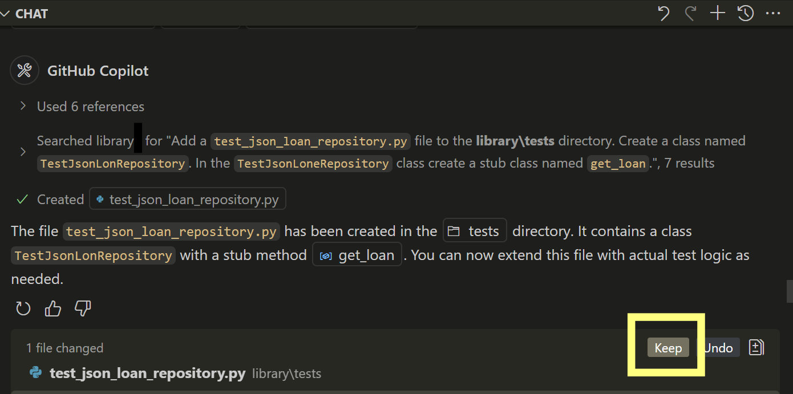

---
lab:
  title: 'Ubung: Entwickeln von Komponententests mithilfe von GitHub Copilot- (Python)'
  description: 'Erfahren Sie, wie Sie die Entwicklung von Komponententests mithilfe von GitHub in Visual Studio Code beschleunigen.Lernen.'
---

# Entwickeln von Komponententests mithilfe von GitHub Copilot

Die großen Sprachmodelle hinter GitHub Copilot werden auf einer Vielzahl von Frameworks zum Testen von Code und Szenarien trainiert. GitHub Copilot ist ein hervorragendes Tool zum Generieren von Testfällen, Testmethoden, Test assertionen und Mocks und Testdaten. In dieser Übung verwenden Sie GitHub Copilot, um die Entwicklung von Modultests. fur eine Python Anwendung zu beschleunigen.

Diese Übung dauert ca. **25** Minuten.

> **WICHTIG:** Um diese Übung abzuschließen, müssen Sie Ihr eigenes GitHub-Konto und GitHub Copilot-Abonnement bereitstellen. Wenn Sie kein GitHub-Konto haben, können Sie sich für ein kostenloses eigenes Konto <a href="https://go.microsoft.com/fwlink/?linkid=2320148" target="_blank">registrieren</a> und einen GitHub Copilot Free-Plan verwenden, um die Übung abzuschließen. Wenn Sie Zugriff auf ein GitHub Copilot Pro-, GitHub Copilot Pro+-, GitHub Copilot Business- oder GitHub Copilot Enterprise-Abonnement in Ihrer Labumgebung haben, können Sie Ihr vorhandenes GitHub Copilot-Abonnement für diese Übung verwenden.

## Vor der Installation

Ihre Labumgebung muss Folgendes enthalten: Git 2.48 oder höher, Python 3.10 oder höher, Visual Studio Code mit dem Python-Erweiterungsformular Microsoft und Zugriff auf ein GitHub-Konto mit aktiviertem GitHub Copilot.

Bei Nutzung eines lokalen PCs als Labumgebung für diese Übung:

- Wenn Sie Hilfe beim Konfigurieren Ihres lokalen PCs als Labumgebung benötigen, öffnen Sie den folgenden Link in einem Browser: <a href="https://microsoftlearning.github.io/mslearn-github-copilot-dev/Instructions/Labs/LAB_AK_00_configure_lab_environment_py.html" target="_blank">Konfigurieren Ihrer Labumgebungsressourcen</a>.

- Wenn Sie Hilfe beim Aktivieren Ihres GitHub Copilot-Abonnements in Visual Studio Code benötigen, öffnen Sie den folgenden Link in einem Browser: <a href="https://go.microsoft.com/fwlink/?linkid=2320158" target="_blank">Aktivieren von GitHub Copilot in Visual Studio Code</a>.

Bei Nutzung einer gehosteten Labumgebung für diese Übung:

- Wenn Sie Hilfe beim Aktivieren Ihres GitHub Copilot-Abonnements in Visual Studio Code benötigen, fügen Sie die folgende URL in die Navigationsleiste eines Browsers ein: <a href="https://go.microsoft.com/fwlink/?linkid=2320158" target="_blank">Aktivieren von GitHub Copilot in Visual Studio Code</a>.

- Öffnen Sie eine Eingabeaufforderung, und führen Sie die folgenden Befehle aus:

    Um sicherzustellen, dass Visual Studio Code für die Verwendung der richtigen Version von Python konfiguriert ist, stellen Sie sicher, dass die Python-Version 3.10 oder höher installiert ist:

    ```bash
    python --version
    ```

    Um sicherzustellen, dass Git für die Verwendung Ihres Namens und Ihrer E-Mail-Adresse konfiguriert ist, aktualisieren Sie die folgenden Befehle mit Ihren Informationen, und führen Sie dann die Befehle aus:

    ```bash

    git config --global user.name "John Doe"

    ```

    ```bash

    git config --global user.email johndoe@example.com

    ```

## Übungsszenario

Sie sind Entwickler, die in der IT-Abteilung Ihrer lokalen Community arbeiten. Die Back-End-Systeme, die die öffentliche Bibliothek unterstützen, gingen in einem Brand verloren. Ihr Team muss ein temporäres Projekt entwickeln, damit die Bibliotheksmitarbeiter ihre Vorgänge verwalten können, bis das System ersetzt werden kann. Ihr Team hat GitHub Copilot ausgewählt, um den Entwicklungsprozess zu beschleunigen.

Sie verfügen über eine erste Version der Bibliotheksanwendung, die ein Komponententestprojekt mit dem Namen UnitTests enthält. Sie müssen die Entwicklung zusätzlicher Komponententests mit GitHub Copilot beschleunigen.

Diese Übung umfasst die folgenden Aufgaben:

1. Einrichten der Bibliotheksanwendung in Visual Studio Code.

1. Untersuchen Sie den Ansatz für Komponententests, der vom UnitTests-Projekt implementiert wird.

1. Erweitern Sie das Projekt UnitTests, um mit dem Testen der Datenzugriffsklassen im Bibliothek\Infrastrukturprojekt zu beginnen.

## Einrichten der Bibliotheksanwendung in Visual Studio Code

Sie müssen die vorhandene Anwendung herunterladen, die Codedateien extrahieren und dann das Projekt in Visual Studio Code öffnen.

Gehen Sie folgendermaßen vor, um die Bibliotheksanwendung einzurichten:

1. Öffnen Sie ein Browserfenster in Ihrer Lab-Umgebung.

1. Um eine ZIP-Datei mit der Bibliotheksanwendung herunterzuladen, fügen Sie die folgende URL in die Adressleiste Ihres Browsers ein: [GitHub Copilot Lab – Entwickeln von Komponententests](https://github.com/MicrosoftLearning/mslearn-github-copilot-dev/raw/refs/heads/main/DownloadableCodeProjects/Downloads/AZ2007LabAppM4Python.zip)

    Die ZIP-Datei heißt **AZ2007LabAppM4Python.zip**.

1. Extrahieren Sie die Dateien aus der **AZ2007LabAppM4Python.zip ** Datei.

    Zum Beispiel:

    1. Navigieren Sie zu dem Ordner "Downloads" in Ihrer Lab-Umgebung.

    1. Klicken Sie mit der rechten Maustaste auf **AZ2007LabAppM4Python.zip**, und wählen Sie **dann "Alle**extrahieren" aus.

    1. Wählen Sie **Dateien nach Extrahierung anzeigen** und dann **Extrahieren** aus.

1. Öffnen Sie den ordner "extrahierte Dateien", und kopieren Sie dann den Ordner "**AccelerateDevGHCopilot**" an einen Speicherort, auf den Sie einfach zugreifen können, z. B. Ihren Windows-Desktopordner.

1. Öffnen Sie den Ordner **AccelerateDevGitHubCopilot** in Visual Studio Code.

    Zum Beispiel:

    1. Öffnen Sie Visual Studio Code in Ihrer Lab-Umgebung.

    1. Wählen Sie in Visual Studio Code im Menü **Datei** die Option **Ordner öffnen** aus.

    1. Navigieren Sie zum Ordner "Windows Desktop", wählen Sie **"AccelerateDevGHCopilot** " und dann "Ordner auswählen **"** aus.

1. Überprüfen Sie in der Visual Studio Code EXPLORER-Ansicht die folgende Projektstruktur:

    - AccelerateDevGHCopilot/Bibliothek ├── Anwendungskern ├── Konsole ├── Infrastruktur └── Tests

## Untersuchen des Ansatzes für Komponententests, der vom UnitTests-Projekt implementiert wird

In diesem Abschnitt der Übung verwenden Sie GitHub Copilot, um den vom UnitTests-Projekt implementierten Komponententestansatz zu untersuchen.

Führen Sie die folgenden Schritte aus, um diesen Abschnitt der Übung zu absolvieren:

1. Erweitern Sie den **Testordner** in der EXPLORER-Ansicht.

    Ihre vorhandene Codebasis enthält ein UnitTests-Projekt, das die folgende Ordnerstruktur implementiert:

    ─ tests   ├─ test_patron_service.py

    Die Testprojektstruktur spiegelt und unterstützt 2 der **Dienste** des **application_core** Projekts.

   – application_core └– Dienste ├– loan_service.py ├– patron_service.py

1. Öffnen Sie die Chatansicht.

1. Fügen Sie die folgenden Dateien-zum-Chatkontext hinzu:

    (unter library\application_core\services\ )

    - loan_service.py
    - patron_service.py

    (unter bibliothek\tests\ )

    - test_patron_service.py
    - test_loan_service.py

1. Um mehr über das vorhandene Komponententestprojekt zu erfahren, geben Sie die folgende Eingabeaufforderung ein:

    ```plaintext
    @workspace Explain the approach to unit testing that's been implemented in this workspace.
    ```

    Dieser Prompt fordert GitHub Copilot auf, den Ansatz für Komponententests im Kontext des Arbeitsbereichs zu erläutern. Durch das Hinzufügen relevanter Dateien zum Chatkontext wird die Antwort verbessert.

1. Nehmen Sie sich eine Minute Zeit, um die Vorschläge von GitHub Copilot zu überprüfen.

    > Es sollte eine Beschreibung angezeigt werden, die dem folgenden Beispiel ähnelt:
    >
    > Dieser Arbeitsbereich verwendet einen standardmäßigen Python-Komponententestansatz mit dem `unittest` Framework und der Mocking über `unittest.mock.MagicMock`. Die wichtigsten Features sind:
    >
    > - **Testklassen**: Jeder Dienst (z. B. `LoanService`, `PatronService`) verfügt über eine entsprechende Testklasse (z. B., `TestLoanService`, `PatronServiceTest`).
    > - **Einrichtung**: Die `setUp` Methode erstellt ein Pseudo-Repository und fügt es in den Testdienst ein, wobei Geschäftslogik aus dem Datenzugriff isoliert wird.
    > - **Testmethoden**: Jede Methode testet ein bestimmtes Verhalten, z. B. eine erfolgreiche Mitgliedschaftsverlängerung oder das Behandeln fehlender Daten.
    > - **Assertionen**: Tests verwenden Assertionen, `self.assertEqual` um die erwarteten Ergebnisse zu überprüfen.
    > - **Testdaten**: Testobjekte (z. B. `Patron`, `Loan`) werden mit relevanten Attributen für jedes Szenario erstellt.
    > - **Testermittlung**: Jede Testdatei umfasst:
    >
    >     ```python
    >     if __name__ == "__main__":
    >         unittest.main()
    >     ```
    >
    > - **Modellieren**: Repositorymethoden werden simuliert, um Rückgabewerte zu steuern und Logik zu isolieren.
    >
    > Siehe Beispiele in `library2/tests/test_patron_service.py` und `library2/tests/test_loan_service.py`.

1. Um die Vorteile des aktuellen Ansatzes zu analysieren, geben Sie die folgende Eingabeaufforderung ein:

    ```plaintext
    @workspace What are the benefits of this approach to unit testing?
    ```

1. Nehmen Sie sich eine Minute Zeit, um die Vorschläge von GitHub Copilot zu überprüfen.

    Sie können die Unterhaltung fortsetzen und weitere Details zu bestimmten Aspekten des Komponententestansatzes anfordern. Sie können z. B. die Vorteile der Verwendung von Testfabriken, Modellabhängigkeiten oder der Gesamtstruktur der Tests fragen.

1. Nehmen Sie sich eine Minute Zeit, um zu überlegen, wie Sie den vorhandenen Ansatz erweitern würden, um das Bibliothek\Infrastrukturprojekt zu testen.

    Das Library.Infrastructure-Projekt enthält Datenzugriffsklassen, die mit dem Dateisystem zusammenarbeiten, um Daten zu laden und zu speichern.

1. Fügen Sie die folgenden Dateien-zum-Chatkontext hinzu:

    - library\application_core\services\loan_service.py
    - library\application_core\services\patron_service.py

    - library\application_core\enums\loan_extension_status.py
    - library\application_core\enums\loan_return_status.py
    - library\application_core\enums\membership_renewal_status.py

    - library\tests\test_patron_service.py
    - library\tests\test_loan_service.py

1. Um GitHub Copilot um Hilfe beim Erweitern des UnitTests-Projekts zu bitten, geben Sie die folgende Eingabeaufforderung ein:

    ```plaintext
    @workspace How can I extend the `tests` project to begin testing methods in the `library\infrastructure` project? 
    Provide a process overview.
    ```

    Diese Eingabeaufforderung fordert GitHub Copilot auf, eine Prozessübersicht für die Erweiterung des UnitTests-Projekts bereitzustellen, um mit dem Testen von Methoden im Library.Infrastructure-Projekt zu beginnen. Im Prompt sind mehrere Dateien enthalten, um den Kontext für die Antwort bereitzustellen.

1. Nehmen Sie sich einen Moment Zeit, um die Antwort von GitHub Copilot zu überprüfen.

    >Sie sollten eine Erklärung angezeigt bekommen, die der folgenden Beschreibung ähnelt:
    >
    >Gehen Sie wie folgt vor, um das `tests` Projekt auf Methoden im `library4Test/infrastructure` Projekt zu erweitern:
    >
    >1. **Identifizieren von Zielmethoden**  
    >   Überprüfen Sie den Code in `infrastructure/` (e.g., `json_data.py`, `json_loan_repository.py`, `json_patron_repository.py`) und wählen Sie die Methoden aus, die Sie testen möchten.
    >
    >2. **Neue Testdateien erstellen**  
    >   Erstellen Sie im `tests/` Verzeichnis neue Testdateien wie `test_json_data.py`, `test_json_loan_repository.py`usw. nach der Benennungskonvention, die für vorhandene Tests verwendet wird.
    >
    >3. **Importieren von Klassen/Funktionen**  
    >   Importieren Sie in jeder neuen Testdatei die relevanten Klassen oder Funktionen aus dem `infrastructure` Modul.
    >
    >4. **Testklassen und Methoden**  
    >   - Wird `unittest.TestCase`als Basisklasse verwendet.
    >   - Implementieren `setUp`wenn Sie Objekte initialisieren oder Daten testen müssen.
    >   - Schreiben Sie Testmethoden für jedes Verhalten oder jeden Edgefall, den Sie überprüfen möchten.
    >
    >5. **Überprüfen externer Abhängigkeiten**  
    >   Wenn der Infrastrukturcode mit Dateien oder externen Systemen interagiert, verwenden Sie `unittest.mock` diese Abhängigkeiten, um sicherzustellen, dass Tests isoliert und wiederholbar sind.
    >
    >6. **Verwenden von Assertionen**  
    >   Verwenden Sie Assertionen (`self.assertEqual`, `self.assertTrue`usw.), um zu überprüfen, ob sich die Methoden wie erwartet verhalten.
    >
    >7. **Ausführen und Verfeinern von Tests**  
    >   Führen Sie Ihre Tests mithilfe der Befehlszeile oder des Testläufers Ihrer IDE aus. Verfeinern Sie Ihre Tests und Code nach Bedarf basierend auf den Ergebnissen.
    >
    >**Beispielskelett:**
    >
    >```python
    >import unittest
    >from infrastructure.json_data import JsonData  # Adjust import as needed
    >
    >class TestJsonData(unittest.TestCase):
    >    def test_some_method(self):
    >        # Arrange
    >        # Act
    >        # Assert
    >        pass
    >
    >if __name__ == "__main__":
    >    unittest.main()
    >```
    >
    >**Zusammenfassung:**  
    >
    >- Fügen Sie neue Testdateien hinzu in`tests/`für jedes Infrastrukturmodul.
    >- Importieren und Testen von Methoden mithilfe von `unittest`.
    >- Simuliert externe Abhängigkeiten nach Bedarf.
    >- Verwenden Sie Assertionen, um das Verhalten zu überprüfen.
    >&nbsp;

Ihre Ergebnisse unterscheiden sich wahrscheinlich geringfügig, untersuchen sie genau.

    > **TIP**: Use GitHub Copilot's **Ask** mode to investigate your approach to testing. Use the responses to plan, develop, or extend your unit tests.

## Erweitern des UnitTests-Projekts, um mit dem Testen von Datenzugriffsklassen zu beginnen

Das **Library.Infrastructure-Projekt** enthält Datenzugriffsklassen, die mit dem Dateisystem zusammenarbeiten, um Daten zu laden und zu speichern. Das Projekt umfasst die folgenden Klassen:

- JsonData (`json_data.py`): Eine Klasse, die JSON-Daten lädt und speichert
- JsonLoanRepository (`json_loan_repository.py`): Eine Klasse, die die ILoanRepository-Schnittstelle implementiert und die JsonData-Klasse zum Laden und Speichern von Loan-Daten verwendet
- JsonPatronRepository (`json_patron_repository.py`): Eine Klasse, die die IPatronRepository-Schnittstelle implementiert und die JsonData-Klasse zum Laden und Speichern von Patron-Daten verwendet.

### Verwenden des Agentmodus zum Erstellen einer neuen Testklasse

Sie können den Agent-Modus der Chatansicht verwenden, wenn Sie eine bestimmte Aufgabe berücksichtigen und Es Copilot ermöglichen möchten, Ihren Code autonom zu bearbeiten. Sie können beispielsweise den Agent-Modus zum Erstellen und Bearbeiten von Dateien oder zum Aufrufen von Tools zum Ausführen von Aufgaben verwenden. Im Agent-Modus kann GitHub Copilot die benötigten Arbeiten autonom planen und die relevanten Dateien und Kontexte ermitteln. Anschließend werden Änderungen an Ihrer Codebasis vorgenommen und Tools aufgerufen, um die von Ihnen vorgenommene Anforderung auszuführen.

> **HINWEIS:** Der Agentmodus ist nur in Visual Studio Code verfügbar. Wenn Sie GitHub Copilot in einer anderen Umgebung verwenden, können Sie den Chatmodus verwenden, um ähnliche Aufgaben auszuführen.

In diesem Abschnitt der Übung verwenden Sie den Agent-Modus von GitHub Copilot, um eine neue Testklasse für die GetLoan-Methode der JsonLoanRepository-Klasse zu erstellen.

Führen Sie die folgenden Schritte aus, um diesen Abschnitt der Übung zu absolvieren:

1. Wählen Sie in der Chatansicht die Schaltfläche **Modus festlegen** und dann **Agent** aus.

    > **WICHTIG:** Wenn Sie die Chatansicht im Agentmodus verwenden, kann GitHub Copilot mehrere Premium-Anforderungen stellen, um eine einzelne Aufgabe abzuschließen. Premium-Anfragen können durch benutzerinitiierte Eingabeaufforderungen und Folgeaktionen verwendet werden, die Copilot in Ihrem Auftrag ausführt. Die Gesamtzahl der verwendeten Premiumanforderungen hängt von der Komplexität des Vorgangs, der Anzahl der beteiligten Schritte und dem ausgewählten Modell ab.

1. Um einen automatisierten Vorgang zu starten, der eine Testklasse für die JsonLoanRepository.get_loan-Methode (Infrastruktur\json_loan_repository.py) erstellt, geben Sie die folgende Eingabeaufforderung ein:

    ```plaintext

    Add a `test_json_loan_repository.py` file to the **library\tests** directory. Create a class named `TestJsonLoanRepository`. 
    In the `TestJsonLoneRepository` class create a stub class named `get_loan`. Add a reference to classes tested.

    ```

    Diese Aufforderung fordert GitHub Copilot auf, eine neue Klassendatei im Projektordner "Tests" zu erstellen.

    - tests\
      - test_json_loan_repository.py

    Die Eingabeaufforderung fordert auch GitHub Copilot auf, einen Verweis auf **"library\infrastructure**" hinzuzufügen.

1. Nehmen Sie sich einen Moment Zeit, um die Antwort von GitHub Copilot zu überprüfen.

    Beachten Sie die folgenden Updates in der Chatansicht und im Code-Editor:

    - Der Agent zeigt Statusmeldungen an, sobald die angeforderten Aufgaben abgeschlossen sind. Die erste Aufgabe ist das Erstellen der **test_json_loan_repository.py** Datei. Der Agent kann angehalten werden und Sie vor dem Erstellen der Datei zur Bestätigung auffordern.

        

    - Die **test_json_loan_repository.py** Datei ist im Code-Editor mit Bearbeitungen ähnlich dem folgenden Update geöffnet:

        ```python

        import unittest
        from infrastructure.json_loan_repository import JsonLoanRepository
        from infrastructure.json_data import JsonData
        from application_core.entities.loan import Loan
        
        class TestJsonLoanRepository(unittest.TestCase):
            def get_loan(self):
                # Stub for get_loan test
                pass
        
        if __name__ == "__main__":
            unittest.main()

        ```

1. Wenn der Agent die Aufgabe anhält und Sie um die Berechtigung zum Ausführen eines Verzeichnisbefehls im Terminal bitten, wählen Sie **"Beibehalten" oder **"Fortfahren"**** aus.

    Wenn Sie "Beibehalten"** oder **"Weiter"** auswählen**, schließt GitHub Copilot die folgenden Aktionen aus:

    - Im Testordner** wird eine neue Datei mit dem **Namen **test_json_loan_repository.py** erstellt.

1. Nehmen Sie sich einen Moment Zeit, um die Updates zu überprüfen.

    Im Editor sollten die folgenden Updates angezeigt werden:

    - Der Testordner** enthält **jetzt test_json_loan_repository.py** mit einem Verweis auf **infrastructure.json_loan_repository **.**

1. Um alle Änderungen anzunehmen, wählen Sie **in der Chatansicht "Beibehalten" aus**.

1. Erweitern Sie in der EXPLORER-Ansicht den Ordner **Bibliothek**.

    Die folgende Ordnerstruktur sollte angezeigt werden:

    tests    ├─ test_json_loan_repository.py    ├─ test_loan_service.py    └─ test_patron_service.py

### Vorbereiten der Erstellung von Komponententests für die GetLoan-Methode

In diesem Abschnitt der Übung verwenden Sie den Bearbeitungsmodus von GitHub Copilot, um Komponententests für die **GetLoan-Methode** in der **JsonLoanRepository-Klasse** (**json_loan_repository.py**) zu erstellen.

Führen Sie die folgenden Schritte aus, um diesen Abschnitt der Übung zu absolvieren:

1. Wählen Sie in der Chatansicht die **Schaltfläche "Modus** festlegen" und dann **"Bearbeiten"** aus.

    Verwenden Sie den Bearbeitungsmodus, um ausgewählte Dateien zu aktualisieren. Antworten werden als Codevorschläge im Code-Editor angezeigt.

1. Öffnen Sie die **json_loan_repository.py** Datei aus dem **Ordner "Bibliothek\Infrastruktur** ".

1. Nehmen Sie sich eine Minute Zeit, um die **json_loan_repository.py** Datei zu überprüfen.

    ```python
    import json
    from datetime import datetime
    from application_core.interfaces.iloan_repository import ILoanRepository
    from application_core.entities.loan import Loan
    from .json_data import JsonData
    from typing import Optional
    
    class JsonLoanRepository(ILoanRepository):
        def __init__(self, json_data: JsonData):
            self._json_data = json_data
    
        def get_loan(self, loan_id: int) -> Optional[Loan]:
            for loan in self._json_data.loans:
                if loan.id == loan_id:
                    return loan
            return None
    
        def update_loan(self, loan: Loan) -> None:
            for idx in range(len(self._json_data.loans)):
                if self._json_data.loans[idx].id == loan.id:
                    self._json_data.loans[idx] = loan
                    self._json_data.save_loans(self._json_data.loans)
                    return
    
        def add_loan(self, loan: Loan) -> None:
            self._json_data.loans.append(loan)
            self._json_data.save_loans(self._json_data.loans)
            self._json_data.load_data()
    
        def get_loans_by_patron_id(self, patron_id: int):
            result = []
            for loan in self._json_data.loans:
                if loan.patron_id == patron_id:
                    result.append(loan)
            return result
    
        def get_all_loans(self):
            return self._json_data.loans
    
        def get_overdue_loans(self, current_date):
            overdue = []
            for loan in self._json_data.loans:
                if loan.return_date is None and loan.due_date < current_date:
                    overdue.append(loan)
            return overdue
    
        def sort_loans_by_due_date(self):
            # Manual bubble sort for demonstration
            n = len(self._json_data.loans)
            for i in range(n):
                for j in range(0, n - i - 1):
                    if self._json_data.loans[j].due_date > self._json_data.loans[j + 1].due_date:
                        self._json_data.loans[j], self._json_data.loans[j + 1] = self._json_data.loans[j + 1], self._json_data.loans[j]
            return self._json_data.loans


    ```

1. Beachten Sie die folgenden Methoden in **`JsonLoanRepository`**:

    - `__init__(self, json_data: JsonData)`: Initialisiert das Repository mit einem `JsonData` Objekt.
    - `get_loan(self, loan_id: int) -> Optional[Loan]`: Ruft einen Kredit anhand seiner ID ab.
    - `update_loan(self, loan: Loan) -> None`: Aktualisiert ein vorhandenes Darlehen und speichert Änderungen.
    - `add_loan(self, loan: Loan) -> None`: Fügt einen neuen Kredit hinzu, speichert und lädt Daten neu.
    - `get_loans_by_patron_id(self, patron_id: int)`: Ruft alle Kredite für einen bestimmten Patron ab.
    - `get_all_loans(self)`: Gibt alle Kredite zurück.
    - `get_overdue_loans(self, current_date)`: Gibt Darlehen überfällig ab . `current_date`
    - `sort_loans_by_due_date(self)`: Sortiert Kredite nach Fälligkeitsdatum mithilfe der Blasensortierung.
    - `get_loans_by_patron_id` Außerdem und `get_overdue_loans`) Gibt Listen von Krediten zurück, die `sort_loans_by_due_date` an Ort und Stelle sortiert werden und die sortierte Liste zurückgibt.

1. Verwenden von Objekten zum Laden und Speichern von Daten:

    - Verwenden Sie ein `JsonData` Objekt (`self._json_data`), um auf die Speicherliste von Darlehen zuzugreifen und sie zu ändern.
    - Behält Änderungen bei, indem sie aufgerufen werden `self._json_data.save_loans(self._json_data.loans)`.
    - Nach dem Hinzufügen eines Kredits werden Aufrufe `self._json_data.load_data()` zum Aktualisieren von Speicherdaten im Arbeitsspeicher aufgerufen.

1. Nehmen Sie sich eine Minute Zeit, um die JsonLoanRepository-Klasse zu berücksichtigen: Feld- und Konstruktoranforderungen

**Feld:**

- `self._json_data`:  
  Eine Instanz von `JsonData`. Dieses Feld enthält die Speicherliste von Krediten und stellt Methoden zum Laden und Speichern von Kreditdaten im persistenten Speicher bereit (z. B. eine JSON-Datei).

**Konstruktor:**

- `__init__(self, json_data: JsonData)`:  
  Der Konstruktor erfordert ein `JsonData` Objekt als Parameter. Dieses Objekt wird allen Repositorymethoden zugewiesen `self._json_data` und verwendet, um auf Kreditdaten zuzugreifen und diese beizubehalten.

**Verwenden von Methoden für das Feld:**

- Alle Methoden (`get_loan`, `update_loan`, , `get_loans_by_patron_id` `add_loan`, `get_all_loans`, , `get_overdue_loans`, `sort_loans_by_due_date`) interagieren mit den Kreditdaten über `self._json_data.loans`.
- Methoden zum Ändern von Daten (`update_loan`, `add_loan`) `self._json_data.save_loans()` zum Beibehalten von Änderungen.
- `add_loan` ruft auch auf `self._json_data.load_data()` , um die Speicherdaten nach dem Speichern zu aktualisieren.

Die **JsonLoanRepository.get_loan-Methode** empfängt beim Aufrufen einen `loan_id` Parameter. Die Methode durchsucht `self._json_data.loans` einen Kredit mit einer übereinstimmenden ID. Wenn ein passender Kredit gefunden wird, wird das ausgefüllte `Loan` Objekt zurückgegeben. Wenn kein passender Kredit gefunden wird, wird `None`zurückgegeben.

Für Komponententests `get_loan`:

- Sie können ein Pseudokredit-Repositoryobjekt verwenden, um den Fall zu testen, in dem eine übereinstimmende ID gefunden wird. Laden Sie das Modell mit dem Kredit, den Sie suchen möchten, und verwenden Sie eine Testklasse, um die ILoanRepository-Schnittstelle zu modellieren und ein Pseudorepository zu instanziieren.
- Ebenso können Sie ein pseudo-Patron-Repositoryobjekt verwenden, um das Szenario zu testen, in dem ein bestimmter Patron vorhanden ist. Füllen Sie das Modell mit dem Patron auf, den Sie abrufen möchten, und verwenden Sie eine Testklasse, um die IPatronRepository-Schnittstelle zu modellieren und ein Pseudorepository zu instanziieren. Mit diesem Ansatz können Sie sowohl erfolgreiche Abruf- als auch nicht gefundene Fälle für verschiedene Repositorytypen simulieren.
- Sie können ein reales `JsonLoanRepository` Objekt verwenden, um den Fall zu testen, in dem keine übereinstimmende ID gefunden wird. Geben Sie eine Kredit-ID an, die Sie kennen, nicht vorhanden ist (z. B. einen Wert über 100).
- Sie benötigen ein `JsonData` Objekt, um ein echtes `JsonLoanRepository`Objekt zu erstellen. Wenn Ihr Testprojekt keinen Zugriff auf die Produktion `JsonData`hat, erstellen Sie nach Bedarf eine Testinstanz oder ein Modell.

### Verwenden des Fragemodus zum Erstellen von Komponententests

**Für Kontext in Tests einzuschließende Dateien:**

- Aus dem Ordner **application_core/Entitäten**.
  - `loan.py` (Kreditentität)
- Aus-dem Ordner **application_core/Dienste**.
  - `loan_service.py`
- Aus dem **Infrastrukturordner** .
  - `json_data.py`
  - `json_loan_repository.py`
- Aus dem **Testordner** .
  - `test_json_loan_repository.py`
  
1. Geben Sie die folgende Bearbeitungsaufforderung ein:

    ```plaintext

    #Codebase Create fields and a class constructor for the `test_json_loan_repository.py` file to support unit tests for the get_loan method in the JsonLoanRepository class. Add private fields: _mock_loan_repository, _json_loan_repository, and _json_data. Initialize these fields in the class constructor or in a setUp (for unittest) or setup_method (for pytest). Use a setup method or fixture to populate _json_data with test data for instantiating JsonLoanRepository.
    ```

    Dieser Prompt fordert GitHub Copilot auf, Felder und einen Klassenkonstruktor vorzuschlagen.

1. Nehmen Sie sich einen Moment Zeit, um die Antwort von GitHub Copilot zu überprüfen.

    Es sollte ein Codevorschlag angezeigt werden, der dem folgenden Codeausschnitt ähnelt:

    ```python

    import unittest
    from unittest.mock import MagicMock
    from infrastructure.json_loan_repository import JsonLoanRepository
    from infrastructure.json_data import JsonData
    from application_core.entities.loan import Loan
    from application_core.entities.book_item import BookItem
    from application_core.entities.patron import Patron
    from datetime import datetime, timedelta
    
    class TestJsonLoanRepository(unittest.TestCase):
        def setUp(self):
            # Create a mock JsonData with minimal test data
            self._json_data = MagicMock(spec=JsonData)
            # Create a test loan and supporting objects
            test_patron = Patron(id=1, name="Test Patron", membership_end=datetime.now()+timedelta(days=30), membership_start=datetime.now()-timedelta(days=365))
            test_book_item = BookItem(id=1, book_id=1, acquisition_date=datetime.now()-timedelta(days=100))
            test_loan = Loan(id=1, book_item_id=1, patron_id=1, patron=test_patron, loan_date=datetime.now()-timedelta(days=10), due_date=datetime.now()+timedelta(days=4), return_date=None, book_item=test_book_item)
            self._json_data.loans = [test_loan]
            self._json_loan_repository = JsonLoanRepository(self._json_data)
            self._mock_loan_repository = MagicMock()
    
        def get_loan(self):
            # Stub for get_loan test
            pass
    
    if __name__ == "__main__":
        unittest.main()

    ```

1. Wählen Sie in der Chatansicht (Bearbeitungsmodus) die Option **"Beibehalten"** aus, um alle Aktualisierungen zu akzeptieren.

1. Fügen Sie die folgenden Dateien-zum-Chatkontext hinzu:

    - Bibliothek\
        - application_core/entities/**loan.py**
        - infrastructure/**json_data.py**
        - infrastructure/**json_loan_repository.py**
        - tests/**test_json_loan_repository.py**

1. Wählen Sie den Inhalt der **test_json_loan_repository.py** Datei aus, und geben Sie dann in der Chatansicht die folgende Eingabeaufforderung ein:

    ```plaintext
    @workspace Update the `test_json_loan_repository` test file and address the following:
    - Use import system paths to the relative library root that match this project’s folder structure.
    - Ensure the Loan class is imported correctly.
    - Confirm datetime and timedelta are imported if used.
    - Add any missing methods as stubs for later completion to DummyJsonData that are required by JsonLoanRepository.
    - Remove any unused variables.
    - Remove any unnecessary or incorrect imports.
    - Use unittest standards
    ```

    Diese Aufforderung fordert GitHub Copilot auf, einen Komponententest für die `JsonLoanRepository.get_loan` -Methode in Python vorzuschlagen. Der Komponententest sollte das Szenario überprüfen, in dem eine Kredit-ID in den Testdaten vorhanden ist. Der Test sollte eine `DummyJsonData` Instanz verwenden, um Beispielkredite bereitzustellen, eine `JsonLoanRepository` mit diesen Daten zu erstellen, mit einer gültigen Kredit-ID aufzurufen `get_loan` und Assertionen zu verwenden, um zu überprüfen, ob das zurückgegebene Darlehen die erwartete ID hat. Die Kredit-ID sollte in der `DummyJsonData.loans` Liste vorhanden sein.

1. Nehmen Sie sich eine Minute Zeit, um die `test_patron_service.py` von GitHub Copilot vorgeschlagenen Updates zu überprüfen.

    Es sollte ein Codevorschlag angezeigt werden, der dem folgenden Codeausschnitt ähnelt:

    ```python

    import sys
    import unittest
    from pathlib import Path
    sys.path.append(str(Path(**file**).resolve().parent.parent))
    from infrastructure.json_loan_repository import JsonLoanRepository
    from application_core.entities.loan import Loan
    from application_core.entities.book_item import BookItem
    from application_core.entities.patron import Patron
    from datetime import datetime, timedelta
    
    class DummyJsonData:
        def **init**(self):
            self.loans = []
            self.save_loans_called = False
    
        def save_loans(self, loans):
            self.save_loans_called = True
    
        def load_data(self):
            pass
    
    class TestJsonLoanRepository(unittest.TestCase):
        def setUp(self):
            self._json_data = DummyJsonData()
            test_patron = Patron(id=1, name="Test Patron", membership_end=datetime.now()+timedelta(days=30), membership_start=datetime.now()-timedelta(days=365))
            test_book_item = BookItem(id=1, book_id=1, acquisition_date=datetime.now()-timedelta(days=100))
            test_loan = Loan(id=1, book_item_id=1, patron_id=1, patron=test_patron, loan_date=datetime.now()-timedelta(days=10), due_date=datetime.now()+timedelta(days=4), return_date=None, book_item=test_book_item)
            self._json_data.loans = [test_loan]
            self._json_loan_repository = JsonLoanRepository(self._json_data)
    
        def test_get_loan(self):
            loan = self._json_loan_repository.get_loan(1)
            self.assertIsNotNone(loan)
            self.assertEqual(loan.id, 1)
    
        def test_get_loan_not_found(self):
            loan = self._json_loan_repository.get_loan(999)
            self.assertIsNone(loan)
    
    if **name** == "**main**":
        unittest.main()

    ```

1. Beachten Sie, dass die Testdatei jetzt nur eine minimale `DummyJsonData` Klasse mit nur den erforderlichen Methoden verwendet, alle Importpfade korrigiert, nicht verwendete Variablen und Importe entfernt und sichergestellt, dass die Kreditklasse und die Datetime-Dienstprogramme ordnungsgemäß importiert werden.

1. Wählen Sie in der Chatansicht die Option **"Beibehalten"** aus, um alle Updates zu akzeptieren.

1. Führen Sie Komponententesttests für Teile des **AccelerateDevGitHubCopilot-Projekts** aus, um sicherzustellen, dass keine offensichtlichen Fehler auftreten. Geben Sie im Terminal an der Eingabeaufforderung \library Folgendes ein:

    ```plaintext
    python -m unittest discover -v tests
    ```

1. Vergleichen Sie mit der Ausführung von Pytest (erwarten Sie dasselbe Ergebnis mit unterschiedlichen Ausgabeformaten).

    ```plaintext
    pytest tests -v
    ```

1. manuell testen:

    ```plaintext
    python console\main.py
    ```

    Ein grundlegender Test besteht darin, folgendes zu testen: 1. geben Sie folgendes ein: **ein** 1. wählen Sie einen aufgelisteten Patron aus, geben Sie Folgendes ein: **1** 1. wählen Sie "b" aus, geben Sie Folgendes ein: **b** 1. Nach einem Buch suchen: **Zwanzig** 1. Auscheckbuch, geben Sie Folgendes ein: **y** 1. beenden, geben Sie Folgendes ein: **q**

### Verwenden von Copilot Inline-Editor-Chat zum Erstellen von Komponententests

1. Verwenden Sie die Inline-Editor-Chatfunktion in **test_json_loan_repository.py** , um einen Test für den Fall zu erstellen, in dem die Kredit-ID nicht gefunden wird.

    Wählen Sie : und fordern Sie **`class TestJsonLoanRepository`** Folgendes an:

    ```plaintext
   I need to ensure 2 test cases are created for this class.  Identify or create one test cases for where the loan `Id` is found, and one when loan `Id` isn't found. No more than 2 more basic test cases are needed.
    ```

    Akzeptieren Sie die Vorschläge zum Erstellen einer neuen Testmethode.

1. Nehmen Sie sich eine Minute Zeit, um den neuen Einheitentext zu überprüfen.

    Es sollte ein vorgeschlagener Einheitentext angezeigt werden, der den folgenden Codeausschnitten ähnelt:

    ```python

    class TestJsonLoanRepository(unittest.TestCase):
        # ...existing code...

        def test_get_loan_found(self):
            # Test case where loan with id=1 exists
            found_loan = self._json_loan_repository.get_loan(1)
            self.assertIsNotNone(found_loan)
            self.assertEqual(found_loan.id, 1)
    
        def test_get_loan_not_found_again(self):
            # Test case where loan with id=2 does not exist
            not_found_loan = self._json_loan_repository.get_loan(2)
            self.assertIsNone(not_found_loan)

    ```

    >**HINWEIS Coplot** Inline-Chat kann je nach Implementierung auch einige simulierte Daten verrate.

### pytest aktivieren

Im Vergleich zu Unittest bietet Pytest einige Vorteile wie präzise Syntax, Features wie Leuchten und Parametrisierung und bessere Fehlerberichterstattung. Pytest erleichtert das Schreiben und Warten von Tests und Pytest führt Unittest-Testfälle aus.

1. Pytest wird bei Bedarf aus der Installation der <a href="https://marketplace.visualstudio.com/items?itemName=ms-python.python" target="_blank">Microsoft Python-Erweiterung</a>von Visual Studio aktiviert.

1. Wählen Sie das Kolbensymbol aus.   auf der Symbolleiste, sobald Tests ermittelt wurden. Wenn das Symbol nicht vorhanden ist, lesen Sie die vorherigen Anweisungen

1. Wählen Sie "Python-Tests konfigurieren" oder falls zuvor konfiguriert:

1. wenn die Tests nicht konfiguriert wurden oder das richtige Projekt testen, fahren Sie mit dem nächsten Schritt fort. Wenn Sie das Testprojekt ändern müssen, fahren Sie mit folgenden Aktionen fort:
    - `Ctrl+Shift+P` zum Öffnen der Befehlspalette.
    - Geben Sie **Python: Tests konfigurieren**.
    - Wählen Sie "pytest" aus.
    - Wählen Sie das Verzeichnis für Ihren Python-Code aus.
    - Wählen Sie das Wiedergabesymbol aus, um Tests auszuführen.

1. Wählen Sie "Pytest" aus den Optionen aus.

1. Wählen Sie den Ordner aus, der Ihren Testcode enthält (`library\`)

1. Wählen Sie das Wiedergabesymbol aus, um Tests auszuführen.
    

1. Führen Sie optional den Ptytest-Befehl vom `library` Pfad im Terminal aus, und übergeben Sie den Pfad an den **Testordner** und den `-v` Befehl `-vv` "verbose" (oder `-vv` "sehr ausführlich"):

    ```plaintext
    pytest tests -v
    ```

>**HINWEIS** Weitere Unterstützung bei der PyTest-Konfiguration finden Sie in den Artikeln: <a href="https://marketplace.visualstudio.com/items?itemName=ms-python.python" target="_blank">Visual Studio Microsoft Python-Erweiterung</a> und <a href="https://code.visualstudio.com/docs/python/testing" target="_blank">Python-Tests in Visual Studio Code</a>.

Die vorherigen Schritte und Befehle führen Ihre Unittest-Fälle (und Pytest-Test) aus.

    >**NOTE**: Although the code was run using **Pytest** the report states that the **unittest** framework was used because there are no Pytest specific test formatted items created at this point in the lab. **Pytest** also runs all **unitest** formatted tests along with any Pytest test cases.

### Pytest-Testfälle einschließen

Fügen Sie Testfunktionen im Pytest-Stil mit dem GitHub Copilot Chat-Bearbeitungsmodus **hinzu, stellen** Sie die folgenden Dateien aus Bibliothek\Tests bereit:

- test_json_loan_repository.py
- test_loan_service.py
- test_patron_service.py

1. Verwenden Sie den folgenden Prompt:

    ```plaintext
    
        Add new Pytest-style test functions to the following files: test_json_loan_repository.py, test_loan_service.py, and test_patron_service.py. 
        - Do not remove or rewrite existing Unittest-based test classes or methods.
        - Import pytest at the top if not already present.
        - For each file, add:
            - At least one parameterized test using @pytest.mark.parametrize.
            - At least one fixture using @pytest.fixture for reusable setup.
            - At least one test using pytest.raises for exception/assertion testing.
        - Name all new Pytest test functions with the test_ prefix.
        - Clearly separate new Pytest functions from existing Unittest classes.
        - If a fixture or parameterized test needs a dummy or mock class, define it within the file or reuse an existing one.
        - Demonstrate how Pytest makes tests more concise and expressive compared to Unittest.
    
    ```

1. Überprüfen Sie die hinzugefügten Testfälle, und **speichern Sie**sie. Sie werden im nächsten Abschnitt testen.

## Ausführen der Komponententests mithilfe von Pytest

1. Verwenden Sie die Symbolleistenmethode, wählen Sie das Flask-Symbol  In der Symbolleiste. Wählen Sie das Wiedergabesymbol aus, um Tests auszuführen.
    .

1. Verwenden Sie zum Beheben von Testfehlern oder Testfehlern die . Wenden Sie den Fix an.

    - Wenn der Fix zu einer anderen Datei gemacht werden muss, kann es einfacher sein, im Chat zu öffnen. und bitten Sie Copilot, die Passenden bereitzustellen

    ```plaintext
    @workspace provide the fix for the test failure
    ```

## Zusammenfassung
<!-- HERE -->
In dieser Übung haben Sie gelernt, wie Sie GitHub Copilot verwenden, um die Entwicklung von Komponententests in einer Python-Anwendung zu beschleunigen, um Pytest zu verwenden und auszuführen. Sie haben die Chatansicht von GitHub Copilot im Fragemodus, im Agentmodus und im Bearbeitungsmodus verwendet. Sie haben den Ask-Modus verwendet, um den vorhandenen Komponententestansatz, den Agentmodus zu untersuchen, um Projektordner und eine neue Testklasse zu erstellen, und den Bearbeitungsmodus zum Erstellen von Komponententests. Sie haben auch die Codevervollständigungsfunktion von GitHub Copilot verwendet, um einen Komponententest zu erstellen.

## Bereinigen

Nachdem Sie die Übung abgeschlossen haben, nehmen Sie sich eine Minute Zeit, um sicherzustellen, dass Sie keine Änderungen an Ihrem GitHub-Konto oder GitHub Copilot-Abonnement vorgenommen haben, das Sie nicht beibehalten möchten. Wenn Sie Änderungen vorgenommen haben, können Sie sie jetzt wiederherstellen.
