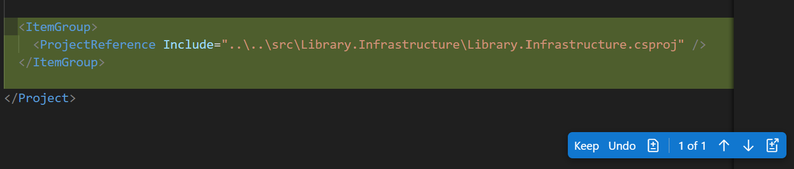

---
lab:
  title: 'Übung: Entwickeln von Modultests mithilfe von GitHub Copilot'
  description: 'Erfahren Sie, wie Sie die Entwicklung von Modultests mithilfe von GitHub in Visual Studio Code beschleunigen.'
---

# Entwickeln von Modultests mithilfe von GitHub Copilot

Die großen Sprachmodelle hinter GitHub Copilot werden auf einer Vielzahl von Frameworks zum Testen von Code und Szenarien trainiert. GitHub Copilot ist ein hervorragendes Tool zum Generieren von Testfällen, Testmethoden, Test-Assertions und -Mocks sowie Testdaten. In dieser Übung verwenden Sie GitHub Copilot, um die Entwicklung von Modultests für eine C#-Anwendung zu beschleunigen.

Diese Übung dauert ca. **25** Minuten.

> **WICHTIG:** Um diese Übung abzuschließen, benötigen Sie ein eigenes GitHub-Konto und ein GitHub Copilot-Abonnement. Falls Sie kein GitHub-Konto haben, können Sie sich für ein kostenloses Einzelkonto <a href="https://github.com/" target="_blank">registrieren</a> und den GitHub Copilot Free-Plan verwenden, um die Übung abzuschließen. Wenn Sie Zugriff auf ein GitHub Copilot Pro-, GitHub Copilot Pro+-, GitHub Copilot Business- oder GitHub Copilot Enterprise-Abonnement in Ihrer Labumgebung haben, können Sie Ihr vorhandenes GitHub Copilot-Abonnement für diese Übung verwenden.

## Vor der Installation

Ihre Übungsumgebung muss die folgenden Voraussetzungen erfüllen: Git 2.48 oder höher, .NET SDK 9.0 oder höher, Visual Studio Code mit der C# -Dev-Kit-Erweiterung und Zugriff auf ein GitHub-Konto mit aktiviertem GitHub Copilot.

Wenn Sie einen lokalen PC als Übungsumgebung für diese Übung verwenden, gilt Folgendes:

- Wenn Sie Hilfe beim Konfigurieren Ihres lokalen PCs als Labumgebung benötigen, öffnen Sie den folgenden Link in einem Browser: <a href="https://go.microsoft.com/fwlink/?linkid=2320147" target="_blank">Konfigurieren der Ressourcen für Ihre Labumgebung</a>.

- Wenn Sie Hilfe beim Aktivieren Ihres GitHub Copilot-Abonnements in Visual Studio Code benötigen, öffnen Sie den folgenden Link in einem Browser: <a href="https://go.microsoft.com/fwlink/?linkid=2320158" target="_blank">Aktivieren von GitHub Copilot in Visual Studio Code</a>.

Wenn Sie eine gehostete Labumgebung für diese Übung verwenden, gilt Folgendes:

- Wenn Sie Hilfe beim Aktivieren Ihres GitHub Copilot-Abonnements in Visual Studio Code benötigen, fügen Sie den folgenden Link in die Navigationsleiste eines Browsers ein: <a href="https://go.microsoft.com/fwlink/?linkid=2320158" target="_blank">Aktivieren von GitHub Copilot in Visual Studio Code</a>.

- So stellen Sie sicher, dass das .NET SDK für die Verwendung des offiziellen NuGet.org-Repositorys als Quelle zum Herunterladen und Wiederherstellen von Paketen konfiguriert ist:

    Öffnen Sie ein Befehlsterminal, und führen Sie den folgenden Befehl aus:

    ```bash

    dotnet nuget add source https://api.nuget.org/v3/index.json -n nuget.org

    ```

## Übungsszenario

Sie arbeiten in der Programmierung, und zwar bei der IT-Abteilung Ihrer Gemeinde. Die Back-End-Systeme, die die öffentliche Bibliothek unterstützen, wurden bei einem Brand zerstört. Ihr Team muss eine temporäre Lösung entwickeln, damit die Mitarbeitenden der Bibliothek ihre Vorgänge verwalten können, bis das System ersetzt werden kann. Ihr Team hat GitHub Copilot ausgewählt, um den Entwicklungsprozess zu beschleunigen.

Sie verfügen über eine erste Version der Bibliotheksanwendung, die ein Modultestprojekt mit dem Namen „UnitTests“ enthält. Sie müssen die Entwicklung zusätzlicher Modultests mit GitHub Copilot beschleunigen.

Diese Übung umfasst die folgenden Aufgaben:

1. Richten Sie die Bibliotheksanwendung in Visual Studio Code ein.

1. Untersuchen Sie den Ansatz für Komponententests, der vom UnitTests-Projekt implementiert wird.

1. Erweitern Sie das Projekt „UnitTests“, um mit dem Testen der Datenzugriffsklassen im Projekt „Library.Infrastructure“ zu beginnen.

## Einrichten der Bibliotheksanwendung in Visual Studio Code

Sie müssen die vorhandene Anwendung herunterladen, die Codedateien extrahieren und dann die Lösung in Visual Studio Code öffnen.

Gehen Sie folgendermaßen vor, um die Bibliotheksanwendung einzurichten:

1. Öffnen Sie ein Browserfenster in Ihrer Übungsumgebung.

1. Um eine ZIP-Datei mit der Bibliotheksanwendung herunterzuladen, fügen Sie die folgende URL in die Adressleiste Ihres Browsers ein: [GitHub Copilot-Übung – Entwickeln von Modultests](https://github.com/MicrosoftLearning/mslearn-github-copilot-dev/raw/refs/heads/main/DownloadableCodeProjects/Downloads/AZ2007LabAppM4.zip)

    Die ZIP-Datei heißt **AZ2007LabAppM4.zip**.

1. Extrahieren Sie die Dateien aus der Datei **AZ2007LabAppM4.zip**.

    Zum Beispiel:

    1. Navigieren Sie zu dem Ordner mit Downloads in Ihrer Übungsumgebung.

    1. Klicken Sie mit der rechten Maustaste auf **AZ2007LabAppM4.zip** und wählen Sie dann **Alle extrahieren** aus.

    1. Wählen Sie **Dateien nach Extrahierung anzeigen** und dann **Extrahieren** aus.

1. Öffnen Sie den Ordner mit den extrahierten Dateien und kopieren Sie dann den Ordner **AccelerateDevGHCopilot** an einen Speicherort, auf den Sie einfach zugreifen können, z. B. Ihren Windows-Ordner „Desktop“.

1. Öffnen Sie den Ordner **AccelerateDevGHCopilot** in Visual Studio Code.

    Zum Beispiel:

    1. Öffnen Sie Visual Studio Code in Ihrer Labumgebung.

    1. Wählen Sie in Visual Studio Code im Menü **Datei** die Option **Ordner öffnen** aus.

    1. Navigieren Sie zum Windows-Ordner „Desktop“ und wählen Sie **AccelerateDevGHCopilot** und dann **Ordner auswählen** aus.

1. Überprüfen Sie in der Visual Studio Code-Ansicht „PROJEKTMAPPEN-EXPLORER“ die folgende Projektmappenstruktur:

    - AccelerateDevGHCopilot\
        - src\
            - Library.ApplicationCore\
            - Library.Console\
            - Library.Infrastructure\
        - tests\
            - UnitTests\

1. Stellen Sie sicher, dass die Lösung erfolgreich erstellt wird.

    Um beispielsweise die Lösung in der PROJEKTMAPPEN-EXPLORER-Ansicht zu erstellen, klicken Sie mit der rechten Maustaste auf **AccelerateDevGHCopilot** und wählen Sie anschließend **Erstellen** aus.

    Es werden einige Warnungen angezeigt, es sollten aber keine Fehler auftreten.

## Untersuchen des Ansatzes für Komponententests, der vom UnitTests-Projekt implementiert wird

In diesem Abschnitt der Übung verwenden Sie GitHub Copilot, um den vom UnitTests-Projekt implementierten Komponententestansatz zu untersuchen.

Führen Sie die folgenden Schritte aus, um diesen Abschnitt der Übung zu absolvieren:

1. Erweitern Sie das Projekt **UnitTests** in der PROJEKTMAPPEN-EXPLORER-Ansicht.

    Ihre vorhandene Codebasis enthält ein UnitTests-Projekt, das die folgende Ordnerstruktur implementiert:

    - UnitTests\
      - ApplicationCore\
        - LoanService\
          - **ExtendLoan.cs**
          - **ReturnLoan.cs**
        - PatronService\
          - **RenewMembership.cs**
      - LoanFactory.cs
      - PatronFactory.cs

    Die Testprojektstruktur spiegelt den Teil **Services** des Projekts **ApplicationCore** wider und unterstützt ihn.

    - ApplicationCore\
      - Dienste\
        - LoanService.cs: Enthält die Methoden **ExtendLoan** und **ReturnLoan**.
        - PatronService.cs: Enthält die Methode **RenewMembership**.

1. Öffnen Sie die Chatansicht.

1. Fügen Sie die folgenden Dateien zum Chat-Kontext hinzu:

    (unter dem Projekt „Library.ApplicationCore“)

    - LoanService.cs
    - PatronService.cs

    (unter dem Projekt „UnitTests“)

    - ExtendLoan.cs
    - ReturnLoan.cs
    - RenewMembership.cs
    - LoanFactory.cs
    - PatronFactory.cs

1. Um mehr über das vorhandene Modultestprojekt zu erfahren, geben Sie den folgenden Prompt ein:

    ```plaintext
    @workspace Explain the approach to unit testing that's been implemented in this workspace.
    ```

    Dieser Prompt fordert GitHub Copilot auf, den Ansatz für Komponententests im Kontext des Arbeitsbereichs zu erläutern. Durch das Hinzufügen relevanter Dateien zum Chat-Kontext wird die Antwort verbessert.

1. Nehmen Sie sich eine Minute Zeit, um die Antwort von GitHub Copilot zu überprüfen.

    Es sollte eine Beschreibung angezeigt werden, die dem folgenden Beispiel ähnelt:

    ```markdown

    The unit testing approach in this workspace follows a structured and comprehensive methodology to ensure the correctness of the application's core business logic. Here's an overview of the approach:
    
    1. **Use of Test Factories**
       - Factories like PatronFactory and LoanFactory are used to create test data. These factories provide reusable methods to generate consistent and meaningful test objects, such as patrons with specific membership statuses or loans with different states (e.g., returned, current, expired).
       - This approach reduces boilerplate code in test cases and ensures that test data is consistent across different tests.
    
    2. **Mocking Dependencies**
       - **NSubstitute** is used to mock dependencies like repositories (IPatronRepository, ILoanRepository). This allows tests to isolate the behavior of the services being tested without relying on actual database or external dependencies.
       - Mocked methods are configured to return specific data or simulate certain behaviors, enabling precise control over test scenarios.
    
    3. **Service-Oriented Testing**
       - Unit tests are focused on the core services (PatronService and LoanService), which encapsulate the business logic of the application.
       - Each service method is tested for various scenarios, including success cases, edge cases, and error conditions.
    
    4. **Comprehensive Test Coverage**
       - Tests cover a wide range of scenarios for each service method:
         - **PatronService.RenewMembership:**
           - Success cases (e.g., renewing with or without loans, expired membership).
           - Failure cases (e.g., patron not found, too early to renew, overdue loans).
         - **LoanService.ReturnLoan:**
           - Success cases (e.g., returning a loan with valid conditions).
           - Failure cases (e.g., loan not found, already returned).
         - **LoanService.ExtendLoan:**
           - Success cases (e.g., extending a valid loan).
           - Failure cases (e.g., loan not found, membership expired, loan already returned or expired).
       - This ensures that all possible paths in the business logic are tested.
    
    5. **Assertions for Expected Behavior**
       - Each test uses assertions to validate the expected outcomes:
         - **Return values**: Ensuring the correct status is returned (e.g., MembershipRenewalStatus.Success, LoanReturnStatus.LoanNotFound).
         - **State changes**: Verifying that object properties (e.g., MembershipEnd, ReturnDate, DueDate) are updated correctly.
         - **Error handling**: Ensuring exceptions or errors are handled gracefully.
    
    6. **Descriptive Test Names**
       - Test methods use descriptive names and Fact attributes with DisplayName to clearly indicate the scenario being tested. This improves readability and makes it easier to understand the purpose of each test.
    
    7. **Focus on Business Logic**
       - Tests are designed to validate the business rules implemented in the services, such as:
         - Not allowing membership renewal if it's too early or if there are overdue loans.
         - Preventing loan extensions for expired memberships or already returned loans.
       - This ensures that the core functionality of the application behaves as expected under various conditions.
    
    8. **Error Simulation**
       - Tests simulate error scenarios, such as repository methods returning null or throwing exceptions, to verify that the services handle these cases appropriately.
    
    9. **Constants for Configurable Logic**
       - Constants like LoanService.ExtendByDays are used in the logic and verified in tests to ensure consistency and maintainability.
    
    **Summary**
    This workspace implements a robust unit testing strategy by leveraging test factories, mocking, and comprehensive test coverage. The focus is on isolating and validating the business logic of core services, ensuring that all possible scenarios are accounted for. This approach enhances the reliability and maintainability of the application.

    ```

1. Um die Vorteile des aktuellen Ansatzes zu analysieren, geben Sie den folgenden Prompt ein:

    ```plaintext
    @workspace What are the benefits of this approach to unit testing?
    ```

1. Nehmen Sie sich eine Minute Zeit, um die Antwort von GitHub Copilot zu überprüfen.

    Sie können die Unterhaltung fortsetzen und weitere Details zu bestimmten Aspekten des Ansatzes des Modultests anfordern. Sie können beispielsweise die Vorteile der Verwendung von Testfabriken, Mock-Abhängigkeiten oder der Gesamtstruktur der Tests fragen.

1. Nehmen Sie sich eine Minute Zeit, um zu überlegen, wie Sie den vorhandenen Ansatz erweitern würden, um das Projekt „Library.Infrastructure“ zu testen.

    Das Library.Infrastructure-Projekt enthält Datenzugriffsklassen, die mit dem Dateisystem zusammenarbeiten, um Daten zu laden und zu speichern.

1. Fügen Sie die folgenden Dateien zum Chat-Kontext hinzu:

    (unter dem Projekt „Library.ApplicationCore“)

    - LoanService.cs
    - PatronService.cs

    (unter dem Projekt „UnitTests“)

    - ExtendLoan.cs
    - ReturnLoan.cs
    - RenewMembership.cs
    - LoanFactory.cs
    - PatronFactory.cs

1. Um GitHub Copilot um Hilfe beim Erweitern des Projekts „UnitTests“ zu bitten, geben Sie den folgende Prompt ein:

    ```plaintext
    @workspace How can I extend the `UnitTests` project to begin testing methods in the `Library.Infrastructure` project? Provide a process overview.
    ```

    Diese Eingabeaufforderung fordert GitHub Copilot auf, eine Prozessübersicht für die Erweiterung des UnitTests-Projekts bereitzustellen, um mit dem Testen von Methoden im Library.Infrastructure-Projekt zu beginnen. Im Prompt sind mehrere Dateien enthalten, um den Kontext für die Antwort bereitzustellen.

1. Nehmen Sie sich einen Moment Zeit, um die Antwort von GitHub Copilot zu überprüfen.

    Es sollte eine Erklärung angezeigt werden, die dem folgenden Beispiel ähnelt:

    ```markdown

    1. Add Project Reference:

      - Open the UnitTests.csproj file located at tests/UnitTests/UnitTests.csproj.
      - Add a reference to the Library.Infrastructure project.

    2. Identify methods to test:

      - Identify the methods in the **Library.Infrastructure** project that need to be tested. For example, if you want to test the **LoanService** class, identify the methods in the **LoanService** class that need to be tested.

    3. Create Test Classes:

      - Create new test classes in the **tests/UnitTests** directory to test the methods in the **Library.Infrastructure** project. For example, if you want to test **LoanService**, create a file named **LoanServiceTests.cs**.

    4. Write Unit Tests:

      - In the newly created test classes, write unit tests for the methods in the **Library.Infrastructure** project. Use the xUnit framework for writing tests and NSubstitute for mocking dependencies.

    5. Run Tests:

      - Use Visual Studio Code's integrated terminal or the Test Explorer to run the tests.
      - Ensure that the tests are discovered and executed correctly.

    ```

    > **TIPP**: Verwenden Sie den **Fragemodus** von GitHub Copilot, um Ihren Ansatz zum Testen zu untersuchen. Verwenden Sie die Antworten, um Modultests zu planen, zu entwickeln oder zu erweitern.

## Erweitern des UnitTests-Projekts, um mit dem Testen von Datenzugriffsklassen zu beginnen

Das Projekt **Library.Infrastructure** enthält Datenzugriffsklassen, die mit dem Dateisystem zusammenarbeiten, um Daten zu laden und zu speichern. Das Projekt umfasst die folgenden Klassen:

- JsonData: Eine Klasse, die JSON-Daten lädt und speichert
- JsonLoanRepository: Eine Klasse, die die ILoanRepository-Schnittstelle implementiert und die JsonData-Klasse zum Laden und Speichern von Loan-Daten verwendet
- JsonPatronRepository: Eine Klasse, die die IPatronRepository-Schnittstelle implementiert und die JsonData-Klasse zum Laden und Speichern von Patron-Daten verwendet.

### Verwenden des Agent-Modus zum Erstellen einer neuen Testklasse

Sie können den Agent-Modus der Chat-Ansicht verwenden, wenn Sie an eine bestimmte Aufgabe denken und es Copilot ermöglichen möchten, Ihren Code autonom zu bearbeiten. Sie können beispielsweise den Agent-Modus zum Erstellen und Bearbeiten von Dateien oder zum Aufrufen von Tools zum Ausführen von Aufgaben verwenden. Im Agent-Modus kann GitHub Copilot die benötigten Arbeiten autonom planen und die relevanten Dateien und Kontexte ermitteln. Anschließend werden Änderungen an Ihrer Codebasis vorgenommen und Tools aufgerufen, um die von Ihnen vorgenommene Anforderung auszuführen.

> **HINWEIS:** Der Agent-Modus ist nur in Visual Studio Code verfügbar. Wenn Sie GitHub Copilot in einer anderen Umgebung verwenden, können Sie den Chat-Modus verwenden, um ähnliche Aufgaben auszuführen.

In diesem Abschnitt der Übung verwenden Sie den Agent-Modus von GitHub Copilot, um eine neue Testklasse für die Methode „GetLoan“ der Klasse „JsonLoanRepository“ zu erstellen.

Führen Sie die folgenden Schritte aus, um diesen Abschnitt der Übung zu absolvieren:

1. Wählen Sie in der Chatansicht die Schaltfläche **Modus festlegen** und dann **Agent** aus.

    > **WICHTIG:** Wenn Sie die Chatansicht im Agentmodus verwenden, kann GitHub Copilot mehrere Premiumanforderungen stellen, um eine einzelne Aufgabe abzuschließen. Premium-Anfragen können durch benutzerinitiierte Eingabeaufforderungen und Folgeaktionen verwendet werden, die Copilot in Ihrem Auftrag ausführt. Die Gesamtzahl der verwendeten Premium-Anforderungen hängt von der Komplexität des Vorgangs, der Anzahl der beteiligten Schritte und dem ausgewählten Modell ab.

1. Um eine automatisierte Aufgabe zu starten, die eine Testklasse für die Methode „JsonLoanRepository.GetLoan“ erstellt, geben Sie den folgenden Prompt ein:

    ```plaintext

    Add `Infrastructure\JsonLoanRepository` folders to the UnitTests project. Create a class file named `GetLoan.cs` in the `JsonLoanRepository` folder and create a stub class named `GetLoan`. Add a reference to the Library.Infrastructure project inside UnitTests.csproj.

    ```

    Dieser Prompt fordert GitHub Copilot auf, eine neue Ordnerstruktur und Klassendatei im Projekt „UnitTests“ zu erstellen.

    - UnitTests\
      - Infrastruktur\
        - JsonLoanRepository\
          - GetLoan.cs

    Dieser Prompt fordert GitHub Copilot außerdem auf, einen Verweis auf das Projekt „Library.Infrastructure“ in die Datei „UnitTests.csproj“ einzufügen.

1. Nehmen Sie sich einen Moment Zeit, um die Antwort von GitHub Copilot zu überprüfen.

    Beachten Sie die folgenden Updates in der Chat-Ansicht und im Code-Editor:

    - Der Agent zeigt Statusmeldungen an, sobald die angeforderten Aufgaben abgeschlossen sind. Der erste Vorgang besteht darin, die Ordnerstruktur im Projekt „UnitTests“ zu erstellen. Der Agent kann angehalten und Sie um Bestätigung bitten, bevor Sie die Ordnerstruktur erstellen.

        

    - Die Datei „UnitTests.csproj“ ist im Code-Editor mit Bearbeitungen ähnlich dem folgenden Update geöffnet:

        

1. Wenn der Agent die Aufgabe anhält und Sie um die Berechtigung zum Ausführen eines Verzeichnisbefehls im Terminal bittet, wählen Sie **Weiter** aus.

    Wenn Sie **Weiter** auswählen, schließt GitHub Copilot die folgenden Aktionen ab:

    - Führt den Befehl „mkdir“ im Terminal aus, um die Ordner **Infrastructure\JsonLoanRepository** im Projekt „UnitTests“ zu erstellen.
    - Erstellt eine neue Datei mit dem Namen **GetLoan.cs** im Ordner **JsonLoanRepository**.

1. Nehmen Sie sich einen Moment Zeit, um die Updates zu überprüfen.

    Die folgenden Updates sollten im Editor angezeigt werden:

    - Das Projekt **UnitTests** enthält nun einen Verweis auf **Library.Infrastructure.csproj**.
    - Die Datei **GetLoan.cs** wird im Ordner **Infrastructure\JsonLoanRepository** erstellt.

1. Um alle Änderungen anzunehmen, wählen Sie in der Chatansicht **Beibehalten** aus.

1. Erweitern Sie in der PROJEKTMAPPEN-EXPLORER-Ansicht die Ordnerstruktur **Infrastructure\JsonLoanRepository**.

    Die folgende Ordnerstruktur sollte angezeigt werden:

    - UnitTests\
      - Infrastruktur\
        - JsonLoanRepository\
          - GetLoan.cs

### Verwenden des Bearbeitungsmodus zum Erstellen von Modultests für die Methode „GetLoan“

In diesem Abschnitt der Übung verwenden Sie den Bearbeitungsmodus von GitHub Copilot, um Modultests für die Methode **GetLoan** in der Klasse **JsonLoanRepository** zu erstellen.

Führen Sie die folgenden Schritte aus, um diesen Abschnitt der Übung zu absolvieren:

1. Wählen Sie in der Chat-Ansicht die Schaltfläche **Modus festlegen** und dann **Agent** aus.

    Verwenden Sie den Bearbeitungsmodus, um ausgewählte Dateien zu aktualisieren. Antworten werden als Codevorschläge im Code-Editor angezeigt.

1. Öffnen Sie die Datei **JsonLoanRepository.cs**.

    **JsonLoanRepository.cs** befindet sich im Ordner **src/Library.Infrastructure/Data/**.

1. Nehmen Sie sich eine Minute Zeit, um die **JsonLoanRepository.cs**-Datei zu überprüfen.

    ```csharp
    using Library.ApplicationCore;
    using Library.ApplicationCore.Entities;
    
    namespace Library.Infrastructure.Data;
    
    public class JsonLoanRepository : ILoanRepository
    {
        private readonly JsonData _jsonData;
    
        public JsonLoanRepository(JsonData jsonData)
        {
            _jsonData = jsonData;
        }
    
        public async Task<Loan?> GetLoan(int id)
        {
            await _jsonData.EnsureDataLoaded();
    
            foreach (Loan loan in _jsonData.Loans!)
            {
                if (loan.Id == id)
                {
                    Loan populated = _jsonData.GetPopulatedLoan(loan);
                    return populated;
                }
            }
            return null;
        }
    
        public async Task UpdateLoan(Loan loan)
        {
            Loan? existingLoan = null;
            foreach (Loan l in _jsonData.Loans!)
            {
                if (l.Id == loan.Id)
                {
                    existingLoan = l;
                    break;
                }
            }
    
            if (existingLoan != null)
            {
                existingLoan.BookItemId = loan.BookItemId;
                existingLoan.PatronId = loan.PatronId;
                existingLoan.LoanDate = loan.LoanDate;
                existingLoan.DueDate = loan.DueDate;
                existingLoan.ReturnDate = loan.ReturnDate;
    
                await _jsonData.SaveLoans(_jsonData.Loans!);
    
                await _jsonData.LoadData();
            }
        }
    }
    ```

1. Beachten Sie die folgenden Details zur **JsonLoanRepository**-Klasse:

    - Die Klasse **JsonLoanRepository** enthält zwei Methoden: **GetLoan** und **UpdateLoan**.
    - Die Klasse **JsonLoanRepository** verwendet ein **JsonData**-Objekt, um Ausleihdaten zu laden und zu speichern.

1. Nehmen Sie sich eine Minute Zeit, um die Anforderungen an das und die Konstruktoren für die Testklasse **GetLoan** zu betrachten.

    Die Methode **JsonLoanRepository.GetLoan** empfängt beim Aufrufen einen Ausleih-ID-Parameter. Die Methode verwendet **_jsonData.EnsureDataLoaded**, um die neuesten JSON-Daten abzurufen, und **_jsonData.Loans**, um nach einem passenden Ausleihvorgang zu suchen. Wenn die Methode eine übereinstimmende Ausleih-ID findet, gibt sie ein ausgefülltes Ausleihobjekt zurück (**ausgefüllt**). Wenn die Methode keine übereinstimmende Ausleih-ID finden kann, gibt sie **null** zurück.

    GetLoan-Komponententests:

    - Sie können ein Mock-Ausleih-Repository-Objekt (**_mockLoanRepository**) verwenden, um den Fall zu testen, in dem eine übereinstimmende ID gefunden wird. Laden Sie das Modell mit der ID, die Sie suchen möchten. Die Klasse **ReturnLoanTest** zeigt, wie die **ILoanRepository**-Schnittstelle vorgetäuscht und ein Ausleih-Repository-Mockobjekt instanziiert wird.

    - Sie können ein nicht-mockartiges Ausleih-Repository-Objekt (**_jsonLoanRepository**) verwenden, um den Fall zu testen, in dem keine übereinstimmende ID gefunden wird. Geben Sie einfach eine Loan-ID an, die nicht in der Datei enthalten ist. Alle über 100 sollten funktionieren.

    - Sie benötigen ein **JsonData**-Objekt, um ein nicht-mockartiges **JsonLoanRepository**-Objekt zu erstellen. Da das Projekt **UnitTests** keinen Zugriff auf das vom Projekt **ConsoleApp** erstellte **JsonData**-Objekt hat, müssen Sie eines über die **IConfiguration**-Schnittstelle erstellen.

1. Öffnen Sie die Testdatei „GetLoan.cs“ und wählen Sie die Klasse „GetLoan“ aus.

1. Fügen Sie die folgenden Dateien zum Chat-Kontext hinzu:

    (unter dem Projekt „Library.ApplicationCore“)

    - LoanService.cs

    (unter dem Projekt „Library.Infrastructure“)

    - JsonData.cs
    - JsonLoanRepository.cs

    (unter dem Projekt „UnitTests“)

    - ReturnLoan.cs
    - LoanFactory.cs

1. Geben Sie den folgenden Prompt ein:

    ```plaintext

    #codebase Create fields and a class constructor for the `GetLoan.cs` file. The class will be used to create unit tests for the GetLoan method in the `JsonLoanRepository.cs` file. Create the following private readonly fields: `_mockLoanRepository`, `_jsonLoanRepository`, `_configuration`, and `_jsonData`. Instantiate the fields in the `GetLoanTest` constructor. Use `ConfigurationBuilder` to create a `_configuration` object that can be used to instantiate the JsonData object.

    ```

    Dieser Prompt fordert GitHub Copilot auf, Felder und einen Klassenkonstruktor vorzuschlagen.

1. Nehmen Sie sich einen Moment Zeit, um die Antwort von GitHub Copilot zu überprüfen.

    Es wird möglicherweise ein Codevorschlag angezeigt, der dem folgenden Codeschnipsel ähnelt:

    ```csharp
    using NSubstitute;
    using Library.ApplicationCore;
    using Library.ApplicationCore.Entities;
    using Library.ApplicationCore.Interfaces;
    using Library.Infrastructure.Data;
    using Microsoft.Extensions.Configuration;
    
    namespace UnitTests.Infrastructure.JsonLoanRepository;
    
    public class GetLoanTest
    {
        private readonly ILoanRepository _mockLoanRepository;
        private readonly JsonLoanRepository _jsonLoanRepository;
        private readonly IConfiguration _configuration;
        private readonly JsonData _jsonData;
    
        public GetLoanTest()
        {
            _mockLoanRepository = Substitute.For<ILoanRepository>();
            _configuration = new ConfigurationBuilder()
                .AddJsonFile("appsettings.json")
                .Build();
            _jsonData = new JsonData(_configuration);
            _jsonLoanRepository = new JsonLoanRepository(_jsonData);
        }
    
        // Add test methods here
    }
    ```

1. Wählen Sie in der Chat-Ansicht die Option **Beibehalten** aus, um alle Updates zu akzeptieren.

1. Überprüfen Sie nach der Annahme der Updates, ob die folgenden Probleme bestehen:

    > **HINWEIS:** Der Beispielcode im folgenden Schritt zeigt Updates an, die die folgenden Probleme beheben:
  
    - Wenn ein Konflikt zwischen dem Namespace **UnitTests.Infrastructure.JsonLoanRepository** und dem im Code angegebenen Typ **JsonLoanRepository** besteht, sollten Sie den Namespace in „GetLoans.cs“ aktualisieren, um den Konflikt zu beseitigen. Folgen Sie dem Muster, das in den Dateien **ReturnLoan.cs** und **RenewMembership.cs** verwendet wird.

    - Wenn **ILoanRepository** in Ihrem Code nicht erkannt wird, müssen Sie möglicherweise eine **Verwendungsrichtlinie** für **Library.ApplicationCore** am Anfang der Datei hinzufügen.

    - Wenn das **_configuration**-Objekt nicht korrekt instanziiert wird, müssen Sie möglicherweise die Codezeile mit **ConfigurationBuilder** aktualisieren. Sie können den Code vereinfachen, indem Sie **_configuration = new ConfigurationBuilder().Build();** verwenden.

    - Wenn GitHub Copilot **using Library.ApplicationCore.Interfaces** vorschlägt, können Sie es am Anfang der Datei löschen.

1. Aktualisieren Sie die Datei **GetLoan.cs**, um die Probleme zu beheben, die Sie im vorherigen Schritt ermittelt haben.

    Der folgende Codeschnipsel soll als Referenz dienen:

    ```csharp
    using NSubstitute;
    using Library.ApplicationCore;
    using Library.ApplicationCore.Entities;
    using Library.Infrastructure.Data;
    using Microsoft.Extensions.Configuration;
    
    namespace UnitTests.Infrastructure.JsonLoanRepositoryTests;
    
    public class GetLoanTest
    {
        private readonly ILoanRepository _mockLoanRepository;
        private readonly JsonLoanRepository _jsonLoanRepository;
        private readonly IConfiguration _configuration;
        private readonly JsonData _jsonData;
    
        public GetLoanTest()
        {
            _mockLoanRepository = Substitute.For<ILoanRepository>();
            _configuration = new ConfigurationBuilder().Build();
            _jsonData = new JsonData(_configuration);
            _jsonLoanRepository = new JsonLoanRepository(_jsonData);
        }
    
    }
    ```

1. Fügen Sie die folgenden Dateien zum Chat-Kontext hinzu:

    (unter dem Projekt „Library.ApplicationCore“)

    - LoanService.cs
    - Loans.json.

    (unter dem Projekt „Library.Infrastructure“)

    - JsonData.cs
    - JsonLoanRepository.cs

    (unter dem Projekt „UnitTests“)

    - ReturnLoan.cs
    - LoanFactory.cs

1. Wählen Sie den Inhalt der Datei **GetLoan.cs** aus und geben Sie dann den folgenden Prompt in der Chat-Ansicht ein:

    ```plaintext
    @workspace Update the selection to include a unit test for the `JsonLoanRepository.GetLoan` method. The unit test should test the case where a loan ID is found in the data. Use `_mockLoanRepository` to arrange the expected return loan. Use `_jsonLoanRepository` to return an actual loan. Asserts should verify that the return loan ID matches the expected loan ID. Use a loan ID that exists in the `Loans.json` file.
    ```

    Dieser Prompt fordert GitHub Copilot auf, einen Modultest für die Methode **JsonLoanRepository.GetLoan** vorzuschlagen. Der Komponententest sollte den Fall testen, in dem eine Loan-ID in den Daten gefunden wird. Der Test sollte **_mockLoanRepository** verwenden, um die erwartete Rückgabe zu arrangieren, **_jsonLoanRepository**, um eine tatsächliche Ausleihe zurückzugeben, und Behauptungen zu überprüfen, ob die Rückgabe-ID mit der erwarteten Ausleihe-ID übereinstimmt. Die Ausleihe-ID sollte in der Datei **Loans.json** vorhanden sein.

1. Nehmen Sie sich eine Minute Zeit, um die von GitHub Copilot vorgeschlagenen Updates zu überprüfen.

    Es sollte ein Codevorschlag angezeigt werden, der dem folgenden Codeausschnitt ähnelt:

    ```csharp
    using NSubstitute;
    using Library.ApplicationCore;
    using Library.ApplicationCore.Entities;
    using Library.Infrastructure.Data;
    using Microsoft.Extensions.Configuration;
    using Xunit;
    
    namespace UnitTests.Infrastructure.JsonLoanRepositoryTests;
    
    public class GetLoanTest
    {
        private readonly ILoanRepository _mockLoanRepository;
        private readonly JsonLoanRepository _jsonLoanRepository;
        private readonly IConfiguration _configuration;
        private readonly JsonData _jsonData;
    
        public GetLoanTest()
        {
            _mockLoanRepository = Substitute.For<ILoanRepository>();
            _configuration = new ConfigurationBuilder().Build();
            _jsonData = new JsonData(_configuration);
            _jsonLoanRepository = new JsonLoanRepository(_jsonData);
        }
    
        [Fact(DisplayName = "JsonLoanRepository.GetLoan: Returns loan when loan ID is found")]
        public async Task GetLoan_ReturnsLoanWhenLoanIdIsFound()
        {
            // Arrange
            var loanId = 1; // Use a loan ID that exists in the Loans.json file
            var expectedLoan = new Loan
            {
                Id = loanId,
                BookItemId = 17,
                PatronId = 22,
                LoanDate = DateTime.Parse("2023-12-08T00:40:43.1808862"),
                DueDate = DateTime.Parse("2023-12-22T00:40:43.1808862"),
                ReturnDate = null
            };

            _mockLoanRepository.GetLoan(loanId).Returns(expectedLoan);

            // Act
            var actualLoan = await _jsonLoanRepository.GetLoan(loanId);
    
            // Assert
            Assert.NotNull(actualLoan);
            Assert.Equal(expectedLoan.Id, actualLoan?.Id);
        }
    }
    ```

1. Wählen Sie in der Chat-Ansicht die Option **Beibehalten** aus, um alle Updates zu akzeptieren.

    Wenn die Klasse **Loan** in Ihrem Code nicht erkannt wird, stellen Sie sicher, dass oben in der Datei „GetLoan.cs“ eine Anweisung **using Library.ApplicationCore.Entities** vorhanden ist. Die Klasse **Loan** befindet sich im Namespace **Library.ApplicationCore.Entities**.

1. Erstellen Sie die Lösung **AccelerateDevGitHubCopilot**, um sicherzustellen, dass keine Fehler vorliegen.

1. Verwenden Sie das Feature für die automatische Vervollständigung von GitHub Copilot, um einen Test für den Fall zu erstellen, in dem die Loan-ID nicht gefunden wird.

    Fügen Sie nach der Methode **GetLoan_ReturnsLoanWhenLoanIdIsFound** eine Leerzeile ein.

    Akzeptieren Sie die Vorschläge für die automatische Vervollständigung, um eine neue Testmethode zu erstellen.

    > **HINWEIS:** Codevervollständigungen werden möglicherweise Zeile für Zeile angezeigt. Möglicherweise müssen Sie mehrmals die **Tabulatortaste** oder **Eingabetaste** drücken, um den vollständigen Modultestcode abzurufen.

1. Nehmen Sie sich eine Minute Zeit, um den neuen Modultext zu überprüfen.

    Es sollte ein vorgeschlagener Modultext angezeigt werden, der den folgenden Codeschnipseln ähnelt:

    ```csharp

        [Fact(DisplayName = "JsonLoanRepository.GetLoan: Returns null when ID is not found")]
        public async Task GetLoan_ReturnsNullWhenIdIsNotFound()
        {
            // Arrange
            var loanId = 999; // Loan ID that does not exist in Loans.json

            _mockLoanRepository.GetLoan(loanId).Returns((Loan?)null);

            // Act
            var actualLoan = await _jsonLoanRepository.GetLoan(loanId);

            // Assert
            Assert.Null(actualLoan);
        }

    ```

    Die Funktion zum automatischen Vervollständigen von GitHub Copilot simuliert möglicherweise einen erwartete Ausleihevorgang, obwohl er nicht benötigt wird. Daher könnten Sie den folgenden Codeschnipsel erhalten:

    ```csharp
    [Fact(DisplayName = "JsonLoanRepository.GetLoan: Returns null when loan ID is not found")]
    public async Task GetLoan_ReturnsNullWhenLoanIdIsNotFound()
    {
        // Arrange
        var loanId = 999; // Use a loan ID that does not exist in the Loans.json file
        var expectedLoan = new Loan { Id = loanId, BookItemId = 101, PatronId = 202, LoanDate = DateTime.Now, DueDate = DateTime.Now.AddDays(14) };
        _mockLoanRepository.GetLoan(loanId).Returns(expectedLoan);

        // Act
        var actualLoan = await _jsonLoanRepository.GetLoan(loanId);

        // Assert
        Assert.Null(actualLoan);
    }

    ```

    Sie können den Code löschen, der einen erwarteten Ausleihevorgang simuliert, aber Sie benötigen eine Ausleih-ID, die in der Datei **Loans.json** nicht vorhanden ist.

    Stellen Sie sicher, dass der Modultest „Returns null when loan ID is not found“ einen **loanId**-Wert zuweist, der nicht im Datensatz enthalten ist.

1. Beachten Sie, dass die Komponententests Zugriff auf die JSON-Datendateien erfordern.

    Die Methode **JsonLoanRepository.GetLoan** verwendet ein **JsonData**-Objekt zum Laden und Speichern von Ausleihevorgangsdaten.

    Die JSON-Datendateien befinden sich im Ordner **Library.Console\Json**. Sie müssen die Datei **UnitTests.csproj** aktualisieren, um diese Dateien in das Testprojekt aufzunehmen.

1. Fügen Sie der Datei **UnitTests.csproj** den folgenden XML-Ausschnitt hinzu:

    ```xml
    <ItemGroup>
        <None Include="..\..\src\Library.Console\Json\**\*">
            <Link>Json\%(RecursiveDir)%(FileName)%(Extension)</Link>
            <CopyToOutputDirectory>PreserveNewest</CopyToOutputDirectory>
        </None>
    </ItemGroup>
    ```

    Dadurch wird sichergestellt, dass die JSON-Datendateien beim Ausführen der Tests in das Ausgabeverzeichnis kopiert werden.

## Ausführen der Modultests

Es gibt mehrere Möglichkeiten zum Ausführen der Modultests für die Klasse **JsonLoanRepository**. Sie können den Test-Explorer von Visual Studio Code, das integrierte Terminal oder den Befehl **dotnet test** verwenden.

Führen Sie die folgenden Schritte aus, um diesen Abschnitt der Übung zu absolvieren:

1. Stellen Sie sicher, dass die Datei „GetLoans.cs“ im Editor geöffnet ist.

1. Erstellen Sie die Lösung, und vergewissern Sie sich, dass keine Fehler vorhanden sind.

    Klicken Sie mit der rechten Maustaste auf **AccelerateDevGitHubCopilot**, und wählen Sie dann **Erstellen** aus.

1. Beachten Sie die grüne Wiedergabeschaltfläche links neben den Testmethoden.

1. Öffnen Sie die Test-Explorer-Ansicht von Visual Studio Code.

    Um die Test-Explorer-Ansicht zu öffnen, wählen Sie das Reagenzglassymbol auf der Aktivitätsleiste links aus. Der Test-Explorer wird auf der Benutzeroberfläche als „Testen“ beschriftet.

    Der Test-Explorer ist eine Strukturansicht, in der alle Testfälle in Ihrem Arbeitsbereich angezeigt werden. Sie können Ihre Testfälle ausführen/debuggen und die Testergebnisse mithilfe des Test-Explorers anzeigen.

1. Erweitern Sie **UnitTests** und die darunter liegenden Knotenpunkte, um **GetLoanTest** zu finden.

1. Führen Sie den Testfall **JsonLoanRepository.GetLoan: Returns loan when loan ID is found** aus.

1. Beachten Sie, dass die Testergebnisse in der Test-Explorer-Ansicht und im Code-Editor angezeigt werden.

    Es sollte ein grünes Häkchen angezeigt werden, wenn der Test erfolgreich durchgeführt wurde.

1. Verwenden Sie den Code-Editor, um den Testfall **JsonLoanRepository.GetLoan: Returns null when loan ID is not found** auszuführen.

    Um den Test im Code-Editor auszuführen, wählen Sie links neben der Testmethode die grüne Wiedergabeschaltfläche aus.

    Beachten Sie, dass die Testergebnisse in der Test-Explorer-Ansicht und im Code-Editor angezeigt werden.

    Stellen Sie sicher, dass der Testfall **JsonLoanRepository.GetLoan: Returns null when loan ID is not found** erfolgreich durchgeführt wird. Links neben beiden Tests sollte ein grünes Häkchen angezeigt werden.

## Zusammenfassung

In dieser Übung haben Sie gelernt, wie Sie GitHub Copilot verwenden, um die Entwicklung von Modultests in einer C#-Anwendung zu beschleunigen. Sie haben die Chat-Ansicht von GitHub Copilot im Fragemodus, im Agent-Modus und im Bearbeitungsmodus verwendet. Sie haben den Fragemodus zum Untersuchen des vorhandenen Modultestansatzes verwendet,den Agent-Modus zum Erstellen des Projektordners und einer neuen Testklasse und den Bearbeitungsmodus zum Erstellen von Modultests. Sie haben auch die Funktion zur Codevervollständigung von GitHub Copilot verwendet, um einen Modultest zu erstellen.

## Bereinigen

Nachdem Sie die Übung abgeschlossen haben, nehmen Sie sich eine Minute Zeit, um sicherzustellen, dass Sie keine Änderungen an Ihrem GitHub-Konto oder GitHub Copilot-Abonnement vorgenommen haben, die Sie nicht beibehalten möchten. Falls Sie Änderungen vorgenommen haben, machen Sie diese jetzt wieder rückgängig.
